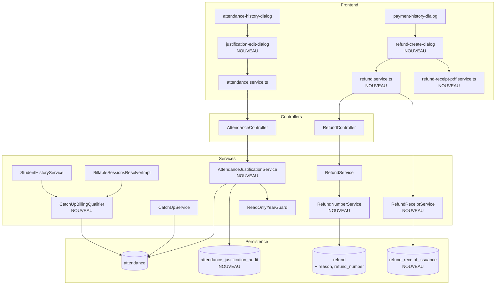
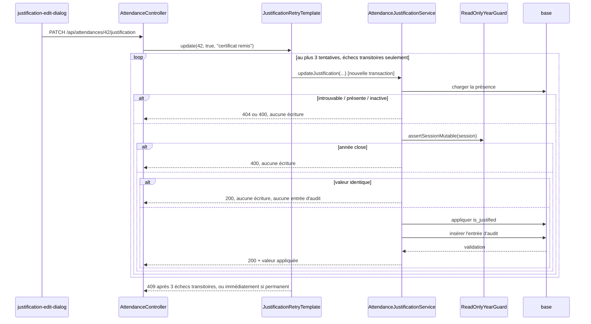
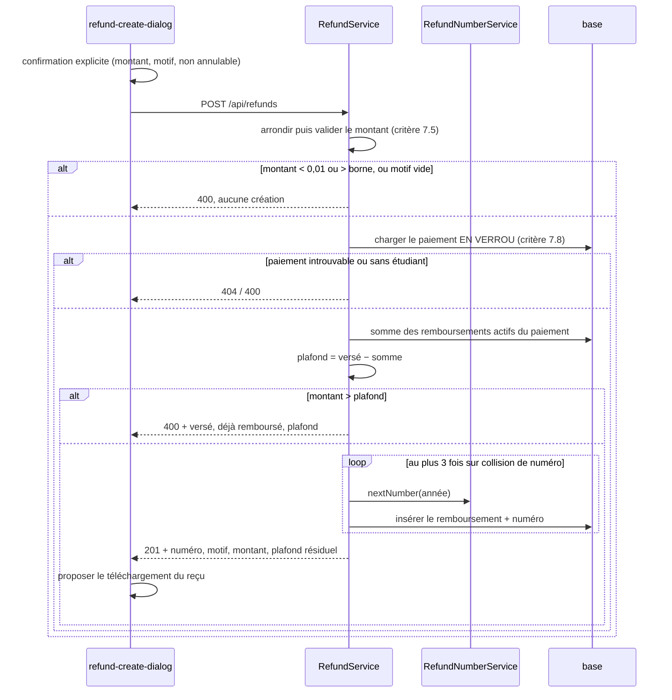

# Design Document

## Overview

Cette conception couvre quatre chantiers qui partagent une même exigence de traçabilité :
rattacher la présence de rattrapage à sa série et en tirer une facturation unique, rendre la
justification d'absence corrigeable et auditée, plafonner correctement les remboursements, et
produire un reçu remettable.

Trois principes guident l'ensemble.

**Aucune règle monétaire n'est dupliquée.** La qualification d'un rattrapage est calculée en un
seul endroit et consommée par le résolveur de séances facturables, le devis et l'historique. Un
second calcul, même correct au départ, divergerait.

**Aucune écriture d'argent ni de justification sans sa trace.** Le numéro de pièce et l'entrée
d'audit sont écrits dans la transaction qui écrit la donnée. Si la trace échoue, la donnée n'est
pas conservée.

**Aucune récursion entre séries.** L'exigence 2 fait dépendre le coût d'une série de l'état d'une
autre. La conception s'y limite à une comparaison de dates, jamais à une réévaluation du coût de
la série d'origine. C'est ce qui garantit la terminaison et l'indépendance à l'ordre d'évaluation.

## Écarts constatés dans le code, qui infléchissent la conception

Deux constats faits en lisant le code existant contredisent des hypothèses du document
d'exigences. Ils sont traités ici plutôt que passés sous silence.

### Aucun remboursement n'est jamais désactivé

Le document d'exigences distingue les Remboursements_Actifs (critère 7.1) et régit la
réactivation d'un remboursement désactivé (critère 7.12). Or `RefundEntity` hérite bien de
l'indicateur `active` de `BaseEntity`, mais **aucun chemin de code ne le met à faux** : la
recherche de `setActive` sur les classes de remboursement ne donne rien. L'annulation d'un
remboursement est par ailleurs un non-objectif déclaré.

Conséquence : le critère 7.12 est **inatteignable en l'état**, et l'exclusion des remboursements
inactifs du plafond est une logique morte. Deux options se présentaient. Retirer le filtre, ce
qui rendrait le plafond faux le jour où la désactivation apparaît. Ou conserver le filtre dès
maintenant, de sorte que l'introduction ultérieure de la désactivation n'ait rien à corriger
dans le calcul du plafond.

**Retenu : conserver le filtre.** Le coût est d'une clause `AND r.active = true` ; le bénéfice
est qu'une fonctionnalité d'annulation future ne pourra pas créer silencieusement une caisse
négative. Le critère 7.12 est implémenté sous forme de garde dans le service, testé
unitairement, et documenté comme non atteignable par l'interface actuelle.

### Les agrégations de remboursement existantes ignorent l'indicateur actif

Le tableau des décisions du document d'exigences affirme qu'un remboursement désactivé est
« exclu du plafond consommé, comme il est exclu des recettes ». **La seconde moitié de cette
phrase est fausse.** Aucune des agrégations de `RefundRepository` — `sumRefundsForStudentAndSeries`,
`sumRefundsForGroup`, `sumRefundsForReport`, `sumRefundsByGroupGroupedBySeries` — ne filtre sur
`active`. Un remboursement désactivé serait donc aujourd'hui exclu du plafond mais toujours
déduit des recettes.

Cette divergence est inoffensive tant que rien ne désactive un remboursement, et devient un écart
de caisse le jour où quelque chose le fait. La conception **aligne les quatre agrégations
existantes sur le même filtre** au titre de l'invariant 7.7, qui exige que la contrainte soit
maintenue « en permanence ». Le comportement observable est inchangé aujourd'hui, puisque tous
les remboursements sont actifs, ce qui rend la modification vérifiable sans régression.

## Architecture



`CatchUpBillingQualifier` est le seul composant nouveau du domaine monétaire. Il est consommé par
le résolveur et par l'historique, ce qui garantit qu'un écran et un montant ne peuvent pas
qualifier le même rattrapage différemment.

## Qualification du rattrapage : le point délicat

### Le problème

`BillableSessionsResolverImpl.resolve(studentId, seriesId)` ne lit aujourd'hui que la série
demandée : les séances via `sessionRepository.findBySessionSeriesId`, les présences via
`attendanceRepository.findByStudentIdAndSessionSeriesIdAndActiveTrue`. L'exigence 2 lui demande
deux informations qui vivent ailleurs :

- **sens accueil** : une séance de la série évaluée est-elle couverte uniquement par des
  rattrapages compensatoires ? Il faut alors connaître, pour chaque rattrapage, la séance manquée
  et la date d'inscription de l'étudiant dans le groupe de cette séance manquée.
- **sens origine** : une séance de la série évaluée a-t-elle été rattrapée ailleurs ? Elle compte
  alors comme suivie (critère 2.12), bien que sa présence reste une absence.

### La solution, sans récursion

La qualification ne demande **jamais** « la série d'origine facture-t-elle cette séance ? ». Elle
compare deux dates immuables : la date de la séance manquée et la date d'inscription de
l'étudiant dans le groupe de cette séance manquée. Aucun appel à `resolve` sur une autre série,
donc aucune récursion possible et aucune dépendance circulaire.

C'est aussi ce qui donne l'indépendance à l'ordre d'évaluation exigée par le critère 2.6 et la
propriété 1 : la qualification d'un rattrapage ne dépend d'aucun état de calcul, seulement de
données stockées. Évaluer la série A puis la série B, ou l'inverse, produit les mêmes
qualifications.

### Le composant

```java
package com.school.management.service.payment;

/**
 * Qualifie les présences de rattrapage d'un étudiant, pour que la règle « une séance consommée
 * est facturée une fois et une seule » (exigence 2.6) soit appliquée en un seul endroit.
 *
 * <p>La qualification ne consulte jamais le coût de la série d'origine : elle compare la date de
 * la séance manquée à la date d'inscription de l'étudiant dans le groupe de cette séance. Aucune
 * récursion entre séries n'est donc possible, et le résultat ne dépend pas de l'ordre dans
 * lequel les séries sont évaluées.</p>
 */
public interface CatchUpBillingQualifier {

    enum Qualification {
        /** La séance manquée est facturée dans sa série d'origine : le rattrapage est gratuit. */
        COMPENSATOIRE,
        /** Aucune autre série ne facture la séance : le rattrapage est facturable. */
        CONSOMME
    }

    /**
     * Vue des rattrapages d'un étudiant, indexée dans les deux sens dont le résolveur a besoin.
     *
     * @param bySessionId      par séance de rattrapage : qualifications des présences qui la couvrent
     * @param compensatedMissedSessionIds séances manquées couvertes par un rattrapage compensatoire
     */
    record CatchUpView(Map<Long, List<Qualification>> bySessionId,
                       Set<Long> compensatedMissedSessionIds) {

        /** Vrai si la séance n'est couverte que par des rattrapages compensatoires (critère 2.3). */
        public boolean isFullyCompensated(Long sessionId) { /* ... */ }
    }

    /** Construit la vue des rattrapages de l'étudiant, en un nombre de requêtes constant. */
    CatchUpView view(Long studentId);
}
```

### Coût des lectures

`view(studentId)` exécute **trois requêtes, indépendamment du nombre de rattrapages** :

| Requête | Objet | Statut |
|---|---|---|
| `attendanceRepository.findByStudentIdAndIsCatchUpTrueAndActiveTrue(studentId)` | tous les rattrapages de l'étudiant | à ajouter |
| `sessionRepository.findAllById(missedSessionIds)` | séances manquées, avec leur groupe et leur date | existante (`JpaRepository`) |
| `studentGroupRepository.findByStudentIdAndActiveTrue(studentId)` | dates d'inscription par groupe | existante |

Une seule requête est donc réellement à écrire. Les deux autres existent : `findAllById` vient de
`JpaRepository`, et `findByStudentIdAndActiveTrue` est déjà déclarée dans `StudentGroupRepository`.

Le seul appel existant `findByStudentIdAndIsCatchUp(studentId, true)` de `PaymentStatusService` ne
filtre pas sur `active` : la nouvelle requête le fait, conformément à la définition de
Présence_Rattrapage du glossaire.

Trois lectures supplémentaires par appel à `resolve` est un coût réel. Il est accepté parce que
le déploiement est mono-site, sur un jeu de données de l'ordre de quelques centaines d'étudiants,
et parce que l'alternative — précalculer la qualification dans une colonne — introduirait une
donnée dérivée à maintenir, donc une source de divergence. Si le coût devenait sensible, la vue
est un objet immuable par étudiant : elle se met en cache à l'échelle de la requête HTTP sans
changer sa sémantique.

### Intégration dans le résolveur

`resolve` conserve sa signature et son contrat. La boucle sur les séances gagne deux branches :

```java
for (SessionEntity session : sessionRepository.findBySessionSeriesId(seriesId)) {
    boolean hasAttendance   = attendedSessionIds.contains(session.getId());
    boolean fullyCompensated = catchUpView.isFullyCompensated(session.getId());

    // Critère 2.3 : couverte seulement par des rattrapages compensatoires → exclue.
    // Critère 2.11 : une présence active non compensatoire la ramène dans les facturables.
    if (fullyCompensated && !hasNonCompensatoryAttendance(session, attendances)) {
        excluded.add(session);
        continue;
    }

    if (hasAttendance || isOnOrAfterEnrolment(session, enrollmentDate)) {
        billable.add(session);
        // Critère 2.12 : la séance rattrapée ailleurs compte comme suivie ICI, côté origine,
        // sans que la présence d'origine (absence) soit réécrite.
        if (presentSessionIds.contains(session.getId())
                || catchUpView.compensatedMissedSessionIds().contains(session.getId())) {
            attendedCount++;
        }
    } else {
        excluded.add(session);
    }
}
```

Le décompte du critère 2.12 vient donc de `compensatedMissedSessionIds`, pas d'une modification
de la présence d'origine. C'est ce qui réconcilie « l'absence reste une absence » (critère 1.3)
avec « un rattrapage compte comme suivi » (`business-rules.md`).

Le record `BillableSessions` est enrichi d'un champ, sans rompre ses accesseurs existants :

```java
record BillableSessions(List<SessionEntity> billable,
                        List<SessionEntity> excluded,
                        int attendedCount,
                        boolean enrolled,
                        Date enrollmentDate,
                        /** Séances écartées au titre du critère 2.3, pour le message du 2.9. */
                        Set<Long> compensatedAwaySessionIds) { }
```

## Data Models

Un unique script `V2__absence_justification_and_refund_receipts.sql` porte l'ensemble. Le profil
prod étant en `ddl-auto=validate`, rien ne peut reposer sur la génération Hibernate.

### Journal d'audit de la justification

```sql
CREATE TABLE attendance_justification_audit (
    id             BIGSERIAL PRIMARY KEY,
    attendance_id  BIGINT       NOT NULL,
    old_value      BOOLEAN,
    new_value      BOOLEAN      NOT NULL,
    performed_by   VARCHAR(255) NOT NULL,
    performed_at   TIMESTAMP(3) NOT NULL,
    sequence_rank  BIGINT       NOT NULL,
    comment        TEXT
);
CREATE INDEX idx_aja_attendance ON attendance_justification_audit (attendance_id, performed_at DESC, sequence_rank DESC);
```

`attendance_id` est une colonne simple, **sans clé étrangère**, exactement comme
`payment_detail_audit.payment_detail_id` dont cette table suit le précédent. Ce n'est pas un
oubli : c'est ce qui donne le critère 5.11, un audit qui survit à la suppression de la présence
auditée. Une clé étrangère avec cascade détruirait la preuve avec son objet.

`performed_at` est en précision milliseconde (critère 5.1) et `sequence_rank` départage deux
entrées de même horodatage (critères 5.7, 5.8). L'index couvre exactement l'ordre de restitution
demandé.

### Remboursement

```sql
ALTER TABLE refund ADD COLUMN reason        TEXT;
ALTER TABLE refund ADD COLUMN refund_number VARCHAR(32) NOT NULL;
ALTER TABLE refund ADD CONSTRAINT uk_refund_number UNIQUE (refund_number);
```

La table est vide, y compris sur le poste de développement : les colonnes sont donc posées
directement dans leur forme définitive, sans étape de remplissage intermédiaire ni renumérotation
de lignes passées.

`reason` reste nullable au niveau du schéma alors que le motif est obligatoire. Ce n'est pas une
incohérence : l'obligation est portée par le service, où le message d'erreur peut expliquer pourquoi
un motif est exigé. Une contrainte `NOT NULL` produirait à la place une violation de contrainte
illisible pour l'administrateur.

La contrainte d'unicité est la garantie du critère 6.6 : elle est portée par le stockage, pas par
le calcul, et vaut donc quel que soit le nombre d'instances.

### Émissions de reçu

```sql
CREATE TABLE refund_receipt_issuance (
    id         BIGSERIAL PRIMARY KEY,
    refund_id  BIGINT       NOT NULL REFERENCES refund (id),
    rank       INTEGER      NOT NULL,
    issued_at  TIMESTAMP(3) NOT NULL,
    issued_by  VARCHAR(255) NOT NULL,
    CONSTRAINT uk_rri_refund_rank UNIQUE (refund_id, rank)
);
```

Le critère 8.10 n'exigeait qu'un rang et une date de production, qu'un simple compteur sur
`refund` aurait suffi à porter. Le journal est préféré parce que la réimpression d'un reçu de
caisse est précisément l'événement qu'on veut pouvoir retracer : un reçu réimprimé peut servir
deux fois. Ici la clé étrangère est légitime, l'émission n'ayant aucun sens sans son
remboursement.

### Un seul rattrapage par séance manquée

```sql
CREATE UNIQUE INDEX uk_attendance_student_missed
    ON attendance (student_id, missed_session_id)
    WHERE missed_session_id IS NOT NULL AND active = true;
```

Deux rattrapages actifs d'une même séance manquée rendraient le décompte des séances suivies
indéterminé (critère 1.9). L'index l'empêche pour les saisies à venir. Aucune détection de doublon
passé n'accompagne sa création : la base est vide, le cas ne peut pas exister.

Le `WHERE` de l'index partiel est en revanche nécessaire : sans lui, toutes les présences ordinaires
(`missed_session_id` nul) entreraient en collision entre elles, et une présence désactivée
bloquerait l'enregistrement d'un nouveau rattrapage légitime.

Le rattachement des présences à leur série est garanti à la création par le critère 1.1, côté
applicatif. La migration n'a rien à rattacher rétroactivement.

## Components and Interfaces

### AttendanceJustificationService (nouveau)

```java
@Service
public class AttendanceJustificationService {

    /**
     * Modifie la justification d'une absence et enregistre sa trace dans la même transaction.
     *
     * @throws CustomServiceException 404 si la présence est introuvable (critère 4.5)
     * @throws CustomServiceException 400 si la présence est marquée présente (4.6),
     *         désactivée (4.12), ou si l'année scolaire est close (4.13)
     * @throws CustomServiceException 409 si la trace d'audit n'a pu être enregistrée (5.6, 5.10)
     */
    @Transactional
    public JustificationUpdateResult updateJustification(Long attendanceId,
                                                         boolean justified,
                                                         String comment);

    /** Piste d'audit, du plus récent au plus ancien (critère 5.7). Vide si aucune entrée. */
    @Transactional(readOnly = true)
    public List<JustificationAuditDTO> auditTrail(Long attendanceId);
}
```

L'ordre des contrôles est fixé et testé : existence, puis absence, puis présence active, puis
année scolaire mutable via `ReadOnlyYearGuard.assertSessionMutable`, puis longueur du commentaire.
Une valeur identique sort avant toute écriture (critère 4.3).

**Rejeu.** Le critère 5.5 borne le rejeu aux échecs transitoires, le 5.10 l'interdit pour les
échecs permanents. La distinction se fait sur le type d'exception Spring, pas sur une heuristique :

| Cause | Exceptions | Comportement |
|---|---|---|
| Transitoire | `TransientDataAccessException`, `CannotAcquireLockException`, `QueryTimeoutException` | jusqu'à 3 rejeux, 1 s d'intervalle, 5 s au total |
| Permanente | `DataIntegrityViolationException`, `ConstraintViolationException` | aucun rejeu, erreur immédiate |

Le rejeu porte sur l'opération complète et doit donc s'exécuter **hors** de la transaction
annulée. Une méthode `@Transactional` qui se rappelle elle-même ne réessaierait rien : la
transaction est déjà marquée pour rollback. Le rejeu est donc porté par un composant appelant
distinct, ce qui est le point d'implémentation le plus facile à rater ici.

### RefundService (modifié)

```java
/**
 * Crée un remboursement : montant validé, plafond cumulé vérifié, motif exigé, numéro attribué.
 *
 * <p>L'ordre est imposé par le critère 7.5 : le montant est arrondi puis validé AVANT
 * l'évaluation du plafond, de sorte qu'un montant nul ou négatif ne puisse pas traverser le
 * contrôle de plafond.</p>
 */
@Transactional
public RefundEntity create(RefundRequestDTO dto);

/** Montant versé, somme déjà remboursée et plafond restant (critère 7.10). */
@Transactional(readOnly = true)
public RefundCapDTO cap(Long paymentId);
```

`RefundRequestDTO` gagne un champ `reason`. Le champ `studentId` reste présent mais devient
explicitement ignoré (critère 7.11) : le bénéficiaire est celui du paiement.

**Plafond cumulé.** Nouvelle agrégation, avec le filtre discuté plus haut :

```java
@Query("SELECT COALESCE(SUM(r.amount), 0) FROM RefundEntity r "
     + "WHERE r.payment.id = :paymentId AND r.active = true")
BigDecimal sumActiveRefundsForPayment(@Param("paymentId") Long paymentId);
```

**Sérialisation par paiement** (critère 7.8). Lire puis écrire sans verrou laisse deux demandes
concurrentes évaluer le même plafond et le dépasser à deux. Le paiement est donc chargé en
verrou pessimiste :

```java
@Lock(LockModeType.PESSIMISTIC_WRITE)
@Query("SELECT p FROM PaymentEntity p WHERE p.id = :id")
Optional<PaymentEntity> findByIdForUpdate(@Param("id") Long id);
```

Le déploiement est mono-instance, ce qui rend la collision improbable mais pas impossible : deux
onglets du navigateur suffisent. Le verrou est retenu parce qu'il est correct indépendamment du
nombre d'instances, et parce qu'un dépassement de plafond est une perte d'argent, pas une gêne
d'affichage.

**Conversion monétaire.** `PaymentEntity.amountPaid` est un `Double`, `RefundEntity.amount` un
`BigDecimal(12,2)`. La conversion existante `toMoney` passe par `BigDecimal.valueOf(double)`, qui
utilise la représentation décimale imprimée et non les bits du `double` : c'est la conversion
correcte, et elle est conservée. La borne haute du critère 7.4 (999 999 999,99) reste dans la
précision exacte d'un `double`, la comparaison est donc fiable. Le remboursement, lui, ne
transite jamais par un `double`.

### RefundNumberService (nouveau)

```java
/**
 * Attribue le numéro de pièce d'un remboursement, dans la transaction qui l'enregistre.
 *
 * <p>Le rang est calculé par lecture du maximum de l'année civile, et l'unicité est garantie par
 * la contrainte de stockage : en cas de collision, l'enregistrement est rejoué avec un rang
 * recalculé, au plus 3 fois (critère 6.14). Un rang consommé par une tentative échouée n'est ni
 * comblé ni réutilisé (critère 6.5) : réattribuer un numéro déjà imprimé sur un reçu créerait
 * deux pièces comptables homonymes.</p>
 */
String nextNumber(int year);
```

Le format est `REMB-AAAA-NNNN`, complété à quatre chiffres jusqu'à 9999 puis écrit sans
troncature (critère 6.5). Une école de cette taille n'atteindra pas ce rang, mais tronquer
casserait l'unicité au moment le moins opportun.

### RefundReceiptService (nouveau)

```java
/**
 * Enregistre une émission de reçu et retourne les données du document.
 *
 * <p>Écriture et non lecture : le rang d'émission du critère 8.10 exige de compter les
 * productions. Le service n'assemble pas le PDF, il fournit les données ; le rendu suit le
 * précédent du projet et reste côté client (pdfmake), comme pour le reçu de versement.</p>
 *
 * @throws CustomServiceException 404 si le remboursement est introuvable ou inactif (critère 8.7)
 */
@Transactional
public RefundReceiptDTO issue(Long refundId);
```

Le document d'exigences reste neutre sur le lieu de production. Le rendu client est retenu par
cohérence avec `payment-receipt-pdf.service.ts` : le reçu de versement et le reçu de
remboursement doivent se ressembler pour être distingués par ce qui compte (titre, sens de
l'opération, libellé du montant, critère 8.9), et deux moteurs de rendu différents produiraient
deux mises en page divergentes.

`RefundReceiptDTO` porte toutes les données du critère 8.1 à 8.4 déjà résolues côté serveur, y
compris les replis « Hors série » (8.3), « Hors groupe » (8.12) et « Administrateur non identifié »
(8.11). Aucune de ces décisions n'est laissée au client : elles doivent être identiques d'une
production à l'autre (critère 8.6).

### CatchUpService (modifié)

`complete()` renseigne la série et refuse trois situations qu'il acceptait :

```java
// Critère 1.1 : la série de la séance de rattrapage, dans la transaction de complétion.
SessionSeriesEntity series = request.getCatchUpSession().getSessionSeries();
if (series == null) {
    throw new CustomServiceException(
        "La séance de rattrapage n'est rattachée à aucune série : complétion impossible.",
        HttpStatus.BAD_REQUEST);                                    // critère 1.7
}
// Critère 1.9 : un seul rattrapage par séance manquée.
if (attendanceRepository.existsByStudentIdAndMissedSessionIdAndActiveTrue(
        studentId, request.getOriginalSession().getId())) {
    throw new CustomServiceException(
        "Un rattrapage est déjà enregistré pour cette séance manquée.",
        HttpStatus.CONFLICT);
}
```

La présence d'origine n'est pas touchée (critère 1.3) : la mention « Rattrapée » est dérivée à
l'affichage, jamais écrite dans la présence.

### StudentHistoryService (modifié)

Consomme `CatchUpBillingQualifier.view` et les nouveaux champs de `BillableSessions` pour porter
les mentions exigées : « Rattrapée » avec date et groupe d'accueil (1.4), désignation de la séance
manquée (1.5), séance non déterminée (1.10), séance déjà facturée dans la série d'origine avec son
nom, son groupe et la date de la séance manquée (2.9), neutralité de la justification par ligne
d'absence (3.4, 3.5), auteur et date de la dernière modification de justification (5.9), numéro de
pièce et motif du remboursement (6.9).

Les DTO `SessionHistoryDTO` et `SeriesHistoryDTO` gagnent les champs correspondants. Ils exposent
aujourd'hui des `Double` pour les montants : ce contrat est conservé pour ne pas casser le
frontend, la conversion se faisant au dernier moment depuis les `BigDecimal` du domaine.

## Points d'entrée REST

Les règles de `SecurityConfig` sont par méthode HTTP sur `/api/**`. Les points d'entrée ci-dessous
tombent du bon côté **sans aucune modification de la configuration de sécurité**, ce qui est
délibéré : toucher aux règles d'autorisation pour ajouter une fonctionnalité est un risque
disproportionné.

| Méthode | Chemin | Rôle | Exigence |
|---|---|---|---|
| `PATCH` | `/api/attendances/{id}/justification` | ADMIN (règle PATCH existante) | 4.1, 4.4 |
| `GET` | `/api/attendances/{id}/justification-audit` | ADMIN + VIEWER | 5.7 |
| `GET` | `/api/refunds/payment/{paymentId}/cap` | ADMIN + VIEWER | 7.10 |
| `POST` | `/api/refunds` | ADMIN (règle POST existante) | 6.11 |
| `POST` | `/api/refunds/{id}/receipts` | ADMIN (règle POST existante) | 8.1 |
| ~~`PUT`~~ | ~~`/api/attendances/{id}`~~ | retiré | 4.9 |

Le corps de la requête de justification est un record fermé à deux champs, ce qui ferme
définitivement la faille pour laquelle le PATCH générique avait été retiré :

```java
public record JustificationUpdateRequest(
        @NotNull Boolean justified,
        @Size(max = 500) String comment) { }
```

Aucun `Map`, aucun `ModelMapper` sur l'entité, aucun champ de présence atteignable autrement que
`is_justified`.

## Séquences

### Modification de justification avec audit



### Création d'un remboursement



## Error Handling

Les messages nomment la cause et l'action corrective, conformément à l'usage déjà en place dans
`PaymentDistributionService`, où le message dit « exemption, série soldée » plutôt que « montant
invalide ».

| Situation | Code | Contenu du message |
|---|---|---|
| Présence introuvable | 404 | identifiant visé |
| Présence marquée présente | 400 | la justification ne concerne qu'une absence |
| Présence désactivée | 400 | la présence est désactivée |
| Année scolaire close | 400 | l'année est close, la correction n'est plus possible |
| Commentaire trop long | 400 | longueur maximale autorisée |
| Audit non enregistré | 409 | la modification n'a pas été conservée faute de trace |
| Rattrapage déjà enregistré | 409 | un rattrapage existe déjà pour cette séance manquée |
| Séance de rattrapage sans série | 400 | la séance nommée n'est rattachée à aucune série |
| Montant hors bornes | 400 | bornes attendues |
| Motif absent | 400 | le motif est obligatoire |
| Plafond dépassé | 400 | versé, déjà remboursé, **plafond restant** |
| Numéro non attribué | 409 | échec d'attribution après trois tentatives |
| Remboursement introuvable ou inactif | 404 | identifiant visé |

Le message de dépassement de plafond porte les trois montants parce que l'administrateur a
quelqu'un devant lui : « montant trop élevé » l'obligerait à aller chercher l'information
ailleurs.

## Frontend

| Élément | Nature | Exigence |
|---|---|---|
| `refund.service.ts` | nouveau, appels HTTP uniquement, `handleError` centralisé | 9.9 |
| `refund-create-dialog` | nouveau, greffé sur `payment-history-dialog` | 9.1 à 9.4, 9.10 à 9.12 |
| `refund-receipt-pdf.service.ts` | nouveau, pdfmake, distinct du reçu de versement | 8.1 à 8.10 |
| `justification-edit-dialog` | nouveau, greffé sur `attendance-history-dialog` | 4.10, 3.10 |
| `attendance.service.ts` | étendu : justification + piste d'audit | 4.1, 5.7 |
| `attendance-history-dialog` | libellés textuels, mentions de neutralité par ligne | 3.4, 3.5, 3.8, 3.9, 5.9 |
| Clés i18n | nouvelles clés `refund.*` et `justification.*` | 8.1 |

Le masquage par rôle passe par les directives `appAdminOnly` / `hasRole` existantes (critères
4.11, 9.8). Ce masquage est une commodité : l'autorité reste le backend, et les tests le vérifient
côté serveur indépendamment de l'interface.

Trois protections du formulaire de remboursement méritent d'être signalées, parce qu'elles
traitent des situations que le blocage client seul ne couvre pas. La validation est indisponible
pendant la requête (9.11), sans quoi un double clic produit deux remboursements. Le rejet serveur
pour plafond dépassé est affiché même si le client avait validé (9.12), le plafond ayant pu
changer depuis l'ouverture du formulaire. Et l'absence de réponse au bout de 30 secondes affiche
que le résultat est inconnu (9.7) plutôt qu'un échec, car la demande a peut-être abouti.

## Correctness Properties

Convention du projet : `// Feature: absence-justification-and-refund-receipts, Property N: …` et
`@Property(tries = 100)`.

### Property 1: Une séance consommée est facturable dans une série au plus

**Type** : invariant — **Classe** : `CatchUpBillingQualifierPropertyTest`

**Validates: Requirements 2.6**

Pour tout ensemble de séances, de présences et de rattrapages d'un étudiant, chaque séance suivie
est retenue comme facturable dans une série au plus, et le résultat est identique quel que soit
l'ordre d'évaluation des séries. Cent tirages trouvent la combinaison rare de rattrapages croisés,
et la dépendance à l'ordre, que deux exemples choisis à la main manquent.

### Property 2: Le coût côté accueil ignore les rattrapages compensatoires

**Type** : métamorphique — **Classe** : `BillableSessionsCompensatoryPropertyTest`

**Validates: Requirements 2.3, 2.4**

Pour toute série d'accueil, le coût au prorata et le montant dû à ce jour calculés en présence de
rattrapages compensatoires égalent ceux calculés en leur absence.

### Property 3: La séance consommée compte comme suivie côté série d'origine

**Type** : métamorphique — **Classe** : `BillableSessionsOriginCountPropertyTest`

**Validates: Requirements 2.12**

Pour toute série d'origine, le montant dû à ce jour croît du prix net d'une séance pour chaque
séance manquée couverte par un rattrapage compensatoire, sans que la présence d'origine cesse
d'être une absence. Sans cette propriété, une séance rattrapée n'augmenterait le montant dû
d'aucune série.

### Property 4: La justification n'influence aucun montant

**Type** : métamorphique — **Classe** : `JustificationNeutralityPropertyTest`

**Validates: Requirements 3.1, 3.2, 3.3**

Pour tout ensemble d'absences d'une série, faire varier arbitrairement la justification laisse le
coût au prorata, le montant dû à ce jour, le plafond encaissable et le statut de paiement
identiques. Cent tirages explorent les chemins de calcul où la justification pourrait s'infiltrer.

### Property 5: Réappliquer la même valeur n'écrit rien

**Type** : idempotence — **Classe** : `JustificationIdempotencePropertyTest`

**Validates: Requirements 4.3, 5.1**

Pour toute présence et toute valeur de justification, appliquer deux fois la même valeur produit
le même état et une seule entrée d'audit.

### Property 6: La valeur courante suit la dernière entrée d'audit

**Type** : invariant — **Classe** : `JustificationAuditTrailPropertyTest`

**Validates: Requirements 5.3, 5.8**

Pour toute suite de modifications, la valeur courante égale celle appliquée par la dernière entrée
d'audit, et le nombre d'entrées égale le nombre de changements effectifs. Le cas que cent tirages
trouvent est le désalignement sur horodatages égaux, que seul le rang de séquence départage.

### Property 7: La somme des remboursements ne dépasse jamais le versement

**Type** : invariant monétaire — **Classe** : `RefundCapPropertyTest`

**Validates: Requirements 7.1, 7.3, 7.7**

Pour toute suite de demandes de remboursement sur un même paiement, la somme des montants acceptés
reste inférieure ou égale au montant versé, et toute demande dépassant le plafond est rejetée.

**C'est la propriété la plus importante du lot** : elle reproduit le défaut existant, où deux
remboursements du montant total d'un même versement sont tous deux acceptés. Elle doit échouer sur
le code actuel avant de passer sur le code corrigé.

### Property 8: Aucun montant invalide ne franchit la validation

**Type** : condition d'erreur — **Classe** : `RefundValidationPropertyTest`

**Validates: Requirements 6.2, 7.4, 7.9**

Pour tout montant inférieur à 0,01 après arrondi, ou tout motif vide, la création est rejetée ;
tout montant accepté est exprimé à l'échelle monétaire. Le cas piégeux est le montant qui devient
nul par arrondi après avoir franchi un contrôle effectué trop tôt.

### Property 9: Les numéros de pièce sont uniques et croissants par année

**Type** : invariant — **Classe** : `RefundNumberPropertyTest`

**Validates: Requirements 6.6, 6.7, 6.12**

Pour tout ensemble de remboursements créés, les numéros sont deux à deux distincts, inchangés après
création, et leur rang est strictement croissant au sein d'une même année civile. Cent tirages
trouvent la collision au passage d'année.

### Property 10: Un reçu réimprimé porte les mêmes données

**Type** : idempotence — **Classe** : `RefundReceiptStabilityPropertyTest`

**Validates: Requirements 8.6, 8.10**

Pour tout remboursement, deux productions successives du reçu affichent les mêmes numéro, montant,
motif et date, et la seconde porte la mention « Duplicata ».

### Property 11: Toute présence de rattrapage porte la série de sa séance

**Type** : invariant — **Classe** : `CatchUpCompletionPropertyTest`

**Validates: Requirements 1.1, 1.2**

Pour toute demande de rattrapage complétée, la présence créée porte la série de sa séance. C'est la
propriété qui verrouille le défaut d'origine de cette fonctionnalité.

### Property 12: Un remboursement ne déplace pas le devis

**Type** : invariant — **Classe** : `RefundDevisNeutralityPropertyTest`

**Validates: Requirements 7.13**

Pour tout remboursement créé sur un paiement rattaché à une série, le coût au prorata, le montant
dû à ce jour, le plafond encaissable et le statut de paiement de cette série sont inchangés.

## Testing Strategy

### Tests d'exemple

Les chemins d'erreur du tableau de gestion des erreurs sont couverts un par un, ainsi que les cas
que les propriétés couvrent mal : ordre des contrôles (7.5), distinction rejeu transitoire et
permanent (5.5, 5.10), survie de l'audit à la suppression de la présence (5.11), et refus de
réactivation (7.12), ce dernier étant testé unitairement
puisque l'interface ne peut pas l'atteindre.

### Vérification de la migration

Le script `V2` ne contient que du DDL : création de deux tables, ajout de deux colonnes, deux
contraintes et deux index. Aucune reprise de données, donc aucune logique conditionnelle à éprouver.

Il a été appliqué contre PostgreSQL après la baseline `V1`, et les trois contraintes ont été
vérifiées : unicité du numéro de pièce, index unique partiel sur le couple (étudiant, séance
manquée) rejetant deux rattrapages actifs tout en tolérant un rattrapage désactivé, et clé étrangère
de l'émission de reçu.

Une version antérieure de ce document annonçait un test d'intégration H2 pour la migration. C'était
faux, H2 ne sachant pas exécuter le PL/pgSQL qu'elle contenait alors ; la question ne se pose plus,
le script étant réduit à du DDL portable. Un test automatisé de non-régression sur ce script exigerait
Testcontainers, donc une dépendance Maven nouvelle et Docker sur la machine de build : cette décision
appartient au propriétaire du projet et reste hors périmètre.

### Couverture

Le `pom.xml` impose 100 % lignes et branches sur une liste explicite de classes métier. Les
classes nouvelles suivantes doivent y être ajoutées, car elles portent des règles monétaires ou
des invariants d'état :

```xml
<include>com.school.management.service.payment.CatchUpBillingQualifier*</include>
<include>com.school.management.service.AttendanceJustificationService</include>
<include>com.school.management.service.RefundNumberService</include>
<include>com.school.management.service.RefundReceiptService</include>
```

`RefundService` et `BillableSessionsResolver*` figurent déjà dans la liste : leurs modifications
sont donc soumises au seuil sans intervention. Les `*MapperImpl` générés par MapStruct restent
exclus, conformément à la politique documentée dans le `pom.xml`.

## Suites à prévoir hors périmètre technique

`.kiro/steering/business-rules.md` contient encore la section « DEFERRED policy decision » qui
demande de ne pas coder d'hypothèse sur la facturation des absences. L'arbitrage « la
justification reste documentaire » la rend caduque et doit la remplacer, sans quoi le fichier de
référence du domaine contredira le code. La même section conserve sa validité pour la
réconciliation de fin d'année, qui demeure hors périmètre.
