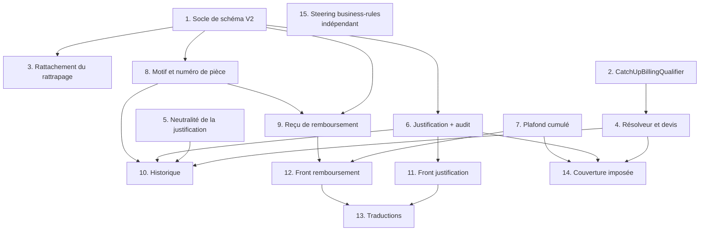

# Implementation Plan

## Overview

L'ordre est contraint par deux chaînes indépendantes qui ne se rejoignent qu'à l'affichage.

La **chaîne monétaire du rattrapage** part du qualificateur (tâche 2), qui alimente le résolveur de
séances facturables (4), lequel alimente le devis. Rien ne peut être branché avant que la
qualification compensatoire existe en un seul endroit.

La **chaîne du remboursement** part du plafond cumulé (7), indépendant du schéma, puis du numéro de
pièce (8), qui conditionne le reçu (9). Le plafond est traité en premier parce qu'il corrige un
défaut qui laisse aujourd'hui sortir plus d'argent qu'il n'en est entré : c'est le seul point du
lot où un retard se paie en argent réel.

Le socle de schéma (1) précède tout ce qui écrit une trace : journal d'audit, numéro de pièce,
émissions de reçu. Le profil prod étant en `ddl-auto=validate`, une entité livrée sans sa colonne
empêche le démarrage — le script `V2` et les entités correspondantes doivent donc être livrés
ensemble, jamais l'un sans l'autre.

Trois contraintes du dépôt pèsent sur presque chaque tâche : tous les montants en `BigDecimal`
échelle 2 `HALF_UP` ; les règles monétaires validées explicitement en Java dans les services
plutôt que par annotation ; et aucune évolution de schéma par génération Hibernate.

## Task Dependency Graph



Les tâches 1, 2, 5, 7 et 15 n'ont aucune dépendance et ouvrent le travail. La tâche 7 est
délibérément dans la première vague malgré sa place tardive dans le graphe : elle ferme une fuite
de caisse.

```json
{
  "waves": [
    {
      "wave": 1,
      "tasks": ["1", "2", "5", "7", "15"],
      "rationale": "Socle de schéma, qualificateur de rattrapage, vérification de neutralité, plafond de remboursement et mise à jour du steering n'ont aucune dépendance entre eux. Le plafond y figure car il corrige une fuite de caisse effective."
    },
    {
      "wave": 2,
      "tasks": ["3", "4", "6", "8"],
      "rationale": "Le rattachement du rattrapage et le journal d'audit ont besoin du schéma ; le résolveur a besoin du qualificateur ; le numéro de pièce a besoin de sa colonne."
    },
    {
      "wave": 3,
      "tasks": ["9", "10", "11"],
      "rationale": "Le reçu a besoin du numéro de pièce et de la table d'émissions ; l'historique agrège résolveur, audit et numéro ; le front de justification a besoin de son point d'entrée."
    },
    {
      "wave": 4,
      "tasks": ["12"],
      "rationale": "Le front de remboursement a besoin du plafond, du numéro et du reçu."
    },
    {
      "wave": 5,
      "tasks": ["13", "14"],
      "rationale": "Traductions une fois les écrans figés, et couverture imposée une fois toutes les classes métier écrites."
    }
  ]
}
```

## Tasks

- [x] 1. Poser le socle de schéma
- [x] 1.1 Écrire le script `V2__absence_justification_and_refund_receipts.sql`
  - **DDL uniquement, aucune reprise de données.** Décision produit : l'existant ne compte pas, ce sont des données de test destinées à être supprimées et l'installation cible démarre vide. Les contraintes posées protègent les données à venir, c'est leur seule raison d'être
  - Créer `attendance_justification_audit` avec `attendance_id` en colonne simple, **sans clé étrangère** : c'est ce qui fait survivre l'audit à la suppression de la présence auditée
  - `performed_at` en `TIMESTAMP(3)` et `sequence_rank` pour départager deux entrées de même horodatage
  - Index `(attendance_id, performed_at DESC, sequence_rank DESC)`, exactement l'ordre de restitution attendu
  - Ajouter `refund.reason` (nullable : l'obligation de motif est applicative, une contrainte `NOT NULL` produirait une erreur illisible) et `refund.refund_number` directement en `NOT NULL` avec contrainte d'unicité, la table étant vide
  - Créer `refund_receipt_issuance` avec clé étrangère vers `refund` et unicité sur `(refund_id, rank)`
  - Créer l'index unique partiel sur `(student_id, missed_session_id)` restreint à `missed_session_id IS NOT NULL AND active = true`, sans quoi les présences ordinaires entreraient en collision
  - _Requirements: 1.9, 5.1, 5.7, 6.4, 6.6_

- [x] 1.2 Créer les entités et repositories du socle
  - `AttendanceJustificationAuditEntity` sur le modèle de `PaymentDetailAuditEntity` (précédent du projet), avec son repository et une requête de restitution ordonnée
  - `RefundReceiptIssuanceEntity` et son repository, avec le rang maximum par remboursement
  - Ajouter `reason` et `refundNumber` à `RefundEntity`
  - Ne pas renommer le dossier `persistance`
  - _Requirements: 5.1, 5.7, 6.4, 8.10_

- [x] 1.3 ~~Compte rendu des présences non reprises~~ — **sans objet**
  - Retirée : il n'y a aucune donnée à reprendre. `UnattachedAttendanceReporter` et ses tests ont été supprimés, ainsi que la requête `findActiveWithoutSeries` qui les servait
  - _Requirements: aucun (critère 1.11 retiré)_

- [x] 1.4 Vérifier la migration
  - Le script étant réduit à du DDL, il n'y a plus de logique conditionnelle à éprouver : appliqué contre PostgreSQL après la baseline, et les trois contraintes vérifiées (unicité du numéro de pièce, index unique partiel rejetant deux rattrapages actifs tout en tolérant un désactivé, clé étrangère de l'émission)
  - **Reste à décider par le propriétaire du projet** : un test de non-régression automatisé exigerait Testcontainers, donc une dépendance Maven nouvelle et Docker sur la machine de build. Hors périmètre
  - _Requirements: 1.9, 6.6_

- [x] 2. Écrire le qualificateur de rattrapage
- [x] 2.1 Créer `CatchUpBillingQualifier` et son record `CatchUpView`
  - **Décision de conception à respecter** : la qualification compare deux dates stockées (date de la séance manquée, date d'inscription dans le groupe de cette séance). Elle ne demande **jamais** si la série d'origine facture la séance — aucune récursion, aucun appel à `resolve` sur une autre série
  - Exposer `bySessionId` (sens accueil) et `compensatedMissedSessionIds` (sens origine) : le résolveur a besoin des deux sens
  - Recalculer la qualification à chaque évaluation depuis l'état courant, et la rendre indépendante de la réduction, du montant versé et du statut de paiement de la série d'origine
  - _Requirements: 2.1, 2.7_

- [x] 2.2 Implémenter la vue en un nombre de requêtes constant
  - Ajouter `findByStudentIdAndIsCatchUpTrueAndActiveTrue` : l'appel existant `findByStudentIdAndIsCatchUp` ne filtre pas sur `active`, contrairement à la définition de Présence_Rattrapage
  - Réutiliser `findAllById` pour les séances manquées et `findByStudentIdAndActiveTrue` pour les inscriptions : ces deux requêtes existent déjà
  - Trois lectures au total, indépendamment du nombre de rattrapages ; la vue est immuable par étudiant et donc cachable à l'échelle d'une requête HTTP sans changer sa sémantique
  - _Requirements: 2.1, 2.7_

- [x] 2.3 Écrire les tests du qualificateur
  - Séance manquée postérieure à l'inscription dans son groupe : compensatoire
  - Séance manquée antérieure à l'inscription : consommé
  - Séance manquée absente, séance ou série disparue, aucune inscription active dans le groupe : consommé
  - Séance manquée exemptée ou série d'origine soldée : reste compensatoire, la qualification ignorant la réduction et le statut de paiement
  - `// Feature: absence-justification-and-refund-receipts, Property 1: …` avec `@Property(tries = 100)` — une séance suivie est facturable dans une série au plus, et le résultat ne dépend pas de l'ordre d'évaluation des séries
  - _Requirements: 2.1, 2.6, 2.7_

- [x] 3. Rattacher la présence de rattrapage à sa série
- [x] 3.1 Corriger `CatchUpService.complete`
  - Renseigner la série de la séance de rattrapage sur la présence créée, dans la transaction qui passe la demande à l'état complété
  - Refuser la complétion si la séance de rattrapage n'a pas de série, en nommant la séance, sans créer de présence
  - Refuser la complétion si un rattrapage existe déjà pour cette séance manquée
  - Ne pas toucher à la présence d'origine : elle reste absente et active, la mention « Rattrapée » étant dérivée à l'affichage
  - _Requirements: 1.1, 1.3, 1.7, 1.9_

- [x] 3.2 Écrire les tests de complétion
  - Présence créée porteuse de la série, de la séance manquée, marquée présente et rattrapage
  - Présence d'origine inchangée, y compris sa justification
  - Séance de rattrapage sans série : refus, demande inchangée, aucune présence créée
  - Second rattrapage de la même séance manquée : refus
  - `Property 11` — toute complétion produit une présence portant la série de sa séance
  - _Requirements: 1.1, 1.2, 1.3, 1.7, 1.9_

- [x] 3.3 Refuser toute présence dont la série est indéterminable
  - La règle ne concerne pas que le rattrapage : elle vaut pour **tous** les chemins de création de présence, dont la soumission en masse `POST /api/attendances/bulk`, qui est aujourd'hui le seul chemin d'écriture d'une présence ordinaire
  - Rejeter la création en nommant la séance concernée, sans enregistrer aucune présence : une présence sans série n'a aucune raison d'exister, aucun rattachement ultérieur n'étant prévu
  - Vérifier qu'un lot contenant une seule ligne invalide n'en enregistre aucune, la soumission en masse étant transactionnelle
  - _Requirements: 1.8_

- [x] 4. Brancher la facturation unique dans le résolveur et le devis
- [x] 4.1 Enrichir `BillableSessions` et `BillableSessionsResolverImpl`
  - Ajouter `compensatedAwaySessionIds` au record, sans rompre les accesseurs existants
  - Exclure la séance dont **toutes** les présences actives sont des rattrapages compensatoires ; une seule présence active non compensatoire la ramène dans les facturables
  - Compter la séance manquée rattrapée ailleurs dans `attendedCount` de sa série d'origine, **sans réécrire la présence d'origine** : c'est ce qui réconcilie « l'absence reste une absence » et « un rattrapage compte comme suivi »
  - Vérifier que la séance manquée reste facturable dans sa série d'origine, y compris quand la réduction rend le coût nul ou quand le versement couvre déjà le coût. Aucun code n'est attendu ici : c'est le comportement du prorata existant, que la tâche verrouille pour qu'une évolution du résolveur ne le retire pas
  - Conserver la signature et le contrat de `resolve`
  - _Requirements: 2.2, 2.3, 2.4, 2.5, 2.11, 2.12_

- [x] 4.2 Recaler le devis sur la série intégralement compensée
  - **Constat : aucun code n'a été nécessaire.** Les deux critères sont satisfaits par construction depuis 4.1. Un étudiant présent en accueil uniquement par rattrapage compensatoire n'y est pas inscrit, donc aucune séance n'y est facturable par la date, et toutes les séances couvertes sont écartées : coût, montant dû et plafond tombent à zéro d'eux-mêmes. L'excédent existant était déjà exposé par le devis depuis la fonctionnalité prorata
  - **Nuance signalée** : le critère 2.8, lu à la lettre, est plus large que ce qui est correct. Un étudiant réellement inscrit dans le groupe d'accueil ET y ayant fait un rattrapage compensatoire doit payer ses propres séances d'inscription ; exiger zéro dans ce cas serait faux. Le comportement obtenu traite le cas visé — le rattrapage seul — et laisse l'inscrit régulier payer ce qu'il doit
  - Retourner coût, montant dû et plafond nuls lorsque l'étudiant a au moins une présence active sur la série et que toutes sont compensatoires — le cas de l'ensemble vide ne doit pas déclencher la mise à zéro
  - Exposer le montant déjà versé comme excédent existant lorsque le plafond tombe à zéro, sans imputer quoi que ce soit sur une autre série : aucun mécanisme de report nouveau n'est introduit ici
  - _Requirements: 2.8, 2.13_

- [x] 4.3 Écrire les tests de facturation unique
  - Séance couverte seulement par un rattrapage compensatoire : exclue côté accueil, comptée suivie côté origine
  - Même séance portant aussi une présence ordinaire : reste facturable côté accueil
  - Rattrapage consommé : facturable côté accueil
  - Série intégralement compensée déjà encaissée : plafond nul, excédent exposé, montant versé inchangé
  - `Property 2` — le coût côté accueil est identique avec et sans rattrapages compensatoires
  - `Property 3` — le montant dû côté origine croît du prix net par séance manquée compensée, la présence d'origine restant une absence
  - _Requirements: 2.3, 2.4, 2.5, 2.8, 2.9, 2.10, 2.11, 2.12, 2.13_

- [ ] 5. Verrouiller la neutralité financière de la justification
- [ ] 5.1 Écrire le test de neutralité
  - Aucune modification de code métier attendue : la justification n'apparaît nulle part dans le calcul, ce test **documente et verrouille** cet état de fait
  - `Property 4` — faire varier arbitrairement la justification des absences d'une série laisse coût, montant dû, plafond et statut de paiement identiques
  - Vérifier que les deux compteurs du tableau de bord restent distincts et que leur somme égale le nombre d'absences de la période
  - _Requirements: 3.1, 3.2, 3.3, 3.7_

- [ ] 5.2 Traiter la justification non renseignée
  - Compter une justification absente parmi les absences injustifiées et la présenter comme non renseignée, sans jamais afficher un `NULL` comme un « non »
  - _Requirements: 3.9_

- [ ] 6. Rendre la justification modifiable et auditée
- [ ] 6.1 Écrire `AttendanceJustificationService`
  - Ordre des contrôles fixé et testé : existence, absence, présence active, année scolaire mutable via `ReadOnlyYearGuard.assertSessionMutable`, longueur du commentaire
  - Une valeur identique sort avant toute écriture, sans entrée d'audit
  - Écrire la modification et son entrée d'audit dans une seule transaction
  - Déterminer l'auteur depuis le contexte de sécurité, avec repli `system`
  - Aucune borne d'ancienneté autre que l'année scolaire courante
  - _Requirements: 4.2, 4.3, 4.5, 4.6, 4.12, 4.13, 4.14, 5.1, 5.2, 5.4_

- [ ] 6.2 Écrire le composant de rejeu
  - **Piège à éviter** : le rejeu ne peut pas être porté par la méthode transactionnelle elle-même, dont la transaction est déjà marquée pour annulation — une méthode `@Transactional` qui se rappelle ne réessaie rien. Le rejeu appartient à un composant appelant distinct, qui ouvre une nouvelle transaction à chaque tentative
  - Rejouer les seuls échecs transitoires (`TransientDataAccessException`, `CannotAcquireLockException`, `QueryTimeoutException`) : au plus 3 fois, 1 s d'intervalle, 5 s au total
  - N'engager aucun rejeu sur échec permanent (`DataIntegrityViolationException`, `ConstraintViolationException`) : un rejeu identique ne reproduirait que la même erreur
  - Après épuisement, laisser la présence inchangée et ne conserver aucune entrée issue des tentatives
  - _Requirements: 5.5, 5.6, 5.10_

- [ ] 6.3 Exposer le point d'entrée et retirer le point d'entrée inerte
  - `PATCH /api/attendances/{id}/justification` avec un record fermé à deux champs (`justified`, `comment`) : aucun `Map`, aucun `ModelMapper` sur l'entité, aucun champ de présence atteignable autrement. C'est ce qui ferme définitivement la faille pour laquelle le PATCH générique avait été retiré
  - Retirer `PUT /api/attendances/{id}` et le talon `AttendanceService.updateAttendance` : un appel qui réussit sans rien modifier induit l'appelant en erreur
  - La règle PATCH existante de `SecurityConfig` réserve déjà l'écriture à ADMIN — **ne pas modifier la configuration de sécurité**
  - _Requirements: 4.1, 4.4, 4.7, 4.8, 4.9_

- [ ] 6.4 Exposer la piste d'audit en lecture
  - `GET /api/attendances/{id}/justification-audit`, restituée du plus récent au plus ancien, collection vide si aucune entrée
  - La règle GET existante l'ouvre aux deux rôles, ce qui est voulu : un consultant doit pouvoir constater qui a modifié quoi
  - Conserver les entrées d'une présence désactivée ou supprimée
  - _Requirements: 5.3, 5.7, 5.11_

- [ ] 6.5 Écrire les tests de justification et d'audit
  - Chaque chemin d'erreur : introuvable, présence marquée présente, présence désactivée, année close, valeur absente ou non booléenne, commentaire trop long — en vérifiant qu'aucune donnée n'est modifiée et aucune entrée créée
  - Rôle : refus au consultant avec un message nommant le rôle requis
  - Deux modifications concurrentes : appliquées l'une après l'autre, chaque entrée portant comme valeur antérieure celle laissée par la précédente
  - Survie de l'audit à la suppression de la présence
  - `Property 5` — réappliquer la même valeur produit le même état et une seule entrée
  - `Property 6` — la valeur courante suit la dernière entrée, y compris à horodatages égaux, et le nombre d'entrées égale le nombre de changements effectifs
  - _Requirements: 4.3, 4.4, 4.5, 4.6, 4.7, 4.8, 4.12, 4.13, 5.1, 5.3, 5.8, 5.11, 5.12_

- [x] 7. Plafonner les remboursements par paiement
- [x] 7.1 Ajouter l'agrégation par paiement et aligner les agrégations existantes
  - Ajouter `sumActiveRefundsForPayment` filtrée sur `active = true`
  - **Constat à corriger** : aucune des quatre agrégations existantes de `RefundRepository` ne filtre sur `active`. Un remboursement désactivé serait donc exclu du plafond mais toujours déduit des recettes. Aligner les quatre sur le même filtre
  - Le comportement observable est inchangé aujourd'hui, aucun code ne désactivant un remboursement : la modification est donc vérifiable sans régression
  - _Requirements: 7.1, 7.7_

- [x] 7.2 Corriger `RefundService.create`
  - Arrondir puis valider le montant **avant** d'évaluer le plafond, afin qu'aucun montant nul ou négatif ne traverse le contrôle de plafond
  - Refuser un montant inférieur à 0,01 après arrondi ou supérieur à la borne haute
  - Charger le paiement en verrou pessimiste : lire puis écrire sans verrou laisse deux demandes concurrentes évaluer le même plafond et le dépasser à deux. Deux onglets du navigateur suffisent, le mono-instance ne protège de rien ici
  - Refuser le dépassement avec un message portant les **trois** montants (versé, déjà remboursé, plafond restant) : l'administrateur a quelqu'un devant lui
  - Refuser un paiement sans étudiant, et ignorer tout identifiant d'étudiant transmis dans la demande
  - Restituer le plafond résiduel
  - Ne modifier ni le montant versé, ni l'imputation, ni le statut de paiement, ni le report d'excédent de la série
  - _Requirements: 7.2, 7.3, 7.4, 7.5, 7.6, 7.8, 7.9, 7.11, 7.13, 7.14_

- [x] 7.3 Implémenter la garde de réactivation et exposer le plafond
  - Refuser une réactivation qui porterait la somme des remboursements actifs au-delà du montant versé
  - **À documenter comme non atteignable par l'interface actuelle** : aucun code ne désactive un remboursement, et l'annulation est un non-objectif. La garde est conservée pour qu'une fonctionnalité d'annulation future ne puisse pas créer une caisse négative
  - `GET /api/refunds/payment/{paymentId}/cap` retournant versé, déjà remboursé et plafond, ouvert aux deux rôles par la règle GET existante
  - _Requirements: 7.10, 7.12_

- [x] 7.4 Écrire les tests de plafond
  - `Property 7` — **la plus importante du lot** : elle doit **échouer sur le code actuel** avant de passer sur le code corrigé. Pour toute suite de demandes sur un même paiement, la somme des montants acceptés reste inférieure ou égale au versé
  - `Property 8` — tout montant inférieur à 0,01 après arrondi ou tout motif vide est rejeté, et tout montant accepté est à l'échelle monétaire
  - `Property 12` — un remboursement ne déplace ni le coût, ni le montant dû, ni le plafond encaissable, ni le statut de paiement de la série
  - Ordre de validation : un montant nul ne doit pas produire un message de plafond
  - Paiement introuvable, paiement sans étudiant, réactivation refusée
  - _Requirements: 7.1, 7.3, 7.4, 7.5, 7.6, 7.7, 7.9, 7.12, 7.13, 7.14_

- [x] 8. Exiger un motif et attribuer un numéro de pièce
- [x] 8.1 Écrire `RefundNumberService`
  - Format `REMB-AAAA-NNNN`, complété à quatre chiffres jusqu'à 9999 puis écrit sans troncature : tronquer casserait l'unicité au moment le moins opportun
  - Rang strictement supérieur au maximum de l'année civile, 1 si l'année est vierge
  - Attribuer le numéro dans la transaction qui enregistre le remboursement
  - En cas de collision, recalculer le rang et rejouer au plus 3 fois, puis échouer en nommant l'échec d'attribution
  - Ne jamais combler ni réutiliser un rang consommé par une tentative échouée : réattribuer un numéro déjà imprimé sur un reçu créerait deux pièces homonymes
  - _Requirements: 6.4, 6.5, 6.6, 6.7, 6.12, 6.14_

- [x] 8.2 Exiger le motif et enrichir les contrats
  - Ajouter `reason` à `RefundRequestDTO` ; conserver `studentId` mais le documenter comme explicitement ignoré
  - Refuser un motif absent, vide, composé uniquement d'espaces, ou dépassant 500 caractères
  - Restituer numéro, motif, montant et date à la création
  - Passer par `MappingContext` pour le mapping DTO ↔ entité, pas par `ApplicationContextProvider`
  - _Requirements: 6.1, 6.2, 6.3, 6.8, 6.11_

- [x] 8.3 Écrire les tests de motif et de numérotation
  - Motif absent, vide, blanc, trop long : refus sans création
  - `Property 9` — numéros deux à deux distincts, inchangés après création, rang strictement croissant par année civile, y compris au passage d'année
  - Collision simulée : rejeu puis échec explicite après trois tentatives
  - _Requirements: 6.2, 6.3, 6.6, 6.7, 6.12, 6.14_

- [ ] 9. Produire le reçu de remboursement
- [ ] 9.1 Écrire `RefundReceiptService`
  - Enregistrer une émission et retourner les données du document : le rang du duplicata exige de compter les productions, c'est donc une écriture et non une lecture
  - Résoudre **côté serveur** tous les replis, pour qu'ils soient identiques d'une production à l'autre : « Hors série », « Hors groupe », « Administrateur non identifié (antérieur à la traçabilité) » quand l'auteur est absent ou vaut `system`
  - Refuser un remboursement introuvable ou inactif, sans restituer aucune donnée partielle de reçu
  - Nommer le fichier depuis le numéro de pièce et le nom de l'étudiant, de façon stable d'une production à l'autre
  - _Requirements: 8.1, 8.2, 8.3, 8.4, 8.7, 8.8, 8.10, 8.11, 8.12_

- [ ] 9.2 Exposer l'émission du reçu
  - `POST /api/refunds/{id}/receipts` : créer une émission est bien une création de ressource, et la règle POST existante la réserve à ADMIN
  - _Requirements: 8.1, 8.10_

- [ ] 9.3 Écrire les tests du reçu
  - Champs obligatoires présents, motif intégral non tronqué, montants à deux décimales même partie décimale nulle
  - Paiement sans série, sans groupe, auteur inconnu : replis appliqués sans faire échouer la production
  - Remboursement introuvable ou inactif : erreur sans donnée partielle
  - `Property 10` — deux productions successives affichent les mêmes numéro, montant, motif et date, la seconde portant « Duplicata »
  - _Requirements: 8.1, 8.3, 8.5, 8.6, 8.7, 8.10, 8.11, 8.12_

- [ ] 10. Enrichir l'historique
- [ ] 10.1 Porter les mentions dans `StudentHistoryService` et les DTO
  - Consommer `CatchUpBillingQualifier` et les nouveaux champs de `BillableSessions` : un écran et un montant ne doivent pas pouvoir qualifier le même rattrapage différemment
  - « Rattrapée » sur la séance manquée, avec date et groupe d'accueil ; désignation de la séance manquée sur le rattrapage ; séance manquée non déterminée signalée sans erreur
  - Séance exclue côté accueil présentée comme non facturée, en nommant la série d'origine, son groupe et la date de la séance manquée
  - Mentions de neutralité **sur la ligne de chaque absence**, sans action de l'utilisateur et non en seule légende, sinon elles ne sont pas testables
  - Auteur et date de la dernière modification de justification ; numéro de pièce et motif du remboursement
  - Conserver les `Double` des DTO d'historique pour ne pas casser le frontend, en convertissant au dernier moment depuis les `BigDecimal` du domaine
  - _Requirements: 1.4, 1.5, 1.10, 2.9, 3.4, 3.5, 3.6, 5.9, 6.9_

- [ ] 11. Interface de modification de la justification
- [ ] 11.1 Étendre `attendance.service.ts`
  - Appels de modification de justification et de lecture de la piste d'audit, HTTP uniquement, gestion d'erreur centralisée du projet
  - _Requirements: 4.1, 5.7_

- [ ] 11.2 Créer `justification-edit-dialog`
  - Valeur courante affichée, champ de commentaire limité à 500 caractères
  - Afficher à l'ouverture que la modification ne change ni le coût, ni le montant dû, ni le statut de paiement
  - _Requirements: 3.10, 4.10_

- [ ] 11.3 Greffer l'action sur `attendance-history-dialog`
  - Action proposée sur chaque absence pour un administrateur, masquée pour un consultant via les directives existantes
  - Libellé textuel distinguant justifiée et injustifiée : la distinction ne doit pas reposer sur la seule couleur
  - Auteur et date de la dernière modification affichés
  - _Requirements: 3.8, 3.9, 4.10, 4.11, 5.9_

- [ ] 12. Interface d'enregistrement du remboursement
- [ ] 12.1 Créer `refund.service.ts`
  - Un service par entité, appels HTTP uniquement, gestion d'erreur centralisée
  - _Requirements: 9.9_

- [ ] 12.2 Créer `refund-create-dialog`
  - Afficher versé, déjà remboursé et plafond à l'échelle monétaire
  - Empêcher la validation sur montant absent, nul, négatif, motif vide, ou dépassement du plafond, sans transmettre de demande au serveur
  - Confirmation explicite rappelant montant, motif et caractère non annulable : l'annulation est hors périmètre, le geste est irréversible
  - Validation indisponible pendant la requête, sans quoi un double clic produit deux remboursements
  - Afficher le rejet serveur pour plafond dépassé même après validation client, le plafond ayant pu changer depuis l'ouverture du formulaire, et remplacer les montants affichés par ceux du serveur
  - Au-delà de 30 secondes sans réponse, indiquer que le résultat est inconnu plutôt qu'un échec : la demande a peut-être abouti
  - _Requirements: 9.2, 9.3, 9.4, 9.7, 9.10, 9.11, 9.12_

- [ ] 12.3 Créer `refund-receipt-pdf.service.ts`
  - Rendu client avec pdfmake, sur le précédent du reçu de versement : deux moteurs de rendu différents produiraient deux mises en page divergentes
  - Distinguer du reçu de versement par le titre, une mention de sortie de caisse et un libellé nommant un montant remboursé et non reçu
  - Zones de signature de l'administrateur et du bénéficiaire
  - _Requirements: 8.4, 8.9_

- [ ] 12.4 Greffer l'action sur `payment-history-dialog`
  - Action proposée sur chaque paiement pour un administrateur, masquée pour un consultant, rendue indisponible avec mention explicative si le plafond est nul
  - Proposer le téléchargement du reçu après enregistrement, et actualiser historique, montants remboursés et plafond
  - _Requirements: 9.1, 9.5, 9.6, 9.8_

- [ ] 13. Ajouter les traductions
  - Clés `refund.*` et `justification.*` dans les fichiers de `src/assets/i18n/`
  - Couvrir les mentions normatives : « Rattrapée », « Hors série », « Hors groupe », « Duplicata », « Motif non renseigné (antérieur à la traçabilité) », « Administrateur non identifié (antérieur à la traçabilité) »
  - Ne pas traduire les commentaires français existants du code
  - _Requirements: 6.10, 8.1, 8.3, 8.10, 8.11, 8.12_

- [ ] 14. Étendre la couverture imposée
  - Ajouter aux `includes` JaCoCo du `pom.xml` : `CatchUpBillingQualifier*`, `AttendanceJustificationService`, `RefundNumberService`, `RefundReceiptService`
  - `RefundService` et `BillableSessionsResolver*` y figurent déjà : leurs modifications sont soumises au seuil sans intervention
  - Laisser les `*MapperImpl` générés exclus, conformément à la politique documentée dans le `pom.xml`
  - Vérifier le seuil 100 % lignes et branches sur ces classes
  - _Requirements: 2.6, 2.10, 5.1, 6.6, 7.7_

- [ ] 15. Mettre à jour le steering de domaine
  - Remplacer la section « DEFERRED policy decision » de `.kiro/steering/business-rules.md` par la décision « la justification reste documentaire, sans effet financier »
  - Conserver la question ouverte de la réconciliation de fin d'année, qui reste hors périmètre
  - Documenter la règle « une séance consommée est facturée une fois et une seule » et la distinction rattrapage compensatoire / consommé, en conciliant avec la règle existante sur le rattrapage antérieur à l'inscription
  - Sans cette tâche, le fichier de référence du domaine contredira le code
  - _Requirements: 2.1, 2.6, 3.1, 3.2_

## Notes

**Deux tâches ferment des défauts existants, pas des manques.** La tâche 7 corrige un contrôle de
plafond qui accepte aujourd'hui deux remboursements du montant total d'un même versement, et la
tâche 3 rattache une présence de rattrapage à sa série, ce qui la fait entrer dans un décompte
auquel elle échappait. Leur propriété de correction respective (7 et 11) doit **échouer sur le code
actuel** avant de passer sur le code corrigé : c'est la preuve que le défaut existait et qu'il est
traité. Une propriété qui passe du premier coup sur ces deux tâches signale un test qui ne teste
rien.

**La tâche 1 ne se découpe pas.** Le profil prod est en `ddl-auto=validate` : une entité livrée
sans sa colonne empêche le démarrage de l'application. Les sous-tâches 1.1 et 1.2 doivent donc
être livrées ensemble, et ne jamais être commitées séparément.

**Ordre interne de la migration.** La détection des doublons précède obligatoirement la création de
l'index unique. Inversé, un jeu de données contenant déjà deux rattrapages de la même séance
manquée ferait échouer le démarrage sans indiquer lesquels.

**Le rejeu de la tâche 6.2 est le point le plus facile à rater** du lot. Une méthode
`@Transactional` qui se rappelle elle-même ne réessaie rien, la transaction étant déjà marquée
pour annulation. Le rejeu appartient à un composant appelant distinct.

**Aucune modification de `SecurityConfig`** n'est prévue et aucune n'est nécessaire : les nouveaux
points d'entrée tombent du bon côté des règles existantes par méthode HTTP. Toucher aux règles
d'autorisation pour ajouter une fonctionnalité serait un risque disproportionné. Si une tâche
semble l'exiger, c'est le point d'entrée qu'il faut revoir, pas la configuration.

**Hors périmètre, rappelé ici parce que la tentation sera présente** : la colonne
`student_groups.exemption_rate` n'est touchée par aucune tâche, l'annulation d'un remboursement
n'est pas couverte, et la réconciliation de fin d'année reste ouverte.

## Corrections apportées en cours d'exécution

**Les tâches 7 et 8 sont indissociables.** Le graphe les plaçait dans deux vagues distinctes, ce qui
était faux : la colonne `refund_number` étant NOT NULL depuis la tâche 1, `RefundService.create` ne
peut plus persister un remboursement sans lui attribuer un numéro. La tâche 8 est donc un prérequis
dur de la 7, et les deux ont été livrées ensemble. Le graphe de dépendances ci-dessus reflète
l'intention initiale, pas cette contrainte.

**Le critère 2.8 est plus large que ce qui est correct** (voir tâche 4.2). Il est satisfait pour le
cas visé, sans code dédié.

**Toute reprise de données est sortie du périmètre.** Décision produit : l'existant ne compte pas,
ce sont des données de test destinées à être supprimées. Le script `V2` a été réduit à du DDL, la
sous-tâche 1.3 est devenue sans objet, et les critères 1.6, 1.11, 6.10 et 6.13 ont été retirés des
exigences.
