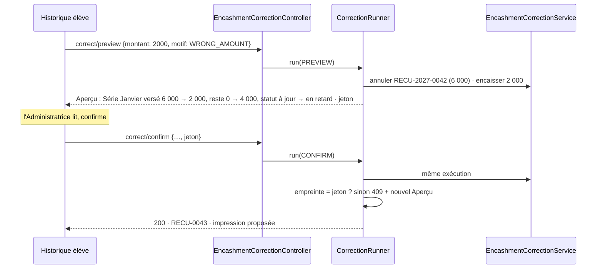

# Design Document — Corrections administrateur, étape 1

## Overview

L'étape 1 couvre les exigences 1 à 12. Elle repose sur quatre décisions structurantes :

1. **L'Encaissement devient une entité** (D2). Toute correction d'argent est une Annulation ou un
   Remplacement d'Encaissement ; plus aucune modification en place d'un montant reçu.
2. **Le cumul par Série devient un dérivé** des Imputations actives (D3), et cesse d'être réécrit
   par la somme des lignes de ventilation, qui effaçait de l'argent reçu.
3. **Une seule notion de Fenêtre_Inscription**, bornée par la Date_Inscription et la Date_Sortie,
   appliquée par le serveur à la Feuille_Appel, à l'écriture des présences et à la facturation (D5).
4. **Aperçu et confirmation passent par le même code** (D7) : l'Aperçu est la Correction exécutée
   puis annulée. Ce que l'Administratrice voit est, par construction, ce qui sera écrit.

Cible : installation sur site, en Docker, poste de l'école, fuseau `Africa/Algiers`.

## Décisions de conception

### D1 — Date calendaire, fuseau de la JVM

Les colonnes sont des `TIMESTAMP` sans fuseau : elles portent l'heure murale de la JVM. Date_Inscription
et Date_Sortie sont stockées à 00:00 du jour ; une comparaison d'instants avec une Séance devient
une comparaison de jours sans modifier le résolveur. La Date_Sortie est **incluse** : la
comparaison se fait contre le lendemain 00:00 exclu.

**Fuseau de la JVM — révisé en C.9.** Il venait de `TZ` dans le conteneur, réglé sur UTC par défaut :
un oubli imprimait un versement de 10:00 à 09:00 et datait de la veille ce qui se passe entre minuit
et une heure à Alger. Le plan était de comparer ce fuseau à `app.expected-timezone` et d'afficher un
bandeau rouge. Décision retenue avec le propriétaire produit : **l'application fixe elle-même son
fuseau** au démarrage, `app.timezone` (variable `APP_TIMEZONE`, `Africa/Algiers` par défaut), avant la
création de tout composant (`ApplicationTimeZone`, inscrit par `main`). Le risque disparaît au lieu
d'être signalé, et aucun écran n'en dépend. Une installation dans un autre pays change cette seule
valeur. Le fuseau appliqué, l'heure locale et le fuseau du système sont journalisés. Une valeur
inconnue empêche le démarrage en la nommant : elle ne peut venir que d'une saisie à l'installation,
où l'échec se voit tout de suite, alors qu'un repli sur Alger fausserait sans bruit toutes les heures
d'une école située ailleurs. Hors périmètre : la monnaie (« DA »), écrite en dur ; à rendre
réglable si une installation hors d'Algérie se présente.

### D2 — L'Encaissement, entité de premier rang

```
encashment
  id, receipt_number (unique), student_id, group_id, target_series_id,
  amount_received NUMERIC(12,2), payment_method, notes,
  received_at, received_by,
  status            ACTIVE | CANCELLED
  cancelled_at, cancelled_by, cancel_reason_type, cancel_reason_text,
  replaces_id, replaced_by_id,
  kind              REGULAR | CATCH_UP
```

`receipt_number` (`RECU-AAAA-NNNN`) vient d'un **compteur verrouillé**, et non du modèle
`RefundNumberService` (rang `MAX + 1`, rejeu sur collision). Ce rejeu ne peut pas réussir sur
PostgreSQL : la violation de contrainte interrompt la transaction, que Spring marque à annuler.

```
receipt_counter
  id = 1 (ck_receipt_counter_single), counter_year, last_rank >= 0
```

- `ReceiptNumberService.next` verrouille l'unique ligne (`PESSIMISTIC_WRITE`) dans la transaction de
  l'encaissement (`MANDATORY`) : deux encaissements simultanés sont numérotés l'un après l'autre.
- Un encaissement refusé, ou un Aperçu exécuté puis annulé, ne consomme aucun numéro.
- Le rang repart à 1 à chaque année civile. Une horloge revenue à une année antérieure est refusée
  (409) : repartir à 1 réattribuerait un numéro déjà remis à une famille.
- Au-delà de 9999, le rang s'écrit en entier, sans troncature. L'index unique reste un filet.

Le même défaut du rejeu existe dans `RefundService.saveWithNumber` : relevé, non corrigé ici.

Un Encaissement n'est jamais modifié sur ses champs monétaires (exigence 1.5). Mode de paiement
et note sont modifiables avec Trace (3.6) : ils n'entrent dans aucun calcul.

### D3 — Imputations et ventilation rattachées à l'Encaissement

```
encashment_allocation
  id, encashment_id, series_id, payment_id, amount NUMERIC(12,2),
  carried_over BOOLEAN, active BOOLEAN
payment_detail        + encashment_allocation_id
payment_carry_over    + encashment_allocation_id
payment_idempotency   + encashment_id
```

- **Qui désigne quoi.** Une ligne de ventilation et un report sont chacun une *part* d'une
  Imputation : ils la désignent, et l'Encaissement s'en déduit. Les relier aussi directement à
  l'Encaissement dupliquerait l'information, avec le risque de deux valeurs contradictoires.
  L'empreinte d'idempotence porte sur la requête entière : elle désigne l'Encaissement. Le rejeu
  relit ses Imputations, actives ou non, pour rendre la réponse d'origine même après annulation.
- **Rattrapage (1.7).** Même Encaissement (`kind = CATCH_UP`), même clé ; l'empreinte ajoute la
  séance payée (`payment_idempotency.session_id`) : deux rattrapages du même montant sur deux
  séances sont deux encaissements, et une clé passée d'un chemin à l'autre est réutilisée (409).
  Plafond : prix net de la séance et reste dû de la série ; aucun report.

- **Une ligne de ventilation par (Encaissement, Séance).** `distributeToSession` ne complète plus
  une ligne partagée : il crée la ligne de l'Encaissement courant, plafonnée à ce qui reste dû sur
  la Séance **au prix net** (1.6). Une Séance peut donc porter plusieurs lignes, une par
  Encaissement ; `findByPaymentIdAndSessionId` (Optional) est remplacé par la somme des lignes
  actives de la séance (`sumActiveAmountForPaymentAndSession`), et ses lecteurs somment. Le prix
  net a une seule définition, `PaymentQuoteService.netPricePerSession`. Une ligne garde la date de
  son Encaissement : une mise à jour ne la redate plus.
- **Le cumul `payments.amount_paid` = Σ Imputations actives de la Série.** Il est recalculé à
  chaque écriture d'Imputation, jamais depuis la ventilation (défaut 2). `recalculatePayment`
  délègue à `EncashmentService.refreshSeriesCumul` : le cumul reste celui des Imputations, seul
  le statut peut bouger. Aucun autre point d'entrée n'écrit le cumul (`POST /api/payments`
  retiré en A.6).
- **Neutraliser un Encaissement** = désactiver ses Imputations, ses lignes de ventilation et ses
  reports, puis recalculer les cumuls et statuts des Séries touchées.

Lecteurs inchangés : `PaymentCostResolver`, devis, statut, relevés lisent le cumul, qui garde sa
signification. Le registre des paiements reste la source des montants ; la ventilation reste une
répartition indicative par Séance.

### D4 — Correction d'un Encaissement = Remplacement indivisible

```
correct(encashmentId, changes, reason, previewToken)
  └─ une transaction
       1. annuler l'original (D3, neutralisation)
       2. encaisser le remplacement par le chemin ordinaire (plan, plafond, report, année)
       3. relier replaces_id / replaced_by_id
       4. Traces
```

Le chemin ordinaire d'encaissement est réutilisé tel quel : aucune règle d'encaissement n'est
dupliquée. Si le plan refuse le remplacement, l'exception annule la transaction, donc l'Annulation
aussi (3.5). Réutiliser le chemin ordinaire garantit que corriger « 20 000 → 2 000 » produit
exactement ce qu'aurait produit un encaissement correct de 2 000 : c'est la propriété P2.

Refus d'Annulation si le cumul passait sous le total remboursé de la Série (2.4) : les
remboursements restent rattachés au cumul, dont ils bornent la diminution. Pour un Remplacement,
le plancher se juge sur l'état final : un remplacement sur la même Série peut rendre ce que
l'annulation retirait.

Précisions (B.4) : la correction reçoit l'état voulu complet ; seuls le mode et la note changés,
elle corrige en place (3.6), sinon elle remplace. Quand l'élève change, une seconde Trace au nom du
nouvel élève alimente son Journal. Un Encaissement de rattrapage ne se remplace pas : il ne garde
pas la séance payée, que le chemin de rattrapage exige ; il s'annule puis se ré-encaisse.

### D5 — Fenêtre_Inscription

```
student_groups  + date_left DATE-like TIMESTAMP (00:00), nullable
```

`EnrolmentWindow.contains(enrolment, sessionDate)` :
`dateAssigned <= jour(séance) AND (dateLeft IS NULL OR jour(séance) <= dateLeft)`.

| Lecteur | Avant | Après |
|---|---|---|
| Feuille_Appel | inscriptions actives, `dateAssigned <= séance` | inscriptions dont la fenêtre contient la séance, actives ou clôturées (6.2) |
| Écriture d'une absence | aucun contrôle | refus hors fenêtre (7.3) |
| `BillableSessionsResolverImpl` | inscription **active** seulement | toutes les inscriptions au groupe, closes comprises ; facturable = dans une fenêtre, ou suivie |
| `GroupRevenueService` (relevé de groupe) | inscrits actifs | tous les étudiants passés par le groupe |
| Rattrapage (`CatchUpBillingQualifierImpl`, routage) | inscriptions actives | inchangé à l'étape 1 |

Le changement du résolveur est le premier des deux changements de calcul assumés dans les
exigences. `removeStudentFromGroup` (clôture sans date) devient la clôture avec Date_Sortie.
Une inscription inactive porte donc toujours une Date_Sortie : aucune n'est créée sans elle.

Précisions (C.1, C.2) :

- La colonne arrive en **V8** : V6 et V7 sont celles du lot A. V8 porte aussi l'invariant :
  `date_left >= date_assigned`, et close si et seulement si datée.
- `EnrolmentWindow` est une valeur (`domain/valueobject`) : `enrolment.window().contains(date)`.
  L'entité ramène ses deux dates à 00:00 à chaque écriture, pas seulement le service : la
  comparaison en jours ne dépend d'aucun appelant.
- Un étudiant qui revient dans un groupe quitté reçoit une **nouvelle** inscription. Rouvrir
  l'ancienne (6.5) sert à annuler un départ saisi par erreur : sur un vrai retour, elle étendrait
  la fenêtre sur l'intervalle d'absence, et ses séances le concerneraient. Deux fenêtres d'un même
  groupe ne se recouvrent jamais (409 à l'inscription).
- Le départ par `DELETE` était daté du jour même, sans Motif ni Aperçu, en attendant C.6 ; il est
  retiré en C.8, le départ passant par la correction avec Motif et Aperçu.

Précisions (C.6) : arrivée, départ et réouverture sont une seule correction de la fenêtre,
`POST /api/enrolments/{id}/arrival|departure|reopen/{preview|confirm}` ; ses conséquences se
lisent en comparant la période avant et après, séance par séance. La confirmation explicite du
maintien des présences hors période (5.6) est celle de l'Aperçu, qui les liste : le jeton change si
la liste change. Un départ futur dans l'année est admis, l'étudiant reste attendu jusqu'à ce jour.

Précisions (C.5) : le résolveur lit toutes les inscriptions de l'étudiant au groupe et rend les
séances que contient une fenêtre (`withinEnrolmentSessionIds`), dont l'historique tire son motif.
« Membre de la série » (`enrolled`) garde l'inscription active comme critère suffisant — une série
entière antérieure à l'arrivée reste affichée, séances écartées — et y ajoute une fenêtre close qui
touche la série. Le relevé de groupe compte tous les étudiants passés par le groupe.

Précisions (C.4) : `AbsenceWindowGuard` juge toute ligne qui n'est pas une présence, sur la
feuille de présence, la présence unitaire et la modification d'une séance pointée — déplacer une
séance d'un jour ou d'un groupe change qui elle concerne. Refus 409 entier, corps `rejected`.

Précisions (C.3) : la Feuille_Appel est `GET /api/sessions/{id}/roll-call`. Elle est désignée par
la Séance et non par un groupe et une date : le jour d'une Séance se lit dans le fuseau qui a écrit
les dates d'inscription, que le navigateur ne connaît pas. Elle renvoie aussi les étudiants du
groupe non concernés, avec leurs fenêtres : une feuille vide s'explique au lieu d'être complétée.

### D6 — Déplacement de ventilation, jamais d'argent

Quand une correction de date rend non facturable une Séance ventilée (5.9), ses lignes de
ventilation sont redistribuées sur les Séances facturables **de la même Série et du même
Encaissement**. Aucun montant ne change de Série ni d'Encaissement : le cumul, le montant dû et le
statut sont inchangés, seule la répartition affichée bouge. Si la Série n'a plus assez de Séances
facturables, le reliquat reste non ventilé et l'Aperçu annonce le trop-perçu ; le traiter (report,
remboursement) reste une décision explicite, par les outils existants.

Cela remplace la décision précédente de refuser la correction : l'outil vers lequel on renvoyait
ne savait pas déplacer d'argent, seulement le supprimer du registre.

### D7 — Aperçu = exécution puis annulation

Chaque Correction a deux points d'entrée, `…/preview` et `…/confirm`, servis par la même méthode :

```java
<T> CorrectionOutcome<T> run(CorrectionCommand command, Mode mode)   // PREVIEW | CONFIRM
```

1. Photographier les montants des Séries susceptibles d'être touchées (`PaymentCostResolver`,
   `PaymentQuoteService`).
2. Exécuter la Correction.
3. Photographier de nouveau les mêmes Séries, plus celles que la Correction a touchées.
4. Construire l'Aperçu : écarts de montants, et effets listés (Imputations neutralisées, absences
   retirées, Séances devenues facturables, ventilation déplacée).
5. `PREVIEW` : annuler la transaction, renvoyer l'Aperçu et son jeton, empreinte SHA-256 de
   l'Aperçu canonique. `CONFIRM` : comparer l'empreinte à celle fournie ; différente → annuler et
   renvoyer 409 avec le nouvel Aperçu (4.3) ; identique → valider.

Une seule implémentation pour l'Aperçu et l'écriture : l'Aperçu ne peut pas mentir, et aucune
règle n'est codée deux fois. Le jeton n'est pas stocké : l'Aperçu lui-même fait preuve. Les numéros
de reçu consommés par une exécution annulée ne sont pas réservés : la séquence est recalculée à la
confirmation.

Précisions (B.1) :

- **Portée déclarée avant d'écrire.** La commande déclare les Séries, ou les groupes entiers quand un
  report peut atteindre des Séries suivantes, qu'elle peut toucher. Une Série touchée hors portée
  n'aurait pas d'état « avant » : le runner refuse la correction.
- **Le jeton lie l'Aperçu à la commande.** L'empreinte couvre la description canonique de la commande
  (type et paramètres) en plus des montants et des effets : un jeton obtenu pour annuler un reçu ne
  confirme pas l'annulation d'un autre reçu au même Aperçu. Les effets ne citent donc que des valeurs
  stables d'une exécution à l'autre — jamais un identifiant, un numéro de reçu attribué pendant
  l'exécution ou une date du jour.
- **Une transaction à lui.** Le runner refuse d'être appelé dans une transaction ouverte, et force
  l'écriture avant la mesure « après » : une correction que la base refuserait échoue dès l'Aperçu,
  et non à la confirmation.

### D8 — Trace commune et lisible

```
correction_audit
  id, domain, action, entity_id, student_id, group_id, session_id, series_id,
  old_value, new_value,            -- valeurs structurées (JSON texte), pour la machine
  summary  VARCHAR(500),           -- phrase en français, pour l'Administratrice (12.2)
  amount_effect VARCHAR(500),      -- « dû 6 000,00 → 4 000,00 DA » ou vide (12.3)
  reason_type, reason_text,
  performed_by, performed_at
```

- `summary` est rédigé **à l'écriture**, quand toutes les données sont disponibles : une Trace
  reste lisible même si la Séance ou l'Encaissement a disparu ensuite.
- **Qui écrit la Trace (B.2).** La correction rédige sa Trace (`AuditDraft`) ; le
  `CorrectionRunner` l'écrit, une fois l'Aperçu mesuré, avec `amount_effect` tiré des Séries
  changées de l'étudiant de la Trace. L'effet sur les montants n'est connu qu'après la mesure :
  la correction ne peut pas l'écrire elle-même. Une correction sans Trace n'a rien changé, et
  elle est refusée (11.3). Sans utilisateur authentifié, la correction est refusée : une Trace
  signée « system » ne dirait pas qui a corrigé.
- **Le rang est l'identifiant** (colonne d'identité), et non une séquence à part : attribué par
  la base, strictement croissant dans l'ordre des écritures, sans course (11.4). Une séquence
  dédiée n'apporterait rien de plus, et une valeur par défaut `nextval` n'existerait pas dans le
  schéma H2 des tests, généré depuis les entités.
- Pas de clé étrangère : la Trace survit à la donnée (11.6).
- Les trois tables d'audit existantes ne sont pas migrées. Le Journal les lit par un adaptateur qui
  rédige leurs entrées en français. Pour `payment_detail_audit`, dont les valeurs sont des chaînes
  techniques (`PaymentDetail{id=…, amountPaid=…}`), l'adaptateur relit la ligne et la Séance ; si
  elles ont disparu, il affiche le montant extrait et « séance supprimée ».

### D9 — Retrait d'une présence de rattrapage

Deux verrous empêchent aujourd'hui de rattraper de nouveau une Séance manquée :
`existsByStudentIdAndMissedSessionIdAndActiveTrue` (une présence active la compense déjà) et
`getEligibleAbsences`, qui écarte toute absence portant une demande de rattrapage non annulée.
Retirer la présence de rattrapage (exigence 9) doit lever les deux, dans la même transaction :

1. désactiver la présence de rattrapage ;
2. passer la demande de rattrapage qui l'a produite à `CANCELLED`, si elle existe ;
3. écrire la Trace avec la Séance manquée et la décision « déjà payée » qu'elle portait (9.3).

L'absence d'origine redevient alors éligible, et son droit au rattrapage n'a jamais été touché.
Les deux montants concernés — Série d'accueil et Série d'origine — figurent dans l'Aperçu : un
rattrapage compensatoire comptait la Séance manquée comme suivie dans sa Série d'origine.

Précisions (D.2) : le retrait passe par le même point d'entrée que celui d'une ligne ordinaire, le
serveur reconnaissant le rattrapage. La demande annulée est celle qui a produit la présence : même
séance d'accueil, même séance manquée (si la présence en désigne une), statut non annulé ; une
demande `COMPLETED` passe directement à `CANCELLED`, ce que l'annulation ordinaire d'une demande
refuse. La séance d'accueil n'a pas à être validée. Seule la série d'accueil peut perdre une séance
facturable, donc sa ventilation ; à l'origine, la séance manquée reste facturable et seul le dû à
ce jour baisse.

Précisions (D.1) — corriger une présence :

- **Trois corrections**, une ligne d'une Séance validée à la fois : présent ↔ absent (justification
  fixée dans la même action, effacée et tracée au passage à présent), ajout d'une ligne manquante,
  retrait par désactivation. Retrait distinct du changement : `POST /api/attendances/{id}/remove/…`.
- **Ajout réservé aux inscrits du groupe**, inscription active ou close : une présence après le
  départ est une séance consommée, facturée par la série du groupe. Un non-inscrit relève d'un
  rattrapage, et de sa demande : le classement « à préciser / facturé sur place » n'est pas refait ici.
- **Séance rattrapée ou en voie de l'être** (présence de rattrapage active qui la désigne, ou demande
  en attente ou planifiée) : elle ne peut devenir suivie ni perdre sa ligne. Le rattrapage
  compenserait une séance qui n'est plus manquée ; il se retire ou s'annule d'abord. Une absence
  ajoutée reste admise.
- **Justification** : la correction écrit `is_justified` et sa propre Trace (`correction_audit`), pas
  `attendance_justification_audit`, réservé à « Justifier » une absence existante. Le Journal (D.4)
  lit les deux sources.
- **Suites sur l'argent** : `SeriesSettlement`, partagé avec les corrections de dates — ventilation
  d'une séance devenue non facturable déplacée, statut stocké des lignes recalculé, trop-perçu
  annoncé.

Précisions (D.3) — dévalider une séance :

- **Une opération**, `POST /api/sessions/{id}/unvalidate/{preview|confirm}`, Motifs « Erreur de
  saisie » et « Autre » : toutes les lignes actives désactivées, la séance de nouveau à valider.
  Elle remplace deux appels sans Motif ni Trace (`PATCH …/unfinish`, puis `PATCH /api/attendances/
  deactivate/{id}`), dont le second pouvait échouer après le premier. Les suppressions définitives
  `DELETE /api/attendances/{id}` et `…/session/{id}` disparaissent avec eux (8.4).
- **Chaque ligne suit sa correction** : une ligne ordinaire comme un retrait (D.1), un rattrapage
  accueilli comme en D.2 — demande annulée, séance d'origine de nouveau à rattraper, groupe
  d'origine dans l'Aperçu. Une absence rattrapée ailleurs, ou dont une demande est en cours, bloque
  tout (409) : le rattrapage se retire d'abord. Une ligne héritée sans étudiant est désactivée avec
  la feuille.
- **Traces** : une pour la séance, en tête, qui liste chaque ligne telle qu'elle était (élève,
  présent, justifié, rattrapage) et les identifiants désactivés ; une par ligne, pour le Journal de
  chaque élève. Lignes rangées par nom, pour un Aperçu et un jeton stables.
- **Année close (10.2)** : dévalider, enregistrer une feuille ou une présence isolée, valider une
  séance — tous refusés (409) avant écriture.

### D10 — Motif

`CorrectionReasonType` : `DATA_ENTRY_ERROR`, `DOCUMENT_RECEIVED`, `ARRIVAL_DATE_CORRECTED`,
`STUDENT_LEFT`, `WRONG_STUDENT`, `WRONG_AMOUNT`, `OTHER`. Chaque type de Correction expose la
sous-liste pertinente ; `OTHER` exige un texte (11.1, 11.2).

## Architecture

```
controller/
  EncashmentController             GET  /api/encashments/{id}                 (reçu, réimpression)
                                   GET  /api/students/{id}/encashments        (historique, A.8)
controller/correction/
  EncashmentCorrectionController   GET  /api/encashments/correction-reasons   (Motifs proposés, B.5)
                                   POST /api/encashments/{id}/cancel/{preview|confirm}
                                   POST /api/encashments/{id}/correct/{preview|confirm}
                                        (mode et note seuls : corrigés en place, sans
                                        Remplacement ni nouveau reçu — B.4)
  EnrolmentCorrectionController    GET  /api/enrolments/correction-reasons     (Motifs par correction)
                                   POST /api/enrolments/{id}/arrival/{preview|confirm}
                                   POST /api/enrolments/{id}/departure/{preview|confirm}
                                   POST /api/enrolments/{id}/reopen/{preview|confirm}
  AttendanceCorrectionController   GET  /api/attendances/correction-reasons     (Motifs proposés)
                                   POST /api/attendances/{id}/correct/{preview|confirm}
                                   POST /api/attendances/{id}/remove/{preview|confirm}
                                   POST /api/sessions/{id}/attendances/add/{preview|confirm}
                                   POST /api/sessions/{id}/unvalidate/{preview|confirm}
  CorrectionJournalController      GET  /api/students/{id}/journal?from&to
service/correction/
  CorrectionRunner                 D7 : exécution, photographie, Aperçu, jeton
  AmountSnapshot                   montants d'une Série à un instant
  CorrectionAuditService           D8
  CorrectionReason                 D10
  EnrolmentWindow                  D5, D1
  EncashmentCorrectionService      exigences 2, 3
  EnrolmentCorrectionService       exigences 5, 6
  AttendanceCorrectionService      exigences 8, 9, 10
  VentilationMover                 D6
  CorrectionJournalService         exigence 12, adaptateurs des audits existants
service/payment/
  EncashmentService                création, imputation, neutralisation (D2, D3) ; mécanique
                                   seule, les gardes métier d'une annulation sont au lot B
  ReceiptNumberService             compteur verrouillé RECU-AAAA-NNNN (D2)
  PaymentLineStatus                statut stocké d'une ligne de paiement, partagé avec
                                   recalculatePayment (A.6)
  PaymentProcessingService         encaisse via EncashmentService
  PaymentDistributionService       ventilation par Encaissement, prix net
```

Contrôleurs minces. Toutes les écritures sont des `POST`/`PATCH` sous `/api/**`, déjà réservés au
rôle ADMIN par `SecurityConfig` (11.7). Les `preview` sont des `POST` : ils exécutent une écriture
annulée, et doivent être refusés au rôle VIEWER comme une écriture.

## Flux principaux

### Corriger un Encaissement (exigence 3)



### Avancer une date d'arrivée (exigence 5.7)

L'Aperçu liste les Séances validées devenues concernées sans Présence. Pour chacune,
l'Administratrice choisit présent, absent ou « laisser » ; « laisser » est annoncé comme
facturable. La confirmation enregistre la date et les Présences choisies en une transaction.

## Data Models — migrations

**Structure seulement, aucune donnée transformée** : la base est réinitialisée avant
l'installation chez le client (exigences, hors périmètre).

- **V6** (A.2) — tables `encashment`, `encashment_allocation`, `correction_audit` ; colonne
  `encashment_allocation_id` sur `payment_detail` et `payment_carry_over`, `encashment_id` sur
  `payment_idempotency`, **facultatives** ; contraintes de cohérence de l'Encaissement (montant
  positif, annulation datée et motivée, remplacé forcément annulé, motif « Autre » avec texte).
- **V7** (A.6) — ces trois colonnes deviennent **`NOT NULL`**. Une ligne de ventilation, un report
  ou une empreinte sans Encaissement devient impossible par construction : l'invariant 1.3 porté
  par le stockage, possible parce qu'aucune ligne ancienne n'est à reprendre.
- **V8** (C.1) — colonne `student_groups.date_left`, facultative ; contraintes : fenêtre ordonnée
  (`date_left >= date_assigned`) et inscription close si et seulement si datée.

**Pourquoi deux migrations et non une.** Le code n'écrit ces liens qu'à partir de A.4 et A.5.
Des colonnes obligatoires dès V6 feraient échouer tout encaissement dans l'intervalle, donc la
suite de tests, que chaque tâche doit laisser verte. V7 est livrée avec le code qui les écrit.

**Vérification.** La suite de tests tourne sur H2, Flyway désactivé : le SQL des migrations n'y
est jamais exécuté. `MigrationSchemaPostgresIntegrationTest` applique toutes les migrations à une
base PostgreSQL jetable, valide chaque entité contre le schéma obtenu (Hibernate `validate`), puis
éprouve les contraintes en SQL. Il est ignoré, en le disant, si aucun PostgreSQL n'est joignable.

Conséquence pratique : V6 ne fait qu'ajouter et s'applique sur la base de développement locale
telle quelle. V7 échouera en revanche sur les lignes de paiement existantes sans Encaissement :
la base locale doit être réinitialisée avant de lancer A.6.

## Frontend

| Écran | Changement |
|---|---|
| Fiche élève, panneau « Versements » | liste des **Encaissements** (reçu, date, montant, Série, statut) ; actions « annuler », « corriger », « réimprimer » ; lien « remplace / remplacé par ». Le relevé par Série et par Séance reste dans le dialogue « Historique des paiements » : il porte la facturation séance par séance |
| Dialogue de paiement | reçu imprimé avec le `receipt_number` renvoyé par le serveur |
| Réimpression | tampon « ANNULÉ » et renvoi vers le reçu de remplacement |
| Fiche élève, groupes | date d'arrivée et date de départ ; « corriger l'arrivée », « enregistrer le départ », « rouvrir » |
| `session-modal` | Feuille_Appel serveur sans repli ; lignes refusées retirables en un clic ; sur Séance validée, « corriger » par élève et « ajouter un élève » ; dévalidation avec motif |
| Composant commun `CorrectionPreviewDialog` | Aperçu avant/après par Série, effets listés, sélection du Motif, confirmation |
| Fiche élève, journal | entrées en français, effet sur le dû, impression par période |

Le composant d'Aperçu est unique : toutes les Corrections présentent leur effet de la même façon
(11, « ne pas apprendre une règle par écran »).

Précisions (B.7) : `CorrectionPreviewComponent` affiche l'Aperçu ; `CorrectionDialogComponent` mène
la correction (Motif, Aperçu, confirmation, reprise sur un Aperçu périmé) sans rien connaître d'elle
qu'une fonction `run(step, motif, jeton)`. Corriger un Encaissement enchaîne deux dialogues — la
saisie de l'état voulu, puis l'Aperçu, avec « Modifier » pour revenir à la saisie ; annuler ouvre
directement l'Aperçu.

Précisions (C.8) :

- **Séances à noter depuis l'Aperçu (5.7).** Un effet peut désigner une séance
  (`CorrectionEffect.sessionId`) : séance validée entrée dans la période sans présence, ou présence
  notée à sa place. Le dialogue y propose « Sans présence (facturée) / Présent / Absent » ;
  `run(step, motif, jeton, présences)` porte les choix. Le jeton les couvre : en changer redemande
  l'Aperçu. L'Aperçu ne décide rien : il rend, à côté de chaque effet, le gabarit que lui confie
  l'hôte (`effectAction`).
- **Inscriptions.** La fiche élève liste les inscriptions de l'année, closes comprises
  (`GET /api/student-groups/{id}/enrolments`). Arrivée, départ, réouverture passent par
  `EnrolmentCorrectionFlow` : saisie de la date, puis le dialogue commun. La fiche groupe
  « enregistre le départ » par le même chemin ; le retrait sec (`DELETE`) n'existe plus.
- **Jours.** Toute date d'inscription est un jour `yyyy-MM-dd`, saisi par un champ `date` natif et
  envoyé tel quel ; `calendarDayOf` donne le jour local, jamais `toISOString()`, qui donne la veille
  avant 1 h du matin à Alger.
- **Feuille refusée (7.5).** La validation garde les lignes du 409 `ABSENCE_OUTSIDE_WINDOW` ;
  « Retirer ces lignes » les ôte de la feuille, la validation se refait.

Précisions (D.3) : « Dévalider la séance » ouvre le dialogue commun (Motifs lus sur
`GET /api/sessions/unvalidation-reasons`). Confirmée, la modale reste ouverte et recharge la feuille
du serveur, cochée par défaut : on dévalide pour refaire la feuille. L'état est aussi écrit sur les
données de la modale, que le calendrier et la liste d'une série relisent à la fermeture, quelle
qu'elle soit (bouton, Échap, clic au dehors). `correctionErrorOf` met en commun la lecture d'un refus
de correction.

## Error Handling

`CustomServiceException` avec statut explicite ; aucun 500 pour un cas métier. Corps
`{ "message": … }`, enrichi de `preview` (409 d'Aperçu périmé), `rejected` (validation refusée),
`blockingRefund` (2.4).

## Correctness Properties

Sur H2 réel, jqwik, vérifiées par mutation comme `JustificationNeutralityPropertyTest`.

- **P1 — Conservation de l'argent.** Pour toute suite d'Encaissements, d'Annulations et de
  Remplacements, le cumul de chaque Série vaut la somme des Imputations actives, et la somme des
  Encaissements actifs vaut la somme des cumuls. Aucune correction ne crée ni ne détruit d'argent
  reçu. (1.4, 2.2)
- **P2 — Remplacer équivaut à avoir bien saisi.** Remplacer le dernier Encaissement A par B donne
  les mêmes montants, reports, statuts et ventilation qu'un jeu de données où B aurait été encaissé
  à la place de A, et l'un est refusé si et seulement si l'autre l'est (P2a). Pour un A quelconque,
  remplacer équivaut à annuler A puis encaisser B (P2b) : un remplacement ne recalcule pas la
  répartition des versements postérieurs à A, qui a pu dépendre de lui. (3.2, 3.4)
- **P3 — Indivisibilité.** Toute Correction refusée ou échouée laisse Encaissements, Imputations,
  ventilation, Présences, dates et Traces inchangés. (3.5, 5.8, 11.5)
- **P4 — L'Aperçu ne ment pas.** Pour toute Correction, les montants après confirmation sont ceux
  annoncés par l'Aperçu. (4.3)
- **P5 — Fenêtre respectée.** Aucun point d'entrée ne laisse subsister une absence active hors
  Fenêtre_Inscription ; une Séance de la fenêtre validée après le départ fait figurer l'Étudiant
  sur la Feuille_Appel. (6.2, 7.1, 7.3)
- **P6 — Déplacer la ventilation ne change aucun montant.** (5.9, D6)
- **P7 — Une Trace par changement effectif**, aucune sur refus ou sans changement, rangs
  strictement croissants. (11.3 à 11.5)

Plus des tests HTTP de bout en bout (statuts, corps, absence d'écriture après refus, 403 VIEWER sur
chaque `preview` et `confirm`), et des tests Karma des composants d'Aperçu et de correction.

## Mise à jour chez le client

L'installation initiale part d'une base vide. La procédure ci-dessous sert aux mises à jour
**suivantes**, dès que l'école aura saisi de vraies données — à commencer par l'étape 2 :

1. sauvegarde (`pg_dump` depuis le conteneur, fichier daté sur le poste et sur clé USB) ;
2. `docker compose pull` / `build`, puis `up` ;
3. vérification du fuseau (ligne « Fuseau de l'école » du journal) et des migrations ;
4. retour arrière documenté : restauration de la sauvegarde et image précédente.

Un script `mise-a-jour.ps1` enchaîne ces étapes sur le Mini PC Windows.

## Risques

- **Ventilation multiple par Séance** (D3) : tout lecteur qui suppose une ligne unique par
  (paiement, Séance) doit être revu. Inventaire établi en A.1 (`tasks.md`).
- **Volume** : l'étape 1 est plus grosse que prévu. Le plan la livre en quatre lots indépendants,
  chacun déployable.
