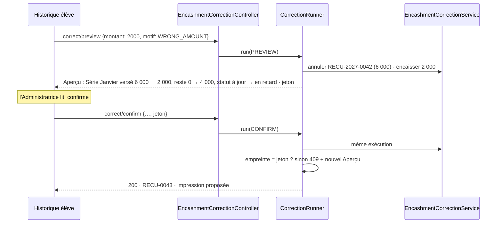

# Design Document — Corrections administrateur, étape 1

## Overview

L'étape 1 couvre les exigences 1 à 12. Elle repose sur quatre décisions structurantes :

1. **L'Encaissement devient une entité** (D2). Toute correction d'argent est une Annulation ou un
   Remplacement d'Encaissement ; plus aucune modification en place d'un montant reçu.
2. **Le cumul par Série devient un dérivé** des Imputations actives (D3), et cesse d'être réécrit
   par la somme des lignes de ventilation, qui effaçait de l'argent reçu.
3. **Une seule notion de Fenêtre_Inscription**, bornée par la Date_Inscription et la Date_Sortie,
   appliquée par le serveur à la Feuille_Appel, à l'écriture des présences et à la facturation (D5).
4. **Aperçu et confirmation passent par le même code** (D7) : l'Aperçu est la Correction exécutée
   puis annulée. Ce que l'Administratrice voit est, par construction, ce qui sera écrit.

Cible : installation sur site, en Docker, poste de l'école, fuseau `Africa/Algiers`.

## Décisions de conception

### D1 — Date calendaire, fuseau de la JVM

Les colonnes sont des `TIMESTAMP` sans fuseau : elles portent l'heure murale de la JVM, fixée par
`TZ` dans le conteneur (`Africa/Algiers`, corrigé depuis `Europe/Paris` sur `main`). Date_Inscription
et Date_Sortie sont stockées à 00:00 du jour ; une comparaison d'instants avec une Séance devient
une comparaison de jours sans modifier le résolveur. La Date_Sortie est **incluse** : la
comparaison se fait contre le lendemain 00:00 exclu.

Au démarrage, le fuseau effectif est journalisé. S'il diffère de `app.expected-timezone`, le
Système démarre quand même et affiche à l'Administrateur un bandeau rouge persistant. Une
application qui ne démarre pas sur le poste du client est pire qu'une heure décalée : il ne sait
pas lire les journaux Docker.

### D2 — L'Encaissement, entité de premier rang

```
encashment
  id, receipt_number (unique), student_id, group_id, target_series_id,
  amount_received NUMERIC(12,2), payment_method, notes,
  received_at, received_by,
  status            ACTIVE | CANCELLED
  cancelled_at, cancelled_by, cancel_reason_type, cancel_reason_text,
  replaces_id, replaced_by_id,
  kind              REGULAR | CATCH_UP
```

`receipt_number` suit le modèle éprouvé de `RefundNumberService` (`REMB-AAAA-NNNN`) : rang extrait
des numéros existants de l'année civile, contrainte unique, trois tentatives sur collision.
Préfixe `RECU-`.

Un Encaissement n'est jamais modifié sur ses champs monétaires (exigence 1.5). Mode de paiement
et note sont modifiables avec Trace (3.6) : ils n'entrent dans aucun calcul.

### D3 — Imputations et ventilation rattachées à l'Encaissement

```
encashment_allocation
  id, encashment_id, series_id, payment_id, amount NUMERIC(12,2),
  carried_over BOOLEAN, active BOOLEAN
payment_detail        + encashment_id, + encashment_allocation_id
payment_carry_over    + encashment_id
payment_idempotency   + encashment_id
```

- **Une ligne de ventilation par (Encaissement, Séance).** `distributeToSession` ne complète plus
  une ligne partagée : il crée la ligne de l'Encaissement courant, plafonnée à ce qui reste dû sur
  la Séance **au prix net** (1.6). Une Séance peut donc porter plusieurs lignes, une par
  Encaissement ; `findByPaymentIdAndSessionId` (Optional) devient une liste, et ses lecteurs somment.
- **Le cumul `payments.amount_paid` = Σ Imputations actives de la Série.** Il est recalculé à
  chaque écriture d'Imputation, jamais depuis la ventilation (défaut 2). `recalculatePayment`
  ne recalcule plus que le statut.
- **Neutraliser un Encaissement** = désactiver ses Imputations, ses lignes de ventilation et ses
  reports, puis recalculer les cumuls et statuts des Séries touchées.

Lecteurs inchangés : `PaymentCostResolver`, devis, statut, relevés lisent le cumul, qui garde sa
signification. Le registre des paiements reste la source des montants ; la ventilation reste une
répartition indicative par Séance.

### D4 — Correction d'un Encaissement = Remplacement indivisible

```
correct(encashmentId, changes, reason, previewToken)
  └─ une transaction
       1. annuler l'original (D3, neutralisation)
       2. encaisser le remplacement par le chemin ordinaire (plan, plafond, report, année)
       3. relier replaces_id / replaced_by_id
       4. Traces
```

Le chemin ordinaire d'encaissement est réutilisé tel quel : aucune règle d'encaissement n'est
dupliquée. Si le plan refuse le remplacement, l'exception annule la transaction, donc l'Annulation
aussi (3.5). Réutiliser le chemin ordinaire garantit que corriger « 20 000 → 2 000 » produit
exactement ce qu'aurait produit un encaissement correct de 2 000 : c'est la propriété P2.

Refus d'Annulation si le cumul passait sous le total remboursé de la Série (2.4) : les
remboursements restent rattachés au cumul, dont ils bornent la diminution.

### D5 — Fenêtre_Inscription

```
student_groups  + date_left DATE-like TIMESTAMP (00:00), nullable
```

`EnrolmentWindow.contains(enrolment, sessionDate)` :
`dateAssigned <= jour(séance) AND (dateLeft IS NULL OR jour(séance) <= dateLeft)`.

| Lecteur | Avant | Après |
|---|---|---|
| Feuille_Appel | inscriptions actives, `dateAssigned <= séance` | inscriptions dont la fenêtre contient la séance, actives ou clôturées (6.2) |
| Écriture d'une absence | aucun contrôle | refus hors fenêtre (7.3) |
| `BillableSessionsResolverImpl` | inscription **active** seulement | inscription dont la fenêtre recoupe la Série ; facturable = dans la fenêtre, ou suivie |
| Rattrapage (`CatchUpBillingQualifierImpl`, routage) | inscriptions actives | inchangé à l'étape 1 |

Le changement du résolveur est le premier des deux changements de calcul assumés dans les
exigences. `removeStudentFromGroup` (clôture sans date) devient la clôture avec Date_Sortie.
Une inscription inactive porte donc toujours une Date_Sortie : aucune n'est créée sans elle.

### D6 — Déplacement de ventilation, jamais d'argent

Quand une correction de date rend non facturable une Séance ventilée (5.9), ses lignes de
ventilation sont redistribuées sur les Séances facturables **de la même Série et du même
Encaissement**. Aucun montant ne change de Série ni d'Encaissement : le cumul, le montant dû et le
statut sont inchangés, seule la répartition affichée bouge. Si la Série n'a plus assez de Séances
facturables, le reliquat reste non ventilé et l'Aperçu annonce le trop-perçu ; le traiter (report,
remboursement) reste une décision explicite, par les outils existants.

Cela remplace la décision précédente de refuser la correction : l'outil vers lequel on renvoyait
ne savait pas déplacer d'argent, seulement le supprimer du registre.

### D7 — Aperçu = exécution puis annulation

Chaque Correction a deux points d'entrée, `…/preview` et `…/confirm`, servis par la même méthode :

```java
<T> CorrectionOutcome<T> run(CorrectionCommand command, Mode mode)   // PREVIEW | CONFIRM
```

1. Photographier les montants des Séries susceptibles d'être touchées (`PaymentCostResolver`,
   `PaymentQuoteService`).
2. Exécuter la Correction.
3. Photographier de nouveau les mêmes Séries, plus celles que la Correction a touchées.
4. Construire l'Aperçu : écarts de montants, et effets listés (Imputations neutralisées, absences
   retirées, Séances devenues facturables, ventilation déplacée).
5. `PREVIEW` : annuler la transaction, renvoyer l'Aperçu et son jeton, empreinte SHA-256 de
   l'Aperçu canonique. `CONFIRM` : comparer l'empreinte à celle fournie ; différente → annuler et
   renvoyer 409 avec le nouvel Aperçu (4.3) ; identique → valider.

Une seule implémentation pour l'Aperçu et l'écriture : l'Aperçu ne peut pas mentir, et aucune
règle n'est codée deux fois. Le jeton n'est pas stocké : l'Aperçu lui-même fait preuve. Les numéros
de reçu consommés par une exécution annulée ne sont pas réservés : la séquence est recalculée à la
confirmation.

### D8 — Trace commune et lisible

```
correction_audit
  id, domain, action, entity_id, student_id, group_id, session_id, series_id,
  old_value, new_value,            -- valeurs structurées (JSON texte), pour la machine
  summary  VARCHAR(500),           -- phrase en français, pour l'Administratrice (12.2)
  amount_effect VARCHAR(500),      -- « dû 6 000,00 → 4 000,00 DA » ou vide (12.3)
  reason_type, reason_text,
  performed_by, performed_at,
  sequence_rank BIGINT DEFAULT nextval('correction_audit_rank_seq')
```

- `summary` est rédigé **à l'écriture**, quand toutes les données sont disponibles : une Trace
  reste lisible même si la Séance ou l'Encaissement a disparu ensuite.
- Rang tiré d'une séquence de base : strictement croissant, sans course (11.4).
- Pas de clé étrangère : la Trace survit à la donnée (11.6).
- Les trois tables d'audit existantes ne sont pas migrées. Le Journal les lit par un adaptateur qui
  rédige leurs entrées en français. Pour `payment_detail_audit`, dont les valeurs sont des chaînes
  techniques (`PaymentDetail{id=…, amountPaid=…}`), l'adaptateur relit la ligne et la Séance ; si
  elles ont disparu, il affiche le montant extrait et « séance supprimée ».

### D9 — Retrait d'une présence de rattrapage

Deux verrous empêchent aujourd'hui de rattraper de nouveau une Séance manquée :
`existsByStudentIdAndMissedSessionIdAndActiveTrue` (une présence active la compense déjà) et
`getEligibleAbsences`, qui écarte toute absence portant une demande de rattrapage non annulée.
Retirer la présence de rattrapage (exigence 9) doit lever les deux, dans la même transaction :

1. désactiver la présence de rattrapage ;
2. passer la demande de rattrapage qui l'a produite à `CANCELLED`, si elle existe ;
3. écrire la Trace avec la Séance manquée et la décision « déjà payée » qu'elle portait (9.3).

L'absence d'origine redevient alors éligible, et son droit au rattrapage n'a jamais été touché.
Les deux montants concernés — Série d'accueil et Série d'origine — figurent dans l'Aperçu : un
rattrapage compensatoire comptait la Séance manquée comme suivie dans sa Série d'origine.

### D10 — Motif

`CorrectionReasonType` : `DATA_ENTRY_ERROR`, `DOCUMENT_RECEIVED`, `ARRIVAL_DATE_CORRECTED`,
`STUDENT_LEFT`, `WRONG_STUDENT`, `WRONG_AMOUNT`, `OTHER`. Chaque type de Correction expose la
sous-liste pertinente ; `OTHER` exige un texte (11.1, 11.2).

## Architecture

```
controller/correction/
  EncashmentCorrectionController   POST /api/encashments/{id}/cancel/{preview|confirm}
                                   POST /api/encashments/{id}/correct/{preview|confirm}
                                   PATCH /api/encashments/{id}/details        (mode, note)
                                   GET  /api/encashments/{id}                 (reçu, réimpression)
  EnrolmentCorrectionController    POST /api/enrolments/{id}/arrival/{preview|confirm}
                                   POST /api/enrolments/{id}/departure/{preview|confirm}
  AttendanceCorrectionController   POST /api/attendances/{id}/correct/{preview|confirm}
                                   POST /api/sessions/{id}/attendances/add/{preview|confirm}
                                   POST /api/sessions/{id}/unvalidate/{preview|confirm}
  CorrectionJournalController      GET  /api/students/{id}/journal?from&to
service/correction/
  CorrectionRunner                 D7 : exécution, photographie, Aperçu, jeton
  AmountSnapshot                   montants d'une Série à un instant
  CorrectionAuditService           D8
  CorrectionReason                 D10
  EnrolmentWindow                  D5, D1
  EncashmentCorrectionService      exigences 2, 3
  EnrolmentCorrectionService       exigences 5, 6
  AttendanceCorrectionService      exigences 8, 9, 10
  VentilationMover                 D6
  CorrectionJournalService         exigence 12, adaptateurs des audits existants
service/payment/
  EncashmentService                création, numéro de reçu, neutralisation (D2, D3)
  PaymentProcessingService         encaisse via EncashmentService
  PaymentDistributionService       ventilation par Encaissement, prix net
```

Contrôleurs minces. Toutes les écritures sont des `POST`/`PATCH` sous `/api/**`, déjà réservés au
rôle ADMIN par `SecurityConfig` (11.7). Les `preview` sont des `POST` : ils exécutent une écriture
annulée, et doivent être refusés au rôle VIEWER comme une écriture.

## Flux principaux

### Corriger un Encaissement (exigence 3)



### Avancer une date d'arrivée (exigence 5.7)

L'Aperçu liste les Séances validées devenues concernées sans Présence. Pour chacune,
l'Administratrice choisit présent, absent ou « laisser » ; « laisser » est annoncé comme
facturable. La confirmation enregistre la date et les Présences choisies en une transaction.

## Data Models — migrations

**Structure seulement, aucune donnée transformée** : la base est réinitialisée avant
l'installation chez le client (exigences, hors périmètre).

- **V6** — tables `encashment`, `encashment_allocation`, `correction_audit` et séquence
  `correction_audit_rank_seq` ; colonne `encashment_id` sur `payment_detail`,
  `payment_carry_over`, `payment_idempotency`, et `encashment_allocation_id` sur
  `payment_detail` ; colonne `student_groups.date_left`.

Sans données anciennes à reprendre, ces colonnes sont **`NOT NULL` dès V6** : une ligne de
ventilation, un report ou une empreinte sans Encaissement est impossible par construction, au lieu
d'être seulement évité par le code. C'est l'invariant 1.3 porté par le stockage.

Conséquence pratique : V6 ne s'applique que sur une base vide de paiements. La base de
développement locale doit être réinitialisée avant de la lancer, comme celle de test l'a été.

## Frontend

| Écran | Changement |
|---|---|
| Fiche élève, historique des paiements | liste des **Encaissements** (reçu, date, montant, Série, statut), au lieu des lignes par Séance ; actions « annuler », « corriger », « réimprimer » ; lien « remplace / remplacé par » |
| Dialogue de paiement | reçu imprimé avec le `receipt_number` renvoyé par le serveur |
| Réimpression | tampon « ANNULÉ » et renvoi vers le reçu de remplacement |
| Fiche élève, groupes | date d'arrivée et date de départ ; « corriger l'arrivée », « enregistrer le départ », « rouvrir » |
| `session-modal` | Feuille_Appel serveur sans repli ; lignes refusées retirables en un clic ; sur Séance validée, « corriger » par élève et « ajouter un élève » ; dévalidation avec motif |
| Composant commun `CorrectionPreviewDialog` | Aperçu avant/après par Série, effets listés, sélection du Motif, confirmation |
| Fiche élève, journal | entrées en français, effet sur le dû, impression par période |

Le composant d'Aperçu est unique : toutes les Corrections présentent leur effet de la même façon
(11, « ne pas apprendre une règle par écran »).

## Error Handling

`CustomServiceException` avec statut explicite ; aucun 500 pour un cas métier. Corps
`{ "message": … }`, enrichi de `preview` (409 d'Aperçu périmé), `rejected` (validation refusée),
`blockingRefund` (2.4).

## Correctness Properties

Sur H2 réel, jqwik, vérifiées par mutation comme `JustificationNeutralityPropertyTest`.

- **P1 — Conservation de l'argent.** Pour toute suite d'Encaissements, d'Annulations et de
  Remplacements, le cumul de chaque Série vaut la somme des Imputations actives, et la somme des
  Encaissements actifs vaut la somme des cumuls. Aucune correction ne crée ni ne détruit d'argent
  reçu. (1.4, 2.2)
- **P2 — Remplacer équivaut à avoir bien saisi.** Remplacer un Encaissement de A par B donne les
  mêmes montants, reports et statuts qu'un jeu de données où B aurait été encaissé directement.
  (3.2, 3.4)
- **P3 — Indivisibilité.** Toute Correction refusée ou échouée laisse Encaissements, Imputations,
  ventilation, Présences, dates et Traces inchangés. (3.5, 5.8, 11.5)
- **P4 — L'Aperçu ne ment pas.** Pour toute Correction, les montants après confirmation sont ceux
  annoncés par l'Aperçu. (4.3)
- **P5 — Fenêtre respectée.** Aucun point d'entrée ne laisse subsister une absence active hors
  Fenêtre_Inscription ; une Séance de la fenêtre validée après le départ fait figurer l'Étudiant
  sur la Feuille_Appel. (6.2, 7.1, 7.3)
- **P6 — Déplacer la ventilation ne change aucun montant.** (5.9, D6)
- **P7 — Une Trace par changement effectif**, aucune sur refus ou sans changement, rangs
  strictement croissants. (11.3 à 11.5)

Plus des tests HTTP de bout en bout (statuts, corps, absence d'écriture après refus, 403 VIEWER sur
chaque `preview` et `confirm`), et des tests Karma des composants d'Aperçu et de correction.

## Mise à jour chez le client

L'installation initiale part d'une base vide. La procédure ci-dessous sert aux mises à jour
**suivantes**, dès que l'école aura saisi de vraies données — à commencer par l'étape 2 :

1. sauvegarde (`pg_dump` depuis le conteneur, fichier daté sur le poste et sur clé USB) ;
2. `docker compose pull` / `build`, puis `up` ;
3. vérification du fuseau et des migrations dans le bandeau d'état ;
4. retour arrière documenté : restauration de la sauvegarde et image précédente.

Un script `mise-a-jour.ps1` enchaîne ces étapes sur le Mini PC Windows.

## Risques

- **Ventilation multiple par Séance** (D3) : tout lecteur qui suppose une ligne unique par
  (paiement, Séance) doit être revu. Inventaire établi en A.1 (`tasks.md`).
- **Volume** : l'étape 1 est plus grosse que prévu. Le plan la livre en quatre lots indépendants,
  chacun déployable.
