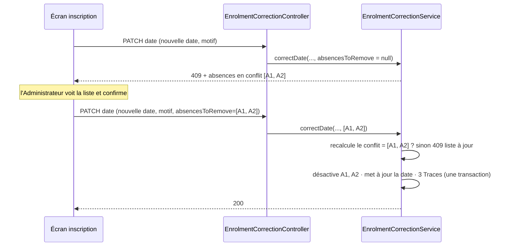

# Design Document — Corrections administrateur, étape 1

## Overview

L'étape 1 couvre les exigences 1 (date d'inscription), 2 (non concerné avant l'inscription),
3 (correction d'une présence), 7 (motif et trace communs) et le journal par Étudiant (8.2, 8.3,
8.5). L'étape 2 (exigences 4, 5, 6, 9, journal filtrable) sera conçue après livraison.

Le principe directeur : **une seule notion d'Étudiant concerné, appliquée par le serveur**.
Aujourd'hui trois endroits en décident chacun à leur façon : la requête de la Feuille_Appel
(`findByGroupIdAndDateAssignedBefore`), le repli de l'écran (tout le groupe), et le résolveur de
Séances facturables (`BillableSessionsResolverImpl`). Aucun n'est consulté à l'écriture d'une
présence. Le design introduit un composant unique, `EnrolmentWindow`, consulté partout.

Le calcul des montants n'est pas modifié. Il lit la Date_Inscription et les Présences ; ce sont
ces entrées que le design rend justes et corrigeables.

## Décisions de conception

### D1 — La Date_Inscription est stockée au début du jour

L'exigence 1.5 fait de la Date_Inscription une date calendaire. Deux options :

| Option | Conséquence |
|---|---|
| Comparer au jour près partout | chaque lecteur doit tronquer ; `BillableSessionsResolverImpl` compare aujourd'hui des instants (`!sessionDate.before(enrollmentDate)`), il faudrait le modifier |
| **Stocker à 00:00 du jour** | toute comparaison d'instants existante devient une comparaison de jours, sans toucher au calcul |

La seconde est retenue : elle satisfait 1.5 sans modifier le calcul des montants, conformément au
hors-périmètre. `EnrolmentWindow.normalize` tronque toute date entrante ; la migration V6 tronque
les valeurs existantes.

**Fuseau : `Africa/Algiers`** (confirmé). L'application est installée sur site, en Docker, sur le
poste de l'école. Les colonnes sont des `TIMESTAMP` sans fuseau : elles portent l'heure murale de
la JVM, fixée par la variable `TZ` du conteneur. Le jour d'une Date_Inscription est donc calculé
dans `ZoneId.systemDefault()`, et c'est `TZ` qui doit être juste. Il valait `Europe/Paris` dans
`docker-compose.yml` et `.env.example` : décalage d'une heure de fin mars à fin octobre, l'Algérie
n'ayant pas d'heure d'été. Corrigé à `Africa/Algiers`.

Au démarrage, `EnrolmentWindow` journalise le fuseau effectif, et refuse de démarrer si ce n'est
pas celui attendu (`app.expected-timezone`, défaut `Africa/Algiers`) : un `.env` copié d'une
ancienne installation ne doit pas fausser les dates en silence.

### D2 — `StudentGroupEntity.onCreate` n'écrase plus la date

`onCreate` ne pose la date du jour que si elle est absente. C'est la correction du défaut 1 : la
date fournie par `addStudentsToGroup` / `addGroupsToStudent` était perdue à la persistance.
L'annotation `@PastOrPresent` de `StudentGroupDTO.dateAssigned` est retirée (exigence 1.3) ; le
contrôle « dans l'année scolaire du Groupe » (1.4) est fait par le service, qui connaît l'année.

### D3 — Une table de trace commune, pas une par domaine

Trois tables d'audit existent, chacune avec ses colonnes et son rang de séquence calculé par
`MAX + 1` — ce qui laisse deux écritures concurrentes obtenir le même rang. Pour les nouvelles
corrections, une seule table `correction_audit`, dont le rang vient d'une **séquence de base de
données** : strictement croissant par construction, sans course (exigence 7.4).

Les trois tables existantes ne sont **pas migrées** : elles sont lues par le journal (exigence 8.3)
à travers un adaptateur. Les migrer serait un changement de données sans bénéfice pour l'étape 1.

### D4 — Une présence avant l'inscription reste acceptée ; une absence, jamais

C'est la règle tranchée (`business-rules.md`). `EnrolmentWindow` ne refuse donc que les absences.
Une présence ordinaire d'un non-membre est déjà classée rattrapage par `AttendanceService`
(`normalizeCatchUpFlag`, `routeCatchUpBilling`) : ce chemin n'est pas modifié.

### D5 — Correction atomique de la date, avec liste vérifiée

L'exigence 1.10 impose que rien ne soit retiré sans avoir été vu. Le client renvoie donc les
identifiants des absences qu'on lui a présentées ; le serveur recalcule la liste et refuse si
elle diffère. Pas de jeton de prévisualisation à stocker : la liste elle-même fait preuve.



### D6 — Une correction qui écarterait une séance déjà payée est refusée

**Point à confirmer.** Un `payment_detail` rattache un montant à une Séance. Si une correction
(date avancée, retrait d'une présence de rattrapage consommé) rend une Séance non facturable alors
qu'elle porte un `payment_detail` actif, l'argent resterait imputé à une Séance que l'Étudiant ne
doit plus.

Option retenue : **refus**, en nommant la Séance et le montant, et en renvoyant vers l'outil de
correction des Détails de paiement existant. Déplacer de l'argent est une décision de paiement,
qui a son propre outil et sa propre trace ; la faire en effet de bord d'une correction de date
la rendrait invisible. L'alternative — recalculer la ventilation automatiquement — est écartée
pour la même raison que D5.

### D7 — Le statut stocké du paiement est recalculé après correction

`payments.status` est posé à l'encaissement. Une correction qui change le montant dû peut le
rendre faux. Après toute correction, le statut du paiement de l'Étudiant sur la Série concernée
est recalculé par la méthode existante `PaymentDetailAdminService.recalculatePayment`. Le retard
lui-même est calculé à la lecture et n'a pas besoin de ce recalcul.

## Architecture

```
controller/
  EnrolmentCorrectionController     PATCH /api/enrolments/{id}/date-assigned
  AttendanceCorrectionController    PATCH /api/attendances/{id}/presence
                                    POST  /api/sessions/{sessionId}/attendances/corrections
                                    POST  /api/attendances/{id}/removal
  CorrectionJournalController       GET   /api/students/{id}/corrections
service/correction/
  EnrolmentWindow                   qui est concerné, quand ; normalisation du jour
  CorrectionReason                  règle unique du Motif (exigence 7.1)
  CorrectionAuditService            écriture des Traces (7.3 à 7.6)
  EnrolmentCorrectionService        exigence 1
  AttendanceCorrectionService       exigence 3
  CorrectionJournalService          exigence 8, lecture des quatre sources
persistance/
  CorrectionAuditEntity, CorrectionDomain, CorrectionField
```

Contrôleurs minces, logique en services séparés par responsabilité (conventions). Toutes les
écritures sont en `PATCH`/`POST` sous `/api/**` : `SecurityConfig` les réserve déjà au rôle ADMIN
(exigence 7.7), sans règle supplémentaire.

## Components and Interfaces

### EnrolmentWindow

```java
Date normalize(Date date);                               // D1 : 00:00 du jour, fuseau de la JVM (TZ)
Optional<StudentGroupEntity> activeEnrolment(Long studentId, Long groupId);
boolean isConcerned(Long studentId, Long groupId, Date sessionDate);
List<AttendanceEntity> absencesOutside(StudentGroupEntity enrolment, Date newDateAssigned);
void assertWithinSchoolYear(GroupEntity group, Date dateAssigned);   // exigence 1.4
```

`isConcerned` = inscription active **et** `dateAssigned <= normalize(sessionDate)`. L'étape 2
ajoutera la borne de sortie (exigence 6.2) ici seulement.

Consommateurs :

| Appelant | Usage |
|---|---|
| `StudentGroupService.getStudentsForSession` | Feuille_Appel (2.1) — la requête actuelle est conservée, la date est normalisée |
| `AttendanceService.saveAll` | refus des absences hors fenêtre (2.3, 2.4, 2.6) |
| `AttendanceCorrectionService` | refus du passage à absent hors fenêtre (3.4) |
| `EnrolmentCorrectionService` | absences mises en conflit par une nouvelle date (1.8) |

### Validation en masse (exigence 2.6)

`AttendanceService.saveAll` valide **toutes** les lignes avant d'en écrire une. Les absences hors
fenêtre sont collectées puis refusées ensemble :

```
400 {
  "message": "Validation refusée : 2 absence(s) portent sur des étudiants non concernés par cette séance.",
  "rejected": [
    { "studentId": 7, "studentName": "Amine Belkacem", "reason": "inscrit le 2030-01-14, séance du 2030-01-07" },
    { "studentId": 9, "studentName": "Lina Hamdani",   "reason": "aucune inscription active au groupe" }
  ]
}
```

### CorrectionReason

```java
static String require(String raw);   // trim ; refus si vide ou > 500 caractères
```

Seule règle de Motif pour les nouvelles corrections (7.1). `PaymentDetailAdminService.validateReason`
et `RefundService.validatedReason` n'y sont pas raccordés à l'étape 1 : même intention, messages
différents, raccordement prévu à l'étape 2.

### CorrectionAuditService

```java
void record(CorrectionDomain domain, CorrectionField field, Long entityId,
            Long studentId, Long groupId, Long sessionId,
            String oldValue, String newValue, String reason);
```

- Auteur lu par `AuditorAware`, jamais reçu du client (7.3).
- Appelé **dans la transaction** de la correction : un échec annule la Trace (7.6).
- `oldValue.equals(newValue)` est une erreur de programmation : le service appelant refuse une
  correction sans changement avant d'y arriver (7.2).

### EnrolmentCorrectionService

```java
StudentGroupEntity correctDate(Long enrolmentId, Date newDate, String reason,
                               List<Long> absencesToRemove);
```

Ordre des contrôles, du plus structurant au plus détaillé :

1. inscription existante (404) ;
2. année close (409, `ReadOnlyYearGuard.assertGroupMutable`) ;
3. Motif (400) ;
4. date dans l'année scolaire du Groupe (400) ;
5. date inchangée après normalisation (400, 7.2) ;
6. séance déjà payée qui deviendrait non facturable (409, D6) ;
7. absences en conflit (409 avec la liste, ou comparaison à `absencesToRemove`, D5) ;
8. écritures : désactivation des absences, nouvelle date, Traces, recalcul du statut (D7).

### AttendanceCorrectionService

```java
AttendanceEntity setPresence(Long attendanceId, boolean present, String reason);
AttendanceEntity addToValidatedSession(Long sessionId, Long studentId, boolean present, String reason);
AttendanceEntity remove(Long attendanceId, String reason);
```

| Contrôle | Réponse |
|---|---|
| présence introuvable ou inactive | 404 |
| année close | 409 |
| présence de rattrapage | 409, en désignant `PATCH /api/catch-up-billing/{id}/correct` (3.6) |
| passage ou ajout d'une absence hors fenêtre | 400 (3.4) |
| ajout sur une séance non validée | 400 : la saisie normale s'applique |
| ajout d'un élève déjà présent sur la séance | 409 |
| valeur inchangée | 400 (7.2) |
| retrait d'une présence qui écarterait une séance payée | 409 (D6) |

Passer à présent efface `isJustified` ; la Trace porte les deux changements dans ses valeurs
(3.5). Le retrait est une désactivation (3.3).

### CorrectionJournalService

```java
List<CorrectionEntryDTO> forStudent(Long studentId);
```

Réunit quatre sources en une liste unique, la plus récente d'abord (8.2, 8.3) :

| Source | Rattachement à l'Étudiant |
|---|---|
| `correction_audit` | colonne `student_id` |
| `attendance_justification_audit` | via `attendance.student_id` |
| `catch_up_billing_audit` | via `attendance.student_id` |
| `payment_detail_audit` | via `payment_detail → payments.student_id` |

**Limite connue** : les trois tables existantes ne portent pas l'Étudiant. Une Trace dont la
présence ou le détail a été supprimé définitivement ne peut plus lui être rattachée. C'est l'un
des motifs de D3 pour les nouvelles traces, et de l'exigence 4.2 (plus de suppression définitive)
à l'étape 2.

## Data Models

### Migration V6

```sql
-- D1 : la date d'inscription est une date calendaire. La colonne est un TIMESTAMP sans fuseau,
-- qui porte déjà l'heure murale locale : une troncature simple suffit. Une conversion
-- AT TIME ZONE décalerait ici chaque date d'une heure.
UPDATE student_groups
   SET date_assigned = date_trunc('day', date_assigned)
 WHERE date_assigned IS NOT NULL;

CREATE SEQUENCE correction_audit_rank_seq;

CREATE TABLE correction_audit (
    id             BIGSERIAL    PRIMARY KEY,
    domain         VARCHAR(40)  NOT NULL,   -- ENROLMENT, ATTENDANCE
    field          VARCHAR(40)  NOT NULL,   -- DATE_ASSIGNED, PRESENCE, ADDED, REMOVED
    entity_id      BIGINT       NOT NULL,
    student_id     BIGINT,
    group_id       BIGINT,
    session_id     BIGINT,
    old_value      TEXT,
    new_value      TEXT,
    reason         VARCHAR(500) NOT NULL,
    performed_by   VARCHAR(255) NOT NULL,
    performed_at   TIMESTAMP    NOT NULL,
    sequence_rank  BIGINT       NOT NULL DEFAULT nextval('correction_audit_rank_seq')
);
CREATE UNIQUE INDEX uk_correction_audit_rank ON correction_audit (sequence_rank);
CREATE INDEX idx_correction_audit_student ON correction_audit (student_id, performed_at DESC);
```

Aucune clé étrangère sur `entity_id`, `student_id`, `group_id`, `session_id` : la Trace doit
survivre à la disparition de la donnée tracée (7.5). Même choix que les tables d'audit existantes.

## Frontend

| Écran | Changement |
|---|---|
| Ajout d'élèves à un groupe (`group-profile`, `student-profile`) | champ « date d'arrivée », par défaut aujourd'hui, borné à l'année scolaire |
| Fiche élève, onglet groupes | action « corriger la date d'arrivée » : dialogue date + motif ; sur 409, liste des absences en conflit et case « les retirer avec la correction » |
| `session-modal` | suppression du repli « tout le groupe » ; sur séance validée, bouton « corriger » par élève (présent / absent / retirer, motif) et « ajouter un élève » |
| Fiche élève | onglet « journal des corrections » |

Le filtrage de la Feuille_Appel n'est plus confié à l'écran : la suppression du repli rend visible
une Feuille_Appel vide, ce qui est juste — personne n'était encore inscrit.

## Error Handling

Toutes les erreurs passent par `CustomServiceException` avec un statut explicite ; aucun `500`
pour un cas métier. Le corps suit le format existant `{ "message": ... }`, enrichi d'une liste
(`rejected`, `conflictingAbsences`, `paidSessions`) quand l'Administrateur doit agir sur plusieurs
lignes.

## Correctness Properties

Propriétés à éprouver, dans l'esprit de `JustificationNeutralityPropertyTest` : sur base H2
réelle, et vérifiées par mutation.

1. **Fenêtre respectée à l'écriture.** Pour toute Date_Inscription et toute Séance, aucun point
   d'entrée (saisie en masse, correction, ajout) ne laisse subsister une absence active sur une
   Séance où l'Étudiant n'est pas concerné. (2.3, 3.4)
2. **Corriger équivaut à avoir bien saisi.** Pour tout jeu de données, corriger la Date_Inscription
   de D1 vers D2 produit le même coût au prorata, le même montant dû, le même plafond et le même
   statut qu'un jeu identique saisi directement avec D2. Propriété métamorphique : elle garantit
   que la correction n'introduit aucun état qu'une saisie correcte n'aurait pas produit. (1.11)
3. **Indivisibilité.** Si une étape de la correction combinée échoue, la date, les absences et les
   Traces sont toutes inchangées. (1.9, 7.6)
4. **Une Trace par changement effectif.** Toute correction réussie écrit exactement une Trace par
   champ changé ; une correction refusée ou sans changement n'en écrit aucune ; les rangs sont
   strictement croissants et sans doublon. (7.2, 7.4, 7.6)
5. **Jour calendaire.** Une Séance tenue le jour de l'inscription concerne l'Étudiant, quelle que
   soit l'heure de l'inscription ou de la Séance. (1.5)

S'y ajoutent des tests HTTP de bout en bout, sur le modèle de
`PaymentProcessingEndpointIntegrationTest` : statuts, corps, absence d'écriture après refus, et
403 pour le rôle VIEWER sur chaque point d'entrée de correction.

## Décisions confirmées

1. **Fuseau** (D1) : `Africa/Algiers`, installation sur site en Docker.
2. **Séance déjà payée qu'une correction écarterait** (D6) : refus, avec renvoi vers l'outil de
   correction des Détails de paiement.
