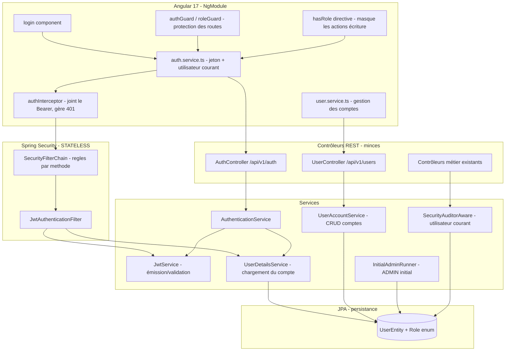

# Document de conception — Authentification & Autorisation

## Overview

Cette conception introduit l'**authentification par JWT** et l'**autorisation par rôle** dans le
système School Management (backend Spring Boot 3.4.1 / Java 21, frontend Angular 17), à partir
des 12 exigences validées. Aujourd'hui l'application est entièrement ouverte
(`SecurityConfig` applique `.anyRequest().permitAll()`) et l'audit de `BaseEntity` est factice
(`createdBy` codé en dur à « admin », `updatedBy` jamais renseigné).

Décisions structurantes retenues :

- **JWT stateless** (aucune session serveur, `SessionCreationPolicy.STATELESS`) : c'est le
  mécanisme de `Justificatif_Authentification` le mieux adapté à un frontend Angular en SPA.
  Un endpoint de login émet un jeton signé (HS256) contenant l'identifiant et le rôle ; un
  filtre Spring Security valide le jeton à chaque requête protégée ; le jeton porte une
  **expiration** (Exigences 1, 2, 9).
- **Entité `UserEntity`** dans le dossier `persistance` existant (jamais renommé) : `username`
  unique, `password` haché **BCrypt**, `role` (enum `Role` : `ADMIN` / `VIEWER`), indicateur
  `enabled`. Elle étend `BaseEntity` comme les autres entités (Exigences 5, 6, 7, 12.1).
- **Configuration Spring Security par méthode HTTP** : points d'accès publics (login, Swagger),
  reste protégé ; `ADMIN` = tout ; `VIEWER` = lecture seule (GET), les écritures
  POST/PUT/PATCH/DELETE sont refusées en **403**. Le backend reste l'autorité : l'UI qui masque
  les actions n'est qu'une commodité, pas la protection (Exigences 2, 3, 4, 11.3 — défense en
  profondeur).
- **Stockage sécurisé** : `BCryptPasswordEncoder` ; le mot de passe (haché ou non) n'apparaît
  jamais dans un DTO de réponse (Exigence 5).
- **Compte ADMIN initial** créé au démarrage si aucun `ADMIN` n'existe, identifiant/mot de passe
  fournis par **configuration externe** (properties / variables d'environnement), sans secret
  codé en dur (Exigence 6).
- **Gestion des comptes** réservée à `ADMIN` : création (unicité → **409**), désactivation,
  réinitialisation de mot de passe (Exigence 7).
- **Audit réel** : un `AuditorAware<String>` branché sur Spring Data JPA Auditing lit
  l'utilisateur courant du `SecurityContext` pour renseigner `createdBy` / `updatedBy`, en
  remplacement du « admin » codé en dur. Une valeur de repli explicite (`system`) couvre les
  écritures sans utilisateur authentifié (migration / seed) (Exigence 8).
- **Frontend Angular** : écran de login, `auth.service` (stockage du jeton, un-service-par-
  entité), intercepteur HTTP qui joint le jeton, garde de route, redirection sur 401,
  masquage/désactivation des actions d'écriture pour `VIEWER`, déconnexion, i18n FR + EN
  (Exigences 9, 10, 11, 12.5, 12.6).
- **Contrôleurs minces**, mapping DTO ↔ entité via `MappingContext`, commentaires et messages
  français préservés (Exigence 12).

### Principes de conception

- **Le dossier `persistance` n'est pas renommé.** `UserEntity` et l'enum `Role` y sont ajoutés
  (convention projet, Exigence 12.1).
- **Stateless d'abord.** Aucune session HTTP côté serveur : le jeton JWT porte l'état
  d'authentification, ce qui convient au proxy Angular et au déploiement Vercel/CORS existant.
- **Le backend est l'autorité.** Les règles d'autorisation par rôle sont appliquées côté
  serveur ; le masquage frontend est une amélioration UX, jamais l'unique barrière
  (Exigence 11.3).
- **Logique dans des services dédiés.** `AuthenticationService`, `UserAccountService`,
  `JwtService` portent la logique ; `AuthController` et `UserController` restent minces
  (Exigence 12.3).
- **DTO ↔ entité via `MappingContext`.** Le `UserMapper` (MapStruct) suit le motif existant ;
  `ApplicationContextProvider` n'est pas utilisé (Exigence 12.2). Le DTO de réponse exclut le
  mot de passe (Exigence 5.3).
- **Messages/commentaires français préservés.** Les messages d'erreur et la Javadoc sont
  rédigés en français pour rester cohérents avec le code existant (Exigence 12.4).
- **Aucun secret codé en dur.** Clé de signature JWT et identifiants de l'ADMIN initial
  proviennent de la configuration externe (Exigences 6.2).

## Architecture



### Flux de connexion (stateless)

1. Le frontend `POST /api/v1/auth/login` avec `{ username, password }`.
2. `AuthenticationService` délègue à l'`AuthenticationManager` Spring (qui utilise
   `UserDetailsService` + `BCryptPasswordEncoder`). Échec → **401** générique (Exigence 1.2,
   1.3). Compte désactivé → **401** (`DisabledException`, Exigence 1.3).
3. Succès → `JwtService` émet un JWT signé (subject = `username`, claim `role`, `iat`, `exp`).
4. Réponse `{ token, username, role, expiresAt }` : le frontend stocke le jeton et adapte l'UI
   (Exigence 1.1, 1.4, 10.2).

### Flux d'une requête protégée

1. Le frontend joint `Authorization: Bearer <token>` (intercepteur, Exigence 10.4).
2. `JwtAuthenticationFilter` valide la signature et l'expiration. Invalide/expiré/absent sur une
   `Ressource_Protégée` → **401** (Exigences 2.1, 9.1).
3. Valide → un `Authentication` (username + autorité `ROLE_ADMIN`/`ROLE_VIEWER`) est placé dans
   le `SecurityContext`.
4. La `SecurityFilterChain` applique l'autorisation par méthode : GET autorisé aux deux rôles ;
   POST/PUT/PATCH/DELETE réservés à `ADMIN`, sinon **403** (Exigences 3, 4).
5. `SecurityAuditorAware` lit le `SecurityContext` pour renseigner `createdBy`/`updatedBy` lors
   des écritures (Exigence 8).

### Couches

Le motif Controller → Service → Repository → Entity est préservé. La sécurité s'insère comme un
filtre transverse (`JwtAuthenticationFilter`) devant les contrôleurs, et l'audit comme un
composant transverse (`AuditorAware`) branché sur le cycle de vie JPA.

## Components and Interfaces

### 1. JwtService (nouveau, service dédié)

Responsabilité : émettre et valider les JWT. Aucune dépendance web ou base de données (logique
quasi pure, testable en isolation).

```java
@Service
public class JwtService {
    String generateToken(String username, Role role);   // subject + claim role + iat + exp
    boolean isTokenValid(String token, String username); // signature + expiration + subject
    String extractUsername(String token);                // Exigence 2.3
    Role extractRole(String token);                      // Exigence 1.1
    Instant extractExpiration(String token);             // Exigence 9.1
}
```

- Bibliothèque : **jjwt** (`io.jsonwebtoken`), pas d'implémentation maison de la cryptographie.
- Algorithme HS256 ; la clé secrète provient de `security.jwt.secret` (variable d'environnement,
  aucune valeur en dur).
- Durée de vie configurable via `security.jwt.expiration-ms` (par défaut ex. 3600000 = 1 h).
- `isTokenValid` renvoie `false` pour un jeton expiré ou de signature invalide (Exigences 9.1,
  2.1).

### 2. JwtAuthenticationFilter (nouveau, OncePerRequestFilter)

Responsabilité : extraire le `Bearer`, valider via `JwtService`, peupler le `SecurityContext`.

- En-tête absent ou non `Bearer` → laisse passer sans authentifier ; la `SecurityFilterChain`
  refusera ensuite les `Ressources_Protégées` en **401** (Exigence 2.1).
- Jeton valide → construit un `UsernamePasswordAuthenticationToken` avec l'autorité
  `ROLE_<role>` et le place dans le `SecurityContext` (Exigence 2.3).
- Jeton invalide/expiré → n'authentifie pas ; l'`AuthenticationEntryPoint` renvoie **401**
  (Exigences 9.1, 2.1).

### 3. SecurityConfig (remplacé, configuration Spring Security)

Remplace la configuration « tout ouvert » actuelle. La configuration CORS existante (origines
localhost + Vercel, `setAllowedOriginPatterns`) est conservée.

```java
http
  .cors(...)                     // configuration existante conservée
  .csrf(AbstractHttpConfigurer::disable)   // API stateless + JWT
  .sessionManagement(s -> s.sessionCreationPolicy(STATELESS))
  .authorizeHttpRequests(authz -> authz
      // Points d'accès publics (Exigence 2.2)
      .requestMatchers("/api/v1/auth/login").permitAll()
      .requestMatchers("/v3/api-docs/**", "/swagger-ui/**", "/swagger-ui.html",
                       "/swagger-resources/**", "/webjars/**").permitAll()
      // Gestion des comptes : ADMIN uniquement (Exigence 7.5)
      .requestMatchers("/api/v1/users/**").hasRole("ADMIN")
      // Lecture : les deux rôles (Exigences 3.1, 4.1)
      .requestMatchers(HttpMethod.GET, "/api/**").hasAnyRole("ADMIN", "VIEWER")
      // Écriture : ADMIN uniquement (Exigences 3.2, 4.2)
      .requestMatchers(HttpMethod.POST,   "/api/**").hasRole("ADMIN")
      .requestMatchers(HttpMethod.PUT,    "/api/**").hasRole("ADMIN")
      .requestMatchers(HttpMethod.PATCH,  "/api/**").hasRole("ADMIN")
      .requestMatchers(HttpMethod.DELETE, "/api/**").hasRole("ADMIN")
      .anyRequest().authenticated())
  .exceptionHandling(e -> e
      .authenticationEntryPoint(restAuthEntryPoint)   // 401 (Exigences 2.1, 9.1)
      .accessDeniedHandler(restAccessDeniedHandler))  // 403 (Exigences 4.2, 7.5)
  .addFilterBefore(jwtAuthenticationFilter, UsernamePasswordAuthenticationFilter.class);
```

Beans complémentaires : `PasswordEncoder` (`BCryptPasswordEncoder`), `AuthenticationManager`
(exposé depuis `AuthenticationConfiguration`), `AuthenticationProvider`
(`DaoAuthenticationProvider` + `UserDetailsService`).

L'ordre des règles est important : la règle spécifique `/api/v1/users/**` (ADMIN) précède les
règles génériques par méthode sur `/api/**`. Le typo `/api/v1/aith/**` de l'ancienne config est
corrigé en `/api/v1/auth/login`.

### 4. AuthenticationService + AuthController (nouveaux)

`AuthController` (mince) :

| Méthode | Endpoint | Corps | Rôle requis | Exigence |
|---------|----------|-------|-------------|----------|
| POST | `/api/v1/auth/login` | `LoginRequestDTO { username, password }` | public | 1.1–1.3 |
| GET | `/api/v1/auth/me` | — | authentifié | 1.4 |

- `login` : délègue à l'`AuthenticationManager`. Identifiants invalides ou compte désactivé →
  **401** générique, sans révéler quel champ est erroné (Exigences 1.2, 1.3). Succès → émet le
  JWT et renvoie `AuthResponseDTO { token, username, role, expiresAt }` (Exigence 1.1).
- `me` : renvoie `{ username, role }` de l'utilisateur courant depuis le `SecurityContext`
  (Exigence 1.4) — sert au rafraîchissement du frontend.
- La déconnexion est côté client (suppression du jeton) puisque stateless ; aucun endpoint
  serveur n'est requis (Exigence 9.2).

### 5. UserDetailsService (nouveau)

Implémente `org.springframework.security.core.userdetails.UserDetailsService`. Charge un
`UserEntity` par `username` et le convertit en `UserDetails` avec l'autorité `ROLE_<role>` et
l'état `enabled`. Compte introuvable → `UsernameNotFoundException` (mappé en 401 générique) ;
compte désactivé → `enabled=false` provoque un `DisabledException` (Exigence 1.3).

### 6. UserAccountService + UserController (nouveaux)

`UserController` (mince), protégé `hasRole("ADMIN")` par la `SecurityFilterChain` (Exigence 7.5) :

| Méthode | Endpoint | Corps | Purpose | Exigence |
|---------|----------|-------|---------|----------|
| POST | `/api/v1/users` | `CreateUserRequestDTO { username, password, role }` | Créer un compte | 7.1, 7.2 |
| GET | `/api/v1/users` | — | Lister les comptes (sans mot de passe) | 5.3 |
| PATCH | `/api/v1/users/{id}/disable` | — | Désactiver un compte | 7.3 |
| PATCH | `/api/v1/users/{id}/enable` | — | Réactiver un compte | 7.3 |
| PATCH | `/api/v1/users/{id}/reset-password` | `ResetPasswordRequestDTO { newPassword }` | Réinitialiser le mot de passe | 7.4 |

`UserAccountService` :
- **create** : hache le mot de passe (BCrypt), rôle par défaut sûr, `enabled=true`. Identifiant
  déjà attribué → `DuplicateUsernameException` → **409**, comptes existants inchangés
  (Exigence 7.2).
- **disable/enable** : bascule `enabled` ; un compte désactivé ne peut plus se connecter
  (Exigences 7.3, 1.3).
- **resetPassword** : ré-encode le nouveau mot de passe en BCrypt (Exigence 7.4).
- Toutes les réponses passent par `UserResponseDTO` **sans champ mot de passe** (Exigence 5.3).

### 7. InitialAdminRunner (nouveau, ApplicationRunner idempotent)

S'exécute au démarrage :

```
1. si userRepository.existsByRole(Role.ADMIN) : ne rien faire (Exigence 6.3)
2. sinon créer un compte ADMIN avec :
     username = ${security.admin.username}
     password = BCrypt(${security.admin.password})
     role = ADMIN, enabled = true
3. les identifiants proviennent de la configuration externe, aucun secret en dur (Exigence 6.2)
```

Idempotent : si un `ADMIN` existe déjà, les comptes ne sont pas écrasés (Exigence 6.3). Les
écritures effectuées par ce runner utilisent la valeur de repli d'audit `system` (Exigence 8.4).

### 8. SecurityAuditorAware + activation de l'audit JPA (nouveau)

Remplace le « admin » codé en dur de `BaseEntity`.

```java
@Component
public class SecurityAuditorAware implements AuditorAware<String> {
    @Override
    public Optional<String> getCurrentAuditor() {
        // Lit l'utilisateur courant du SecurityContext ; repli "system" sinon (Exigence 8.4)
        Authentication auth = SecurityContextHolder.getContext().getAuthentication();
        if (auth == null || !auth.isAuthenticated() || auth instanceof AnonymousAuthenticationToken) {
            return Optional.of("system");
        }
        return Optional.of(auth.getName());
    }
}
```

Activation via `@EnableJpaAuditing(auditorAwareRef = "securityAuditorAware")` et adaptation de
`BaseEntity` :

- Ajout de `@EntityListeners(AuditingEntityListener.class)` sur `BaseEntity`.
- Les champs `createdBy` / `updatedBy` sont annotés `@CreatedBy` / `@LastModifiedBy`.
- La ligne `createdBy = "admin";` du `@PrePersist` est **retirée** (Exigence 8.3) ; `updatedBy`
  est désormais renseigné automatiquement à chaque modification (Exigence 8.2).
- Les autres commentaires français de `BaseEntity` sont préservés (Exigence 12.4).

> Alternative envisagée : renseigner l'audit manuellement dans chaque service. Rejetée car
> intrusive et source d'oublis ; `AuditorAware` centralise la logique et couvre toutes les
> entités dérivant de `BaseEntity`.

### 9. Frontend Angular (NgModule)

- **`auth.service.ts`** (un service par entité) : `login()`, `logout()`, `getToken()`,
  `currentUser$` (BehaviorSubject `{ username, role }`), `hasRole(role)`. Stocke le jeton
  (localStorage) et restaure l'utilisateur au démarrage tant que le jeton n'est pas expiré
  (Exigences 10.2, 9.2).
- **`login` component** : formulaire identifiant/mot de passe, message d'erreur traduisible sans
  révéler le champ erroné (Exigence 10.3), redirection vers la vue principale au succès
  (Exigence 10.2).
- **`authInterceptor`** (HttpInterceptor) : joint `Authorization: Bearer <token>` aux requêtes
  vers les `Ressources_Protégées` (Exigence 10.4) ; sur réponse **401**, purge le jeton et
  redirige vers `/login` (Exigence 9.3).
- **`authGuard` / `roleGuard`** : empêchent l'accès aux vues métier sans connexion (redirection
  login, Exigence 10.1) et réservent les vues d'administration au rôle `ADMIN`.
- **`hasRole` directive** (`*appHasRole="'ADMIN'"`) : masque/désactive les commandes d'écriture
  pour un `VIEWER` (Exigence 11.1) et les affiche pour un `ADMIN` (Exigence 11.2). Rappel : ce
  masquage est cosmétique, le backend reste l'autorité (Exigence 11.3).
- **`user.service.ts`** (un service par entité) : appels HTTP de gestion des comptes, gestion
  d'erreur centralisée suivant le motif `payment.service.ts` (Exigences 7, 12.5).
- **Déconnexion** : `auth.service.logout()` supprime le jeton et redirige vers `/login`
  (Exigence 9.2).
- **i18n** : chaque nouvelle chaîne utilise des clés ngx-translate définies dans `fr.json` et
  `en.json` (Exigence 12.6).

## Data Models

### Nouvelle entité : UserEntity (`persistance`)

```java
@Entity
@Table(name = "app_user",
       uniqueConstraints = @UniqueConstraint(name = "uk_user_username", columnNames = "username"))
@Getter @Setter @NoArgsConstructor @AllArgsConstructor @SuperBuilder
public class UserEntity extends BaseEntity {

    @Id @GeneratedValue(strategy = GenerationType.IDENTITY)
    private Long id;

    @Column(name = "username", nullable = false, unique = true)
    private String username;                 // Identifiant unique (Exigence 7.2)

    @Column(name = "password", nullable = false)
    private String password;                 // Haché BCrypt (Exigence 5.1)

    @Enumerated(EnumType.STRING)
    @Column(name = "role", nullable = false)
    private Role role;                       // ADMIN | VIEWER

    @Column(name = "enabled", nullable = false)
    @Builder.Default
    private Boolean enabled = true;          // Indicateur d'activation (Exigence 7.3)
}
```

Le nom de table est `app_user` (`user` est un mot réservé PostgreSQL). L'unicité de `username`
est garantie par la contrainte `uk_user_username` (Exigence 7.2). `UserEntity` étend
`BaseEntity`, donc ses propres écritures sont aussi auditées.

### Nouvel enum : Role (`persistance`)

```java
public enum Role {
    ADMIN,   // accès complet lecture + écriture (Exigence 3)
    VIEWER   // lecture seule (Exigence 4)
}
```

Les autorités Spring Security sont dérivées par préfixe : `ROLE_ADMIN`, `ROLE_VIEWER`.

### Repository

```java
public interface UserRepository extends JpaRepository<UserEntity, Long> {
    Optional<UserEntity> findByUsername(String username);   // login + UserDetailsService
    boolean existsByUsername(String username);              // unicité (Exigence 7.2)
    boolean existsByRole(Role role);                        // ADMIN initial (Exigence 6.1)
}
```

### DTOs et Mapper

- `LoginRequestDTO { String username, String password }`.
- `AuthResponseDTO { String token, String username, Role role, Instant expiresAt }`.
- `CreateUserRequestDTO { String username, String password, Role role }` (validation Jakarta :
  `@NotBlank`).
- `ResetPasswordRequestDTO { String newPassword }`.
- `UserResponseDTO { Long id, String username, Role role, Boolean enabled }` — **aucun champ mot
  de passe** (Exigence 5.3).
- `UserMapper` (MapStruct) : `toResponse(UserEntity)` ignore explicitement `password` ; le
  mapping DTO → entité passe par `MappingContext`, pas `ApplicationContextProvider`
  (Exigence 12.2). Le hachage du mot de passe est réalisé dans `UserAccountService` (le mapper
  ne manipule jamais de mot de passe en clair).

### Configuration externe (properties / variables d'environnement)

Ajouts à `application.properties` (valeurs par défaut non secrètes ; secrets via variables
d'environnement, Exigences 6.2) :

```properties
# JWT
security.jwt.secret=${JWT_SECRET}
security.jwt.expiration-ms=${JWT_EXPIRATION_MS:3600000}

# Compte ADMIN initial
security.admin.username=${ADMIN_USERNAME:admin}
security.admin.password=${ADMIN_PASSWORD}
```

`JWT_SECRET` et `ADMIN_PASSWORD` n'ont pas de valeur par défaut codée en dur : l'absence de
`JWT_SECRET` doit faire échouer le démarrage (fail-fast), et `ADMIN_PASSWORD` est requis pour la
création du compte initial.

### Migration de schéma

Dev utilise `ddl-auto=update` (Hibernate crée automatiquement la table). Pour la prod
(`validate`), DDL requis :

```sql
CREATE TABLE app_user (
    id            BIGINT GENERATED BY DEFAULT AS IDENTITY PRIMARY KEY,
    username      VARCHAR(255) NOT NULL,
    password      VARCHAR(255) NOT NULL,
    role          VARCHAR(20)  NOT NULL,
    enabled       BOOLEAN      NOT NULL DEFAULT TRUE,
    date_creation TIMESTAMP,
    date_update   TIMESTAMP,
    created_by    VARCHAR(255),
    updated_by    VARCHAR(255),
    active        BOOLEAN,
    description   VARCHAR(255),
    CONSTRAINT uk_user_username UNIQUE (username)
);
```

Aucune donnée à rétro-remplir : le compte ADMIN initial est créé par `InitialAdminRunner` au
démarrage (Exigence 6.1).

## Correctness Properties

*Une propriété est une caractéristique ou un comportement qui doit être vrai pour toutes les
exécutions valides d'un système — essentiellement, un énoncé formel de ce que le système doit
faire. Les propriétés font le pont entre les spécifications lisibles par l'humain et des
garanties de correction vérifiables par la machine.*

Les propriétés ci-dessous dérivent de la prework. Les critères redondants ont été consolidés :
tous les critères d'autorisation par rôle se réduisent à une matrice (rôle × méthode) ; les
critères de rejet de jeton (absent/invalide/expiré) fusionnent ; les critères d'audit fusionnent
en une propriété unique ; les critères de connexion refusée fusionnent.

### Property 1: Round-trip d'émission/validation du jeton

*Pour tout* couple (identifiant, rôle), le jeton émis par `JwtService.generateToken` est valide
pour cet identifiant et permet de ré-extraire exactement l'identifiant et le rôle d'origine ;
la connexion réussie d'un compte actif renvoie donc un justificatif exposant son identifiant et
son rôle.

**Validates: Requirements 1.1, 1.4, 2.3**

### Property 2: Connexion refusée pour identifiants invalides ou compte désactivé

*Pour tout* identifiant inexistant, *pour tout* mot de passe incorrect associé à un compte
existant, et *pour tout* compte désactivé (même avec le bon mot de passe), la tentative de
connexion est rejetée avec un code HTTP 401 et un message identique qui ne révèle pas lequel des
deux champs est erroné.

**Validates: Requirements 1.2, 1.3**

### Property 3: Jeton absent, invalide ou expiré refusé sur ressource protégée

*Pour tout* jeton absent, malformé, de signature invalide, ou dont l'expiration est dépassée,
toute requête vers une `Ressource_Protégée` est refusée avec un code HTTP 401.

**Validates: Requirements 2.1, 9.1**

### Property 4: Autorisation par rôle (matrice rôle × méthode)

*Pour tout* utilisateur authentifié et *pour toute* méthode HTTP appliquée à une
`Ressource_Protégée` : un `ADMIN` est autorisé quelle que soit la méthode (lecture et écriture) ;
un `VIEWER` est autorisé pour les `Opérations_Lecture` (GET) et refusé avec un code HTTP 403 pour
toute `Opération_Écriture` (POST/PUT/PATCH/DELETE), y compris sur les endpoints de gestion des
comptes.

**Validates: Requirements 3.1, 3.2, 4.1, 4.2, 7.5, 11.3, 2.3**

### Property 5: Un refus d'écriture laisse les données inchangées

*Pour tout* état persistant et *pour toute* `Opération_Écriture` refusée à un `VIEWER` (403),
l'état persistant après le refus est identique à l'état avant la tentative.

**Validates: Requirements 4.3**

### Property 6: Round-trip de hachage des mots de passe

*Pour tout* mot de passe en clair, la valeur stockée par le système est différente du clair et
`encoder.matches(clair, stocké)` est vrai, tandis que `matches` est faux pour tout autre mot de
passe ; la vérification à la connexion s'appuie exclusivement sur cette comparaison hachée.

**Validates: Requirements 5.1, 5.2**

### Property 7: Le mot de passe est exclu des réponses de l'API

*Pour tout* compte utilisateur, la représentation renvoyée par l'API (DTO sérialisé) ne contient
ni le champ mot de passe ni sa valeur (hachée ou en clair).

**Validates: Requirements 5.3**

### Property 8: Idempotence de la création du compte ADMIN initial

*Pour tout* état initial de la base, l'exécution du `InitialAdminRunner` garantit qu'au moins un
compte `ADMIN` existe : si aucun `ADMIN` n'existait, exactement un compte `ADMIN` initial est
créé à partir de la configuration ; si un `ADMIN` existait déjà, aucun compte n'est créé ni
écrasé, et une exécution répétée ne change rien.

**Validates: Requirements 6.1, 6.3**

### Property 9: Cycle de vie d'un compte (création, désactivation, réinitialisation)

*Pour tout* compte créé par un `ADMIN` avec des données valides, le compte est persisté avec un
mot de passe haché et peut être retrouvé par son identifiant ; après désactivation, son
indicateur `enabled` est faux et toute connexion est refusée ; après réinitialisation du mot de
passe, seul le nouveau mot de passe est accepté et l'ancien est rejeté.

**Validates: Requirements 7.1, 7.3, 7.4**

### Property 10: Rejet des identifiants en double

*Pour tout* identifiant déjà attribué, une nouvelle demande de création de compte utilisant cet
identifiant est rejetée avec un code HTTP 409 et l'ensemble des comptes existants reste inchangé.

**Validates: Requirements 7.2**

### Property 11: Traçabilité de l'audit sur l'utilisateur courant

*Pour tout* enregistrement dérivant de `BaseEntity` : lorsqu'il est créé ou modifié par un
utilisateur authentifié, `createdBy` (à la création) et `updatedBy` (à la modification) valent
l'identifiant de cet utilisateur, jamais la valeur codée en dur « admin » ; lorsqu'aucun
utilisateur authentifiable n'est présent, ces champs valent l'identifiant de repli explicite
`system`.

**Validates: Requirements 8.1, 8.2, 8.3, 8.4**

### Property 12: L'intercepteur joint le justificatif aux requêtes protégées

*Pour toute* requête HTTP sortante vers une `Ressource_Protégée` alors qu'un jeton est présent
côté client, l'intercepteur ajoute l'en-tête `Authorization: Bearer <token>`.

**Validates: Requirements 10.4**

## Error Handling

- **Échec d'authentification** — identifiants invalides (`BadCredentialsException`,
  `UsernameNotFoundException`) ou compte désactivé (`DisabledException`) sont convertis par un
  `RestAuthenticationEntryPoint` en réponse **401** avec un message français **générique** ne
  précisant pas le champ erroné (Exigences 1.2, 1.3).
- **Accès refusé par rôle** — un `AccessDeniedException` (VIEWER tentant une écriture, ou tout
  utilisateur non autorisé sur `/api/v1/users/**`) est converti par un
  `RestAccessDeniedHandler` en réponse **403** avec un message français (Exigences 4.2, 7.5).
- **Jeton absent / invalide / expiré** — traité dans `JwtAuthenticationFilter` :
  l'authentification n'est pas peuplée, et l'entry point renvoie **401** (Exigences 2.1, 9.1).
- **Identifiant en double** — `UserAccountService` lève une `DuplicateUsernameException`
  (package `service/exception`), mappée en **409** avec un message français, sans altérer les
  comptes existants (Exigence 7.2).
- **Validation des DTO** — `@NotBlank` sur `username`/`password`/`newPassword` et `@NotNull` sur
  `role` ; violation → **400** via le gestionnaire d'exceptions existant.
- **Compte introuvable** (désactivation / réinitialisation d'un id inconnu) → **404** via
  `ResourceNotFoundException`.
- **Configuration manquante** — l'absence de `JWT_SECRET` fait échouer le démarrage (fail-fast) ;
  l'absence de `ADMIN_PASSWORD` empêche la création du compte initial avec un message explicite
  (Exigence 6.2).
- Tous les messages d'erreur sont rédigés en français, cohérents avec le code existant, et les
  messages français existants ne sont pas traduits (Exigence 12.4).

## Testing Strategy

Le PBT **est** approprié pour cette fonctionnalité : l'émission/validation JWT, la vérification
des mots de passe (BCrypt), les règles d'autorisation par rôle, l'idempotence du seed, le cycle
de vie des comptes et la logique d'audit sont des logiques pures ou quasi pures présentant des
propriétés universelles sur de grands espaces d'entrées. En revanche, l'accessibilité des points
publics, le rendu conditionnel de l'UI, les gardes/redirections frontend et la parité des clés
i18n relèvent de tests d'exemple, d'intégration et de smoke.

### Approche duale

- **Tests basés sur les propriétés** (jqwik pour Java, éventuellement fast-check côté Angular
  pour l'intercepteur) couvrent les Propriétés 1–12.
- **Tests unitaires / d'exemple** (JUnit 5 + Mockito côté backend ; Karma + Jasmine côté
  frontend) couvrent les scénarios concrets : accessibilité des points publics login/Swagger
  (2.2), création du compte initial à partir des properties (6.2), déconnexion côté client
  (9.2), redirection sur 401 par l'intercepteur (9.3), garde de route bloquant les vues
  protégées (10.1), redirection après login réussi (10.2), message d'erreur générique traduit
  (10.3), masquage/affichage des commandes selon le rôle (11.1, 11.2), mapping via
  `MappingContext` (12.2), parité des clés i18n FR/EN (12.6).
- **Tests d'intégration** (Spring Boot Test, H2 + MockMvc) couvrent le câblage de la chaîne de
  sécurité : accès public sans jeton, 401 sans jeton valide, 403 pour VIEWER en écriture,
  autorisation ADMIN, endpoints de gestion des comptes.
- **Tests smoke / structurels** vérifient l'emplacement de `UserEntity`/`Role` dans le package
  `persistance` (12.1) et l'absence de secret codé en dur (revue).

### Configuration des tests de propriété

- Bibliothèque de PBT : **jqwik** pour le backend Java (ne pas réimplémenter un framework de
  génération) ; `@Property` avec fournisseurs `@ForAll`.
- Chaque test de propriété exécute un **minimum de 100 itérations** (`@Property(tries = 100)` ou
  plus).
- Chaque test de propriété est étiqueté par un commentaire référençant sa propriété de
  conception, au format : **Feature: authentication-authorization, Property {number}:
  {property_text}**.
- Chaque propriété de correction est implémentée par un **unique** test de propriété.
- Les générateurs incluent les valeurs limites : mots de passe vides/longs/à caractères non-ASCII,
  identifiants dupliqués, jetons tout juste expirés (exp = maintenant), rôles ADMIN et VIEWER, les
  quatre méthodes d'écriture plus GET, contexte de sécurité vide/anonyme et authentifié.

### Cibles de test clés

- `JwtService` (Propriétés 1, 3) — round-trip pur, le plus rapide à property-tester.
- `PasswordEncoder`/hachage (Propriété 6) — round-trip pur BCrypt.
- `AuthenticationService` (Propriété 2) — mock `AuthenticationManager`/`UserDetailsService`.
- Chaîne de sécurité (Propriétés 4, 5) — MockMvc paramétré sur la matrice (rôle × méthode).
- `UserResponseDTO`/`UserMapper` (Propriété 7) — sérialisation générée, absence du champ mot de
  passe.
- `InitialAdminRunner` (Propriété 8) — H2, états initiaux générés, idempotence.
- `UserAccountService` (Propriétés 9, 10) — mix mock/H2 pour création/désactivation/reset et
  doublons.
- `SecurityAuditorAware` + audit JPA (Propriété 11) — `SecurityContext` simulé, entités
  persistées en H2.
- `authInterceptor` Angular (Propriété 12) — requêtes générées, vérification de l'en-tête Bearer.
