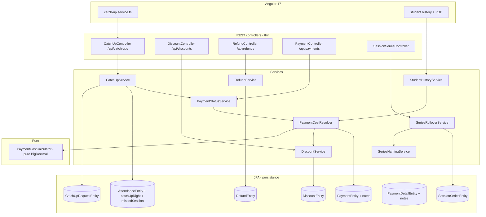

# Design Document — Payment & Attendance Rules

## Overview

This design implements the seven product decisions captured in `requirements.md` (series
billing + naming + rollover, catch-up workflow, payment notes, multi-level discounts,
immediate late status, refunds, strict `BigDecimal` money model) and repairs the four known
defects:

1. `PaymentStatusService` still computes with `double` → refactor to delegate to the pure
   `PaymentCostCalculator`.
2. `PaymentCostCalculator` (already written, pure `BigDecimal`) is not wired → wire it in via
   a new resolver that gathers the four inputs from entities.
3. `PaymentRepository.findAmountPaidForStudentAndSeries` selects `p.amountPaid` without
   `SUM` → fix to `SUM` of non-cancelled payments, returning `BigDecimal`.
4. The backend `/api/catch-ups` workflow does not exist while the Angular
   `catch-up.service.ts` already calls it → build a `CatchUpController` + `CatchUpService` +
   `CatchUpRequestEntity` matching the existing front signatures exactly.

The guiding principle from `business-rules.md` is preserved: the two money quantities
(`Month_Total_Cost` and `Amount_Due_So_Far`) are computed by separate functions and never
conflated. The `PaymentCostCalculator` stays pure; all entity/repository resolution happens
in a new orchestration layer around it.

### Design principles

- **Series is the billing unit.** Every payment, late-status, and receipt calculation keys
  off a `SessionSeriesEntity`, not the calendar month. The calendar month only drives the
  series *name* sequence.
- **The calculator stays pure.** `PaymentCostCalculator` keeps its current signature
  (four resolved inputs). A new `PaymentCostResolver` reads entities and constructs the
  calculator. This keeps the correctness-critical math trivially unit/property testable.
- **Single discount scope.** A student has at most one applicable `Discount` per billing
  context. Selection resolves the most specific applicable scope; scopes are never summed.
- **Thin controllers.** `CatchUpController`, discount/refund endpoints, and note handling
  delegate all logic to services (convention: controllers stay thin).
- **No renaming of `persistance`.** New entities live in the existing `persistance` folder.
- **DTO↔Entity via `MappingContext`.** New mappers extend the existing `MappingContext`
  pattern; `ApplicationContextProvider` is not used.
- **French comments/messages preserved.** Error messages and Javadoc stay in French.

## Architecture



### Layering

The layered pattern (Controller → Service → Repository → Entity) is preserved. The one
addition is `PaymentCostResolver`, a service that sits between `PaymentStatusService` and the
pure `PaymentCostCalculator`: it gathers `plannedSessions`, `attendedSessions`,
`pricePerSession`, and `discountRate` from repositories, then constructs and delegates to the
calculator.

## Components and Interfaces

### 1. PaymentCostCalculator (existing, reused as-is)

Kept unchanged in signature and semantics. It already:
- validates non-negative `plannedSessions`, `attendedSessions`, `pricePerSession`;
- validates `exemptionRate ∈ [0.00, 1.00]`;
- applies the rate to the amount owed (`base × (1 − rate)`) at scale 2, `HALF_UP`;
- exposes `monthTotalCost()`, `amountDueSoFar()`, `isLate(paid)`, `isMonthFullyPaid(paid)`.

This satisfies Requirement 4.1, 4.3, 4.4, 4.5, 4.6 directly. The `exemptionRate` parameter is
the discount rate resolved for the billing context (Requirement 12). No change required
except optional documentation noting it now receives a resolved *discount* rate rather than
only an exemption rate — the math is identical.

### 2. PaymentCostResolver (new service)

Responsibility: turn a `(studentId, seriesId)` pair into a constructed
`PaymentCostCalculator`, then answer status questions. This is the wiring layer (Requirement
4.2).

```java
public record PaymentStatusResult(
        BigDecimal monthTotalCost,
        BigDecimal amountDueSoFar,
        BigDecimal amountPaid,
        boolean late,
        boolean monthFullyPaid) {}

@Service
public class PaymentCostResolver {
    // deps: SessionSeriesRepository, AttendanceRepository, PaymentRepository,
    //       RefundRepository, DiscountService, GroupRepository

    PaymentCostCalculator calculatorFor(Long studentId, Long seriesId);
    PaymentStatusResult resolve(Long studentId, Long seriesId);
}
```

Resolution steps:
1. Load series → `plannedSessions = series.totalSessions`, `group = series.group`,
   `pricePerSession = BigDecimal(group.price.price)` at scale 2.
2. `attendedSessions = attendanceRepository.countPresentForStudentAndSeries(studentId, seriesId)`
   counting only `isPresent == true`, cross-group within the series scope (Requirement 1.3,
   6.5).
3. `discountRate = discountService.resolveRate(studentId, seriesId)` — single-scope selection
   (Requirement 12).
4. Construct `new PaymentCostCalculator(plannedSessions, attendedSessions, pricePerSession, discountRate)`.
5. `amountPaid = paymentRepository.sumAmountPaidForStudentAndSeries(...) − refundRepository.sumRefundsForStudentAndSeries(...)`
   (Requirement 5, 13.3).

### 3. PaymentStatusService (refactored)

`isStudentPaymentOverdueForSeries(...)` and the per-session/series/group status builders are
refactored to delegate to `PaymentCostResolver` instead of using `double`. The `double`
`pricePerSession` parameter is replaced by internal `BigDecimal` resolution. Public method
signatures used by controllers keep returning the same status DTOs; only the internal math
changes. Satisfies Requirement 4.2, 6.1–6.5.

### 4. SeriesNamingService (new)

Responsibility: produce the series name and sequence number (Requirement 2).

```java
@Service
public class SeriesNamingService {
    // deps: SessionSeriesRepository
    String buildName(GroupEntity group, Date seriesStart);   // "Série {group} - {MM}-{yyyy}-{NNN}"
    int nextSequenceNumber(Long groupId, Date seriesStart);  // 001 if first in calendar month
}
```

Sequence rule: count existing series for `groupId` whose `serieTimeStart` falls in the same
calendar month/year as `seriesStart`; `NNN = count + 1`, zero-padded to 3 digits. First in a
month → 001; new calendar month → restarts at 001 (Requirement 2.3, 2.4, 2.5).

### 5. SeriesRolloverService (new)

Responsibility: implement automatic rollover (Requirement 3, Option A).

```java
@Service
public class SeriesRolloverService {
    // deps: SessionSeriesRepository, SessionRepository, SeriesNamingService
    SessionSeriesEntity attachSessionToSeries(GroupEntity group, SessionEntity session);
}
```

Algorithm when a session is added to a group:
1. Find the current (latest) series for the group.
2. If current series `sessions.size() < totalSessions` → attach session to current series
   (Requirement 3.3).
3. If current series is full (`size == totalSessions`) → create the next series (named via
   `SeriesNamingService`, `totalSessions = group.sessionNumberPerSerie`,
   `serieTimeStart = session start`), attach the session to it (Requirement 3.1, 3.2).
4. If no series exists yet → create the first series (sequence 001) and attach.

This service is invoked from the existing session-creation flow (`SessionService` /
`SessionSeriesController`) so rollover is automatic.

### 6. CatchUpService + CatchUpController (new)

The controller matches the existing Angular `catch-up.service.ts` signatures exactly:

| Front call | HTTP | Endpoint | Body / params |
|------------|------|----------|---------------|
| `createCatchUpRequest(request)` | POST | `/api/catch-ups` | `CatchUpRequestDTO` (studentId, originalSessionId, originalGroupId, originalAttendanceId) |
| `getPendingRequests()` | GET | `/api/catch-ups/pending` | — |
| `getRequestsByStudent(studentId)` | GET | `/api/catch-ups/student/{studentId}` | — |
| `getAvailableSessions(studentId, originalSessionId)` | GET | `/api/catch-ups/available-sessions` | query `studentId`, `originalSessionId` |
| `scheduleCatchUp(requestId, catchUpSessionId, catchUpGroupId)` | PATCH | `/api/catch-ups/{requestId}/schedule` | `{ catchUpSessionId, catchUpGroupId }` |
| `completeCatchUp(requestId)` | PATCH | `/api/catch-ups/{requestId}/complete` | `{}` |
| `cancelCatchUp(requestId, reason?)` | PATCH | `/api/catch-ups/{requestId}/cancel` | `{ reason }` |

`CatchUpService` responsibilities:
- **create**: validate `Catch_Up_Right == true` on the original attendance (Requirement
  7.4), validate the missed session is paid (Requirement 7.5); set status `PENDING`, record
  request date, student, missed session and its group (Requirement 9.2).
- **available-sessions**: return sessions whose group has the same `Group_Type` and same
  `Price_Per_Session` as the original group (Requirement 8.1, 8.2, 8.3).
- **schedule**: only from `PENDING`; validate compatibility again (Requirement 8.4); set
  `SCHEDULED`, record catch-up session, catch-up group, scheduled date (Requirement 9.3).
- **complete**: only from `SCHEDULED`; set `COMPLETED`, record completed date, create an
  `AttendanceEntity` with `isPresent = true`, `isCatchUp = true`, linked to the catch-up
  session/group and the missed session (Requirement 9.4, 9.7, 10.1).
- **cancel**: set `CANCELLED`, record reason when provided (Requirement 9.5).
- Illegal transitions (e.g. complete a `PENDING`, schedule a `COMPLETED`) throw a validation
  error (Requirement 9.6).

### 7. DiscountService + DiscountController (new)

```java
@Service
public class DiscountService {
    // deps: DiscountRepository
    DiscountEntity create(DiscountRequestDTO dto);      // validates scope + rate + no conflict
    BigDecimal resolveRate(Long studentId, Long seriesId); // single most-specific scope
}
```

- Validates exactly one scope reference is set (Group xor Series xor Session) (Requirement
  12.1, 12.8).
- Validates `rate ∈ [0.00, 1.00]` (Requirement 12.7).
- `resolveRate` selects the single applicable discount for the billing context by scope
  specificity (Session > Series > Group) and never sums (Requirement 12.5). Returns `0.00`
  when none applies. Exemption is simply a Group-scope discount with `rate = 1.00`
  (Requirement 12.6).

### 8. RefundService + RefundController (new)

```java
@Service
public class RefundService {
    // deps: RefundRepository, PaymentRepository
    RefundEntity create(RefundRequestDTO dto); // validates amount <= amountPaid for the payment
}
```

Validates refund amount does not exceed the related payment's paid amount (Requirement 13.4,
no commercial gesture). Refunds are excluded from `Amount_Paid` in `PaymentCostResolver`
(Requirement 13.3) and surfaced in history (Requirement 13.2).

### 9. PaymentController / notes (extended)

The payment recording endpoint accepts an optional free-text `notes` field persisted on the
payment (Requirement 11). No note → persisted null (Requirement 11.3). Notes are returned in
payment DTOs (Requirement 11.2).

### 10. StudentHistoryService (extended)

Extended so history and PDF include completed catch-ups, discounts/exemptions, and refunds,
and mark catch-up attendances distinctly (Requirement 10.2, 10.3, 13.2, 14.1). Money in the
history DTOs migrates to `BigDecimal` to stay consistent with the calculator.

## Data Models

### New entity: CatchUpRequestEntity (`persistance`)

```java
@Entity @Table(name = "catch_up_request")
public class CatchUpRequestEntity extends BaseEntity {
    @Id @GeneratedValue(strategy = IDENTITY) private Long id;

    @ManyToOne @JoinColumn(name = "student_id")        private StudentEntity student;
    @ManyToOne @JoinColumn(name = "original_session_id") private SessionEntity originalSession;
    @ManyToOne @JoinColumn(name = "original_group_id")   private GroupEntity originalGroup;
    @ManyToOne @JoinColumn(name = "original_attendance_id") private AttendanceEntity originalAttendance;

    @ManyToOne @JoinColumn(name = "catch_up_session_id") private SessionEntity catchUpSession;
    @ManyToOne @JoinColumn(name = "catch_up_group_id")   private GroupEntity catchUpGroup;

    @Enumerated(EnumType.STRING) @Column(name = "status")
    private CatchUpStatus status;  // PENDING, SCHEDULED, COMPLETED, CANCELLED

    @Temporal(TIMESTAMP) @Column(name = "request_date")   private Date requestDate;
    @Temporal(TIMESTAMP) @Column(name = "scheduled_date") private Date scheduledDate;
    @Temporal(TIMESTAMP) @Column(name = "completed_date") private Date completedDate;
    @Column(name = "cancellation_reason") private String cancellationReason;
    @Column(name = "notes") private String notes;
}
```

`CatchUpStatus` is a new enum. Fields align 1:1 with the front `CatchUpRequest` interface.

### New entity: DiscountEntity (`persistance`)

```java
@Entity @Table(name = "discount")
public class DiscountEntity extends BaseEntity {
    @Id @GeneratedValue(strategy = IDENTITY) private Long id;

    @ManyToOne @JoinColumn(name = "student_id") private StudentEntity student;

    @Enumerated(EnumType.STRING) @Column(name = "scope")
    private DiscountScope scope;   // GROUP, SERIES, SESSION

    @Column(name = "group_id")   private Long groupId;    // set iff scope == GROUP
    @Column(name = "series_id")  private Long seriesId;   // set iff scope == SERIES
    @Column(name = "session_id") private Long sessionId;  // set iff scope == SESSION

    @Column(name = "rate", precision = 3, scale = 2)
    private BigDecimal rate;       // [0.00, 1.00]
}
```

Invariant enforced in service + `@PrePersist`: exactly one of `groupId/seriesId/sessionId`
matches `scope` and the others are null.

### New entity: RefundEntity (`persistance`)

```java
@Entity @Table(name = "refund")
public class RefundEntity extends BaseEntity {
    @Id @GeneratedValue(strategy = IDENTITY) private Long id;

    @ManyToOne @JoinColumn(name = "payment_id") private PaymentEntity payment;
    @ManyToOne @JoinColumn(name = "student_id") private StudentEntity student;

    @Column(name = "amount", precision = 12, scale = 2) private BigDecimal amount;
    @Temporal(TIMESTAMP) @Column(name = "refund_date")  private Date refundDate;
}
```

### Modified entity: AttendanceEntity

Add:
```java
@Column(name = "catch_up_right") @Builder.Default
private Boolean catchUpRight = true;                 // Requirement 7.1 (default true)

@ManyToOne @JoinColumn(name = "missed_session_id")
private SessionEntity missedSession;                 // link from a catch-up attendance to the missed session
```

### Modified entities: PaymentEntity and PaymentDetailEntity

Add a nullable free-text notes column to `PaymentEntity` (primary place for Requirement 11):
```java
@Column(name = "notes", length = 1000) private String notes;
```

Money migration note: `amountPaid` currently `Double`. New calculations use `BigDecimal`;
`PaymentCostResolver` converts at the boundary. A follow-up may migrate the column to
`NUMERIC(12,2)`; not strictly required for this feature since aggregation happens via the
corrected `SUM` query returning `BigDecimal`.

### Repository fix: PaymentRepository

Replace the buggy query:
```java
// BEFORE (bug: no SUM, returns a single row's amount)
@Query("SELECT p.amountPaid FROM PaymentEntity p WHERE ... AND p.status != 'CANCELLED'")
Double findAmountPaidForStudentAndSeries(...);

// AFTER (Requirement 5.1, 5.2, 5.3)
@Query("SELECT COALESCE(SUM(p.amountPaid), 0) FROM PaymentEntity p " +
       "WHERE p.student.id = :studentId AND p.sessionSeries.id = :sessionSeriesId " +
       "AND p.status <> 'CANCELLED'")
BigDecimal sumAmountPaidForStudentAndSeries(@Param("studentId") Long studentId,
                                            @Param("sessionSeriesId") Long sessionSeriesId);
```

New repositories: `CatchUpRequestRepository`, `DiscountRepository`, `RefundRepository`
(with `sumRefundsForStudentAndSeries`), plus
`AttendanceRepository.countPresentForStudentAndSeries` counting `isPresent = true`.

### DTOs and Mappers

- `CatchUpRequestDTO` mirrors the front interface; mapped via a new `CatchUpRequestMapper`
  using `MappingContext` to resolve student/session/group/attendance references (no
  `ApplicationContextProvider`).
- `DiscountRequestDTO` / `DiscountResponseDTO`, `RefundRequestDTO` / `RefundResponseDTO`
  with their MapStruct mappers.
- Existing payment DTOs gain an optional `notes` field.
- History DTOs (`SessionHistoryDTO`, `SeriesHistoryDTO`) gain `isExempted` /
  `catchUpIndicator` / refund fields for the legend rendering.

### Schema migrations

Dev uses `ddl-auto=update` (auto-creates new tables/columns). For prod (`validate`), the
required DDL:

```sql
-- New tables
CREATE TABLE catch_up_request ( ... columns above ..., date_creation TIMESTAMP, date_update TIMESTAMP,
  created_by VARCHAR, updated_by VARCHAR, active BOOLEAN, description VARCHAR );
CREATE TABLE discount ( ... );
CREATE TABLE refund ( ... );

-- Altered tables
ALTER TABLE attendance ADD COLUMN catch_up_right BOOLEAN DEFAULT TRUE;
ALTER TABLE attendance ADD COLUMN missed_session_id BIGINT REFERENCES sessions(id);
ALTER TABLE payments   ADD COLUMN notes VARCHAR(1000);
```

### Frontend changes

- `catch-up.service.ts` is already correct; no change needed once the backend matches.
- Student history component + PDF export: add a color legend including "Présent et exempté"
  and a catch-up indicator (Requirement 14.2, 14.4); render exempted presence with the
  dedicated legend color (Requirement 14.3); include catch-ups, discounts, and refunds in the
  displayed history (Requirement 14.1).

## Correctness Properties

*A property is a characteristic or behavior that should hold true across all valid
executions of a system — essentially, a formal statement about what the system should do.
Properties serve as the bridge between human-readable specifications and machine-verifiable
correctness guarantees.*

The following properties are derived from the prework analysis. Redundant criteria have been
consolidated (e.g. all "count only present sessions" criteria collapse into one property; all
status-derivation criteria collapse into one; the rollover branches collapse into one
invariant).

### Property 1: Month total cost arithmetic

*For any* non-negative `plannedSessions`, non-negative `pricePerSession`, and `rate ∈ [0.00,
1.00]`, `monthTotalCost()` equals `round(plannedSessions × pricePerSession × (1 − rate))` at
scale 2 `HALF_UP`.

**Validates: Requirements 1.2, 4.4**

### Property 2: Amount-due-so-far arithmetic

*For any* non-negative `attendedSessions`, non-negative `pricePerSession`, and `rate ∈ [0.00,
1.00]`, `amountDueSoFar()` equals `round(attendedSessions × pricePerSession × (1 − rate))` at
scale 2 `HALF_UP`; when `rate == 1.00` both `amountDueSoFar()` and `monthTotalCost()` equal
zero.

**Validates: Requirements 4.3, 4.5**

### Property 3: Monetary outputs are scale-2

*For any* valid calculator inputs, every returned monetary amount has scale exactly equal to
`MONEY_SCALE` (2).

**Validates: Requirements 4.1**

### Property 4: Negative monetary inputs are rejected

*For any* input where `plannedSessions`, `attendedSessions`, `pricePerSession`, or
`amountPaid` is negative, the calculator rejects the input with a validation error.

**Validates: Requirements 4.6**

### Property 5: Amount due is monotonic and bounded

*For any* calculator inputs, `amountDueSoFar()` is non-decreasing as `attendedSessions`
increases, and whenever `attendedSessions ≤ plannedSessions`, `amountDueSoFar()` is less than
or equal to `monthTotalCost()`.

**Validates: Requirements 1.2, 4.3, 6.5**

### Property 6: Attended count uses only present records, cross-group

*For any* set of attendance records for a student within a series scope (spanning one or more
groups, including completed catch-ups), the computed `Attended_Sessions` equals the number of
records with `isPresent == true`.

**Validates: Requirements 1.3, 6.5, 9.7**

### Property 7: Payment status derivation is deterministic and idempotent

*For any* `amountPaid`, `amountDueSoFar`, and `monthTotalCost`, `isLate` equals
`amountPaid < amountDueSoFar` and `isMonthFullyPaid` equals `amountPaid ≥ monthTotalCost`;
the derivation depends only on these amounts (no time/grace-period input) and yields the same
result on repeated evaluation.

**Validates: Requirements 6.1, 6.2, 6.3, 6.4**

### Property 8: Status service matches the calculator

*For any* resolved `(plannedSessions, attendedSessions, pricePerSession, rate, amountPaid)`,
the `PaymentStatusService` late and fully-paid results equal those of a `PaymentCostCalculator`
constructed from the same inputs.

**Validates: Requirements 4.2**

### Property 9: Amount paid is the sum of non-cancelled payments

*For any* set of payment records for a student and series, `Amount_Paid` equals the sum of
the amounts of records whose status is not `CANCELLED`, and equals zero when no such record
exists.

**Validates: Requirements 5.1, 5.2, 5.3**

### Property 10: Effective amount paid excludes refunds

*For any* set of non-cancelled payments and recorded refunds for a student and series, the
effective `Amount_Paid` used for late status equals `sum(payments) − sum(refunds)`.

**Validates: Requirements 13.3**

### Property 11: Refund cannot exceed the related paid amount

*For any* refund whose amount is greater than the related payment's paid amount, creation is
rejected with a validation error; *for any* refund whose amount is less than or equal to it,
creation succeeds.

**Validates: Requirements 13.4**

### Property 12: Series name round-trip

*For any* group name, series start date, and sequence number, parsing the name produced by
`buildName` recovers the original group name, month, year, and sequence number, and the
sequence is always rendered zero-padded to three digits.

**Validates: Requirements 2.1**

### Property 13: Series sequence numbering

*For any* number `N` of existing series for a group within a given calendar month, the next
sequence number assigned to a series created in that month is `N + 1`; for a series created
in a different calendar month than the previous series, the sequence restarts at 1 (001)
regardless of prior months' counts.

**Validates: Requirements 2.3, 2.4, 2.5**

### Property 14: Rollover invariant

*For any* group and added session, the session is attached to the current series when that
series holds fewer than `totalSessions`, and otherwise to a newly created next series; in all
cases no series ever holds more than its `totalSessions`.

**Validates: Requirements 3.1, 3.2, 3.3**

### Property 15: Catch-up right defaults true independent of justification

*For any* attendance created with `isPresent == false` and any value of `isJustified`, the
`Catch_Up_Right` defaults to `true`.

**Validates: Requirements 7.1, 7.2**

### Property 16: Catch-up creation preconditions

*For any* catch-up request creation attempt, the request is rejected when the original
attendance's `Catch_Up_Right` is `false`, and rejected when the missed session is not paid.

**Validates: Requirements 7.4, 7.5**

### Property 17: Catch-up compatibility filter

*For any* set of candidate sessions, the available catch-up sessions returned are exactly
those whose group has both the same `Group_Type` and the same `Price_Per_Session` as the
original group (the original group itself included when compatible); scheduling against any
session outside this set is rejected.

**Validates: Requirements 8.1, 8.2, 8.3, 8.4**

### Property 18: Catch-up lifecycle state machine

*For any* catch-up request and requested transition, the transition succeeds only for allowed
edges (`PENDING→SCHEDULED`, `SCHEDULED→COMPLETED`, `PENDING→CANCELLED`,
`SCHEDULED→CANCELLED`) and is rejected otherwise; completing a request sets status
`COMPLETED` and creates an attendance with `isPresent == true` and `isCatchUp == true` linked
to the catch-up session/group and the missed session.

**Validates: Requirements 9.3, 9.4, 9.5, 9.6, 9.7, 10.1**

### Property 19: Payment note round-trip

*For any* note string (including empty), persisting a payment with that note and reading it
back returns the same note; persisting with no note stores null.

**Validates: Requirements 11.1, 11.3**

### Property 20: Discount has exactly one scope

*For any* discount creation request, creation succeeds only when exactly one scope reference
(`groupId` xor `seriesId` xor `sessionId`) matching the declared scope is set; requests with
zero or more than one scope reference are rejected.

**Validates: Requirements 12.1, 12.8**

### Property 21: Discount rate range

*For any* submitted rate outside `[0.00, 1.00]`, discount creation is rejected with a
validation error.

**Validates: Requirements 12.7**

### Property 22: Single-scope discount selection

*For any* set of applicable discounts for a student and billing context, the resolved rate
equals the rate of the single most-specific applicable scope (Session > Series > Group) and
is never a sum or product of multiple scopes; a group-scope rate of `1.00` (exemption)
resolves to `1.00` and drives both computed amounts to zero.

**Validates: Requirements 12.5, 12.6**

## Error Handling

- **Validation errors** (negative money, rate out of range, multi-scope discount, refund
  over paid amount, illegal catch-up transition, catch-up without right/payment) throw a
  domain validation exception from the `service/exception` package, mapped to HTTP 400 with a
  French message (do not translate existing French messages).
- **Not found** (unknown student/session/series/request) → 404 via the existing
  `EntityNotFoundException` handling.
- **State conflicts** (transition from a non-permitting status) → 409 Conflict with an
  explanatory French message.
- The pure `PaymentCostCalculator` throws `IllegalArgumentException` on invalid inputs; the
  resolver/service layer translates these into the domain validation exception so controllers
  stay thin.
- Money conversions from legacy `Double` columns are guarded: null → `BigDecimal.ZERO`, and
  every result is normalized to scale 2 `HALF_UP` at the boundary.

## Testing Strategy

PBT **is** appropriate for this feature: the calculator, series naming/sequence, rollover,
discount selection, aggregation, refund bounds, and catch-up state machine are pure or
near-pure logic with universal properties over large input spaces. UI rendering (history
component, PDF legend) and pure CRUD/persistence checks use example-based and integration
tests instead.

### Dual approach

- **Property-based tests** (jqwik for Java) cover Properties 1–22 above. UI/PDF rendering
  criteria (14.x), history content (10.2, 10.3, 13.2, 14.1), and simple persistence defaults
  (2.2, 7.1, 7.3, 9.2, 13.1, 11.2) are covered by example/integration tests.
- **Unit / example tests** (JUnit 5 + Mockito) cover concrete scenarios, controller mappings,
  and edge cases: empty payment set → 0, rate 1.00 exemption, note absent, revoke right.
- **Integration tests** (Spring Boot Test, H2) cover repository queries (the corrected `SUM`
  query, cross-group attendance counting) and `/api/catch-ups` endpoint wiring (Requirement
  9.1).
- **Frontend tests** (Karma + Jasmine) cover the history component and PDF legend rendering
  including "Présent et exempté" and the catch-up indicator.

### Property test configuration

- Property-based testing library: **jqwik** for the Java backend. Do not hand-roll
  generators frameworks; use jqwik `@Property` with `@ForAll` providers.
- Each property test runs a **minimum of 100 iterations** (`@Property(tries = 100)` or more).
- Each property test is tagged with a comment referencing its design property, format:
  **Feature: payment-attendance-rules, Property {number}: {property_text}**
- Each correctness property is implemented by a **single** property-based test.
- Generators must include edge values: zero sessions, zero price, `rate == 0.00` and
  `rate == 1.00`, empty payment/refund sets, all-cancelled sets, month boundaries for the
  naming sequence, and full-vs-not-full series for rollover.

### Key test targets

- `PaymentCostCalculator` (Properties 1–5, 7) — pure, fastest to property-test.
- `PaymentCostResolver` / `PaymentStatusService` (Properties 6, 8, 9, 10) — use mocks for
  repositories so 100+ iterations stay cheap.
- `SeriesNamingService` (Properties 12, 13) — pure string/sequence logic.
- `SeriesRolloverService` (Property 14) — mock repositories.
- `CatchUpService` (Properties 15–18) — mock repositories; verify state machine and
  attendance side-effects.
- `DiscountService` (Properties 20–22) and `RefundService` (Property 11) — mostly pure
  validation logic.
