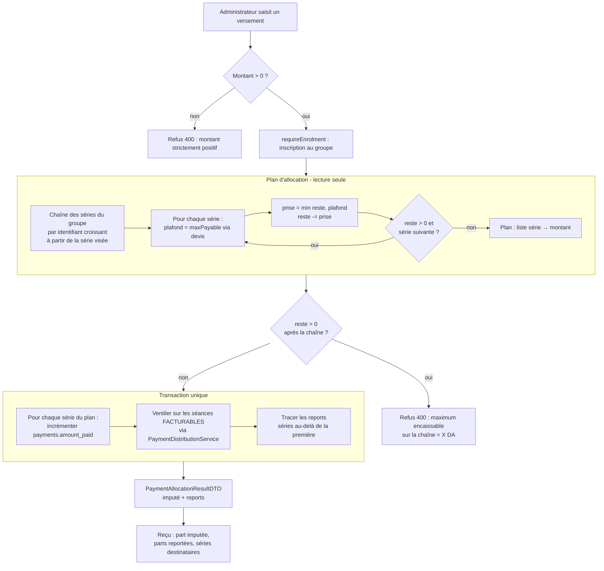
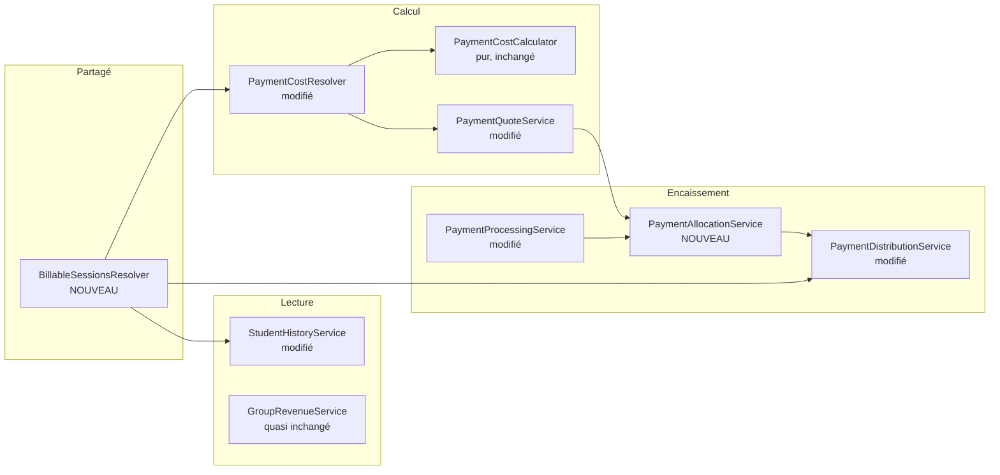

# Design Document

## Overview

Cette conception poursuit trois objectifs, dans cet ordre de dépendance :

1. **Unifier la définition de « séance facturable »** dans un composant partagé unique. C'est la
   cause racine du défaut observé : `StudentHistoryService` applique déjà le prorata, alors que
   `PaymentQuoteService` calcule son plafond sur `series.total_sessions`. Le plafond autorise
   donc plus que ce que la facturation reconnaît, et l'écart devient un trop-perçu intégral
   (Exigence 1.5).
2. **Recaler le coût de série et le plafond encaissable** sur ce décompte (Exigences 2, 3).
3. **Transformer le refus du dépassement en plafonnement puis report** sur les séries suivantes
   (Exigences 4, 5), avec la traçabilité, le reçu et les relevés qui en découlent (6, 7, 8, 9).

Le principe directeur est qu'aucun montant encaissé ne doit rester sans contrepartie
identifiable. Aujourd'hui un versement excédentaire est soit refusé, soit accepté et qualifié de
trop-perçu ; après cette évolution il est réparti sur les séries qui ont réellement quelque chose
à encaisser, ou refusé en bloc avec un motif explicite.

## Décision structurante : la Série est l'unité de facturation

Tranchée avant le démarrage, cette décision conditionne le composant partagé et tout ce qui en
dépend. Elle est documentée en détail dans la section « Décisions tranchées » des exigences.

**Le décompte des séances suivies reste borné à la série.** Aucune agrégation automatique entre
groupes sur un mois civil. Deux constats l'ont emporté : « une série = un mois » est faux dans les
données — le groupe Math 1ère B compte trois séries en novembre 2026 — et toutes les entités
monétaires sont indexées par série, pas par mois.

Cette décision a deux effets directs sur la conception :

1. `BillableSessionsResolver` prend une **série** en paramètre, et non une plage de dates. Sa
   signature `resolve(studentId, seriesId)` est donc définitive.
2. Le décompte des présences alimenté au calculateur reste série-scopé, ce qui valide le
   remplacement de `countPresentForStudentAndSeries` par le compteur du résolveur.

`.kiro/steering/business-rules.md` demandait l'inverse (décompte cross-group sur le mois civil) et
**a été corrigé** : le code avait raison, la règle de référence était périmée.

**Contrepartie obligatoire** : un `MultiGroupActivityDetector` signale les cas que l'agrégation
automatique ne traite plus (Exigence 10). Sans lui, la décision rendrait invisible le changement
de groupe en cours de mois.

## Décisions de détail tranchées

Les sept points laissés ouverts à la rédaction du design ont tous été tranchés à partir de cas
concrets, et sont consignés dans la section « Décisions de détail » des exigences. Le tableau
ci-dessous ne conserve que ce qui a un effet sur la conception.

| Décision | Effet sur la conception |
|---|---|
| Refus **total** si une part du surplus n'est plaçable nulle part | `resolveAllocationPlan` reste en lecture seule et le refus intervient avant toute écriture. Aucune logique d'encaissement partiel |
| Le message de refus doit indiquer **l'action corrective** | Le message nomme le maximum encaissable **et** l'action : créer les séances de la série suivante pour l'ouvrir |
| Une série n'est apte à recevoir que si elle a **au moins une séance facturable** | Le plan teste la présence de séances facturables, pas seulement l'existence de la série |
| Cascade sans limite de profondeur | Boucle sur toute la chaîne des séries du groupe |
| Report automatique | Aucun champ de confirmation ; l'aperçu du dialogue existant suffit |
| Série exemptée sautée | Découle du plafond nul, aucun traitement particulier |
| Rattrapage facturé sur sa série d'origine, **étiqueté comme tel** | Le résolveur expose le motif d'inclusion pour que l'historique puisse l'afficher |
| Reçu nommant les séries destinataires | Le résultat d'encaissement porte les noms de séries, pas seulement les identifiants |
| Aucune reprise de données | Le champ `existingExcess` du devis suffit |
| Signalement d'un **changement de groupe**, pas d'une appartenance multiple | Le détecteur s'appuie sur les inscriptions, pas sur les présences |

### Conséquence structurante : le statut de paiement

La décision du prorata déborde le calcul de coût. **Le statut d'une série doit être évalué contre
le `Coût_Série_Prorata`**, jamais contre `total_sessions × prix`. Un étudiant arrivé à la
dernière séance d'une série et l'ayant réglée est soldé.

Cela touche trois endroits qui comparent aujourd'hui un montant versé à un coût nominal :
`PaymentProcessingService` (statut de la ligne de paiement, qui compare aujourd'hui à
`attendedSessionsCost`), `StudentHistoryService` (statut `FULL` / `PARTIAL` de la série) et
`PaymentStatusService` (témoin « à jour / en retard » de la fiche étudiante). Les trois doivent
consommer la même source, sous peine de reproduire exactement la divergence que cette
fonctionnalité corrige.

### Pourquoi le refus est total

Un versement dont une part du surplus ne peut être placée nulle part est refusé **en totalité**,
et non partiellement accepté. La raison n'est pas technique mais comptable : en acceptant
partiellement, l'argent physiquement reçu diverge du montant enregistré. L'administrateur
conserve la différence en main sans aucune trace dans le système — c'est le mécanisme par lequel
de l'argent disparaît sans qu'aucune intention malveillante n'intervienne.

Le refus préserve aussi l'invariant de l'Exigence 4.3 : montant imputé + surplus = montant du
versement.

Son coût est une ressaisie, et il sera rare en pratique : l'aperçu côté interface (Exigence 9.3)
annonce le maximum encaissable **sur l'ensemble de la chaîne** avant la saisie, de sorte que
l'administrateur ne découvre jamais ce refus après coup. Le message nomme par ailleurs l'action
corrective — créer les séances de la série suivante pour l'ouvrir — plutôt que de laisser
l'administrateur devant un refus sans issue.

## Architecture

### Flux d'encaissement cible



Le plan est calculé **entièrement en lecture** avant toute écriture. Ce découpage est ce qui rend
le refus de l'Exigence 5.5 trivial : si le plan ne couvre pas le versement, rien n'a encore été
écrit, il n'y a aucune annulation à orchestrer.

### Composants



## Components and Interfaces

### Le composant partagé : BillableSessionsResolver

C'est la pièce centrale. Il répond à une seule question : **quelles séances d'une série sont
facturables à un étudiant donné ?** (Exigence 1)

```java
/**
 * Séances d'une série réellement facturables à un étudiant.
 *
 * Source unique de la règle : une séance est facturable si elle est postérieure ou égale à
 * la date d'inscription de l'étudiant dans le groupe, OU si l'étudiant y a une présence
 * active. Cette règle vivait uniquement dans StudentHistoryService, tandis que le devis
 * plafonnait sur series.total_sessions : les deux se contredisaient (Exigence 1.5).
 */
public interface BillableSessionsResolver {

    /** Décompte et détail des séances facturables, jamais nul. */
    BillableSessions resolve(Long studentId, Long seriesId);

    record BillableSessions(
            List<SessionEntity> billable,   // ordre chronologique
            List<SessionEntity> excluded,   // motif : antérieure à l'inscription, non assistée
            int attendedCount,              // présences (isPresent) parmi les facturables
            boolean enrolled,               // inscription trouvée dans student_groups
            Date enrollmentDate) {          // null si aucune inscription

        public int billableCount() { return billable.size(); }
        public int excludedCount() { return excluded.size(); }
    }
}
```

Points de conception :

**L'inscription est lue via `StudentGroupRepository`**, pas via `student.getGroups()`.
`StudentHistoryService` détermine aujourd'hui `isOfficial` par
`student.getGroups().contains(group)` — une collection `@ManyToMany` en mémoire, dont
l'appartenance dépend de `equals`/`hashCode` et du chargement de la session Hibernate. La
requête `findByGroupIdAndStudentIdAndActiveTrue` est déterministe et testable. Cette bascule
corrige au passage une fragilité qui pouvait faire basculer un inscrit régulier en mode
rattrapage.

**Étudiant sans inscription** : seules les séances assistées sont facturables (Exigence 1.4).
C'est le cas du rattrapage pur, cohérent avec la décision 4.

**Les séances assistées sont toujours facturables**, ce qui donne gratuitement l'invariant de
l'Exigence 2.4 : l'ensemble des séances assistées est inclus dans l'ensemble des facturables,
donc `amountDueSoFar ≤ Coût_Série_Prorata` par construction, sans contrôle supplémentaire.

**Ordre chronologique** : la ventilation remplit les séances de la plus ancienne à la plus
récente ; l'ordre est donc porté par le résolveur, pas reconstitué par chaque appelant.

### Le détecteur d'activité multi-groupes

Contrepartie de la décision d'unité de facturation (Exigence 10). Purement informatif : il ne
participe à aucun calcul monétaire et ne peut donc pas fausser un montant.

```java
/**
 * Détecte les mois civils où un étudiant a suivi des séances dans plusieurs groupes.
 *
 * L'agrégation automatique cross-group ayant été abandonnée au profit de la série comme unité
 * de facturation, ce détecteur garantit que le cas reste visible pour l'administrateur, qui
 * l'ajuste manuellement.
 */
public interface MultiGroupActivityDetector {

    List<MultiGroupMonth> detect(Long studentId);

    record MultiGroupMonth(int year, int month, List<GroupActivity> groups) {
        record GroupActivity(Long groupId, String groupName, int attendedCount,
                             boolean catchUpOnly) {}
    }
}
```

Implémentation : une requête d'agrégation groupant les présences actives de l'étudiant par
`(année, mois, groupe)`, puis ne conservant que les couples `(année, mois)` comportant au moins
deux groupes distincts. L'indicateur `catchUpOnly` distingue un vrai changement de groupe d'un
simple rattrapage (Exigence 10.7), les deux ne demandant pas la même réaction administrative.

Ce détecteur est **en lecture seule et hors du chemin d'encaissement** : il n'ajoute aucune
latence à `processPayment` et ne peut pas en bloquer l'exécution (Exigences 10.4, 10.5).

### Modifications par composant — Backend

#### PaymentCostCalculator — inchangé

Le calculateur reste **pur** et sa signature ne change pas. Le prorata n'est pas une nouvelle
règle de calcul : c'est une nouvelle valeur pour un paramètre existant. On lui passe désormais le
nombre de **séances facturables** là où on passait `series.getTotalSessions()`.

Conséquence : `monthTotalCost` devient le `Coût_Série_Prorata` de l'Exigence 2.1 sans modifier
une ligne du calculateur. Sa couverture JaCoCo à 100 % reste acquise.

#### PaymentCostResolver — point d'insertion du prorata

```java
public PaymentCostCalculator calculatorFor(Long studentId, Long seriesId) {
    SessionSeriesEntity series = /* inchangé, 404 si absente */;

    // AVANT : int plannedSessions = series.getTotalSessions();
    BillableSessions billable = billableSessionsResolver.resolve(studentId, seriesId);
    int plannedSessions = billable.billableCount();
    int attendedSessions = billable.attendedCount();

    BigDecimal pricePerSession = resolvePricePerSession(series.getGroup());
    BigDecimal discountRate = discountService.resolveRate(studentId, seriesId);
    return new PaymentCostCalculator(plannedSessions, attendedSessions, pricePerSession, discountRate);
}
```

`attendedSessions` cesse de venir de `attendanceRepository.countPresentForStudentAndSeries` pour
venir du résolveur : les deux décomptes doivent porter sur le même ensemble de séances, sinon
l'invariant 2.4 peut être violé sur des données limites.

#### PaymentQuoteService — plafond recalé et champs exposés

Le calcul du plafond (Exigences 3.1 à 3.3) est structurellement inchangé puisqu'il s'appuie sur
`monthTotalCost`, désormais au prorata. Ce qui change :

- `PaymentQuoteDTO` gagne `billableSessions`, `excludedSessions` et `existingExcess`
  (Exigences 3.4, 3.5) ;
- `plannedSessions` conserve son nom mais porte maintenant le décompte facturable. **Renommer
  serait préférable** — `billableSessions` est explicite — mais le champ est consommé par le
  front (`payment-quote.ts`) et par les libellés d'indices du formulaire. Proposition : ajouter
  `billableSessions` et `excludedSessions`, marquer `plannedSessions` comme déprécié dans la
  documentation du record, et le retirer dans un second temps pour ne pas mêler renommage et
  changement de règle.

#### PaymentAllocationService — nouveau

Isole la décision de répartition, en lecture seule. Ne fait aucune écriture, ce qui le rend
testable sans base.

```java
/** Plan de répartition d'un versement sur la chaîne des séries d'un groupe. */
public record AllocationPlan(
        List<SeriesAllocation> allocations,  // au moins une entrée si le plan est complet
        BigDecimal unplaceable) {            // reliquat non plaçable, zéro si complet

    public record SeriesAllocation(Long seriesId, String seriesName, BigDecimal amount,
                                   boolean carriedOver) {}

    public boolean isComplete() { return unplaceable.signum() == 0; }
    public BigDecimal totalAllocated() { /* somme */ }
}

@Transactional(readOnly = true)
public AllocationPlan plan(Long studentId, Long groupId, Long startSeriesId, BigDecimal amount);
```

Algorithme (Exigences 4.1, 4.2, 5.1, 5.2, 5.8, 5.9) :

```
chaîne  = séries du groupe, identifiant croissant, à partir de startSeriesId inclus
reste   = amount
plan    = []
pour chaque série s de chaîne :
    devis   = quoteService.quote(studentId, s.id)         // applique l'Exigence 3
    // Exigence 5.8 : une série sans séance facturable n'est pas ouverte, elle ne peut
    // rien recevoir même si son plafond théorique serait positif.
    si devis.billableSessions() == 0 : continuer
    prise = min(reste, devis.maxPayable())
    si prise > 0 : plan += (s, prise, carriedOver = (s != startSeriesId))
                   reste -= prise
    si reste == 0 : sortir
retourner AllocationPlan(plan, reste)
```

Le test sur `billableSessions()` est distinct du test sur le plafond, et les deux sont
nécessaires. Une série **soldée** a un plafond nul mais des séances facturables : elle est sautée
et le report continue. Une série **sans séances planifiées** a aussi un plafond nul, mais pour une
raison différente qui appelle une autre réaction — c'est elle qui déclenche le message « créez les
séances pour ouvrir la série ». Confondre les deux produirait un message d'erreur trompeur.

Une série déjà soldée de la chaîne donne un plafond nul, donc `prise = 0` : elle est
**sautée sans être inscrite au plan**, et le report continue sur la suivante. C'est le
comportement attendu quand l'étudiant a déjà réglé une série intermédiaire.

Le plafond est relu série par série via le devis, donc réductions et exemptions s'appliquent
automatiquement à chaque étape : un étudiant exempté sur la série suivante donne un plafond nul
et le surplus poursuit sa route.

#### PaymentProcessingService — plafonnement au lieu du refus

`distributionService.canProcessPayment` refuse aujourd'hui tout montant supérieur à
`maxPayable`. Ce refus disparaît du chemin série pour laisser place au plan. Le refus du montant
nul ou négatif, lui, **reste** (Exigence 4.6).

```java
@Transactional
public PaymentAllocationResult processPayment(Long studentId, Long groupId,
                                              Long seriesId, BigDecimal amount) {
    requirePositiveAmount(amount);          // conservé
    StudentEntity student = /* 404 */;
    GroupEntity group = /* 404 */;
    requireEnrolment(studentId, group);     // conservé

    AllocationPlan plan = allocationService.plan(studentId, groupId, seriesId, amount);
    if (!plan.isComplete()) {
        // Décision 1 : refus en bloc, avec le maximum réellement encaissable.
        throw new CustomServiceException(unplaceableMessage(plan), HttpStatus.BAD_REQUEST);
    }

    for (SeriesAllocation a : plan.allocations()) {
        PaymentEntity payment = getOrCreateSeriesPayment(student, group, a.seriesId());
        payment.setAmountPaid(payment.getAmountPaid() + a.amount().doubleValue());
        payment.setPaymentDate(new Date());
        payment.setStatus(resolveStatus(studentId, a.seriesId(), payment.getAmountPaid()));
        paymentRepository.save(payment);

        distributionService.distributePayment(payment, a.seriesId(), a.amount().doubleValue());

        if (a.carriedOver()) {
            carryOverService.record(studentId, seriesId, a.seriesId(), a.amount(), payment);
        }
    }
    return new PaymentAllocationResult(plan, /* … */);
}
```

Le statut de la ligne de paiement se calcule désormais contre le `Coût_Série_Prorata` de la série
concernée, et non contre `attendedSessionsCost` comme aujourd'hui — deux quantités que
`business-rules.md` demande explicitement de ne pas confondre.

#### PaymentDistributionService — ventilation sur les seules séances facturables

`distributePayment` choisit ses séances par un test `catchUpOnly`. Ce test est conservé pour le
cas du rattrapage pur, mais la liste des séances candidates provient désormais du résolveur
partagé (Exigence 4.5) :

```java
BillableSessions billable = billableSessionsResolver.resolve(studentId, sessionSeriesId);
List<SessionEntity> sessions = catchUpOnly
        ? billable.billable().stream().filter(s -> hasCatchUpAttendance(s, studentId)).toList()
        : billable.billable();
```

Une séance antérieure à l'inscription et non assistée ne peut donc plus recevoir d'affectation,
ce qui est exactement ce qui produisait des `payment_detail` sur des séances non dues.

`canProcessPayment` conserve son rôle de garde-fou du montant positif et de ses messages
contextuels, mais n'est plus l'autorité du plafond : celle-ci passe au plan d'allocation.

#### StudentHistoryService — délégation

`resolveBillableSessions` est **supprimé** et remplacé par un appel au résolveur partagé. Le
service conserve ses responsabilités propres : affichage de toutes les séances pour un inscrit
(y compris les exclues, qui restent visibles avec le statut « non facturée »), affectation en
cascade des versements aux séances, et calcul de `totalAllocated` / `totalOverpaid`.

Son `isOfficial` basé sur `student.getGroups().contains(group)` disparaît au profit du champ
`enrolled` du résolveur.

#### GroupRevenueService — quasi inchangé

L'encaissé par série est déjà lu sur le registre `payments` : un montant reporté sur la série
suivante incrémente le registre de **cette** série, donc les Exigences 8.1 et 8.2 sont
satisfaites sans modification. La séparation `remaining` / `overpaid` de `balanceForSeries` est
également conservée (Exigence 8.5).

Le seul effet de bord est mécanique et bénéfique : `expected` par série devient la somme des
`Coût_Série_Prorata` individuels, donc l'attendu d'un groupe baisse pour les étudiants arrivés en
cours de série. L'Exigence 8.4 (somme des imputations par série = total des versements du groupe)
devient vérifiable, alors qu'elle ne l'était pas tant que des montants restaient non ventilés.

## Data Models

### Traçabilité du report (Exigence 6)

**Approche retenue : une entité dédiée `PaymentCarryOverEntity`.**

```java
@Entity @Table(name = "payment_carry_over")
public class PaymentCarryOverEntity extends BaseEntity {
    @Id @GeneratedValue private Long id;
    @ManyToOne private StudentEntity student;
    @ManyToOne private SessionSeriesEntity sourceSeries;   // série visée à la saisie
    @ManyToOne private SessionSeriesEntity targetSeries;   // série créditée
    @ManyToOne private PaymentEntity targetPayment;        // ligne de paiement créditée
    private BigDecimal amount;
    private Date originPaymentDate;
}
```

`BaseEntity` fournit `dateCreation` et `createdBy` via l'audit JPA, donc l'auteur du report est
tracé sans champ supplémentaire.

**Alternative écartée : un indicateur sur `payment_detail`.** Moins coûteux en schéma, mais il
conflate deux notions différentes — un `payment_detail` répond à « quelle séance ce montant
couvre-t-il », alors qu'un report répond à « d'où vient cet argent ». Un report se ventile
lui-même en plusieurs `payment_detail` sur la série destination ; poser l'indicateur sur chacun
d'eux disperserait l'information et rendrait impossible de restituer « 6 000 DA reportés de la
série A vers la série B » en une ligne, ce que demande l'Exigence 6.2.

L'Exigence 6.4 (distinguer imputation directe et montant reçu par report) se lit alors par
présence ou absence d'un `PaymentCarryOverEntity` pointant la ligne de paiement.

### Contrats de données modifiés

`PaymentQuoteDTO` (back) et `payment-quote.ts` (front) gagnent `billableSessions`,
`excludedSessions` et `existingExcess` (Exigences 3.4, 3.5). Le champ `plannedSessions` porte
désormais le décompte facturable : il est marqué déprécié plutôt que renommé, pour ne pas mêler
un renommage à un changement de règle. `PaymentAllocationResult` est un nouveau contrat exposant
le montant imputé et la liste des reports avec leur série destinataire (Exigence 6.3).

### Modifications par composant — Frontend

| Composant | Modification | Exigence |
|---|---|---|
| `models/payment/payment-quote.ts` | Ajout de `billableSessions`, `excludedSessions`, `existingExcess` | 3.4, 3.5 |
| `models/payment/payment-allocation.ts` *(nouveau)* | Résultat d'encaissement : montant imputé, liste des reports avec série destinataire | 6.3 |
| `payment.service.ts` | Type de retour de `processPayment` élargi au résultat de répartition | 6.3 |
| `payment-dialog.component.ts` | Aperçu de la répartition à la saisie : au-delà du plafond de la série, afficher imputé / reporté et les séries destinataires. Réutilise `getPaymentQuotesForGroup`, déjà en place | 9.1, 9.2, 9.3 |
| `payment-confirmation-dialog.component.ts` | Récapitulatif de la répartition avant validation (décision 3) | 9.3 |
| `payment-receipt-pdf.service.ts` | Bloc « répartition du versement » : part imputée, parts reportées, séries destinataires | 7.1, 7.2, 7.5 |
| i18n `fr.json` / `en.json` | Motif d'exclusion, libellés de report, mention sur le reçu | 9.2, 7.2 |

Le formulaire n'a **plus besoin** de son validateur `max` sur le plafond de la série : dépasser
n'est plus une erreur mais un report. Il conserve en revanche le refus du montant nul ou négatif.
Le nouveau plafond client devient le maximum encaissable sur la chaîne, calculable localement en
sommant les `maxPayable` des devis déjà chargés — ce qui évite un appel supplémentaire et rend le
refus de la décision 1 impossible à atteindre par inadvertance.

Rappel de mise en œuvre du reçu : les montants passent par `Intl.NumberFormat`, qui insère une
espace fine insécable (U+202F) absente de la police embarquée par pdfmake. Le nettoyage existant
dans le service doit couvrir les nouveaux libellés.

## Error Handling

| Situation | Comportement | Exigence |
|---|---|---|
| Montant ≤ 0 | 400, message contextuel existant (série soldée / étudiant exempté / reste à payer) | 4.6 |
| Étudiant jamais inscrit au groupe | 400, garde `requireEnrolment` conservé | — |
| Série introuvable | 404 | 3.7 |
| Coût ou plafond non résoluble | 400, aucun devis produit | 3.7 |
| Surplus non plaçable | 400 **avant toute écriture**, avec le maximum encaissable sur la chaîne | Décision 1, 4.3 |
| Échec de ventilation ou d'imputation | Annulation de la transaction entière, y compris la part déjà imputée sur la série visée | 4.9, 5.5, 5.7 |

`processPayment` reste annoté `@Transactional` : l'ensemble plan → imputations → ventilations →
traçabilité vit dans une seule transaction (Exigence 5.6). Une `RuntimeException` levée à
n'importe quelle étape annule tout.

Un point d'attention hérité : `PaymentDistributionService` levait une `CustomServiceException`
porteuse d'un `HttpStatus.OK` pour signaler un excédent, ce qui annulait la transaction tout en
annonçant un succès. Ce piège a été neutralisé (avertissement en journal) et ne doit pas
réapparaître : **aucune exception ne doit servir à transmettre une information de succès.**

## Correctness Properties

Trois invariants gouvernent cette fonctionnalité. Ils sont énoncés ici parce qu'ils valent
mieux que des exemples : ils doivent tenir sur tout l'espace des entrées, et le projet dispose
déjà de jqwik pour les vérifier ainsi.

### Property 1: Conservation du versement

Pour tout versement accepté, `somme des montants imputés sur les séries = montant du versement`.
Aucun centime ne disparaît ni n'apparaît en cours de répartition. Un versement dont le reliquat
n'est plaçable nulle part est refusé en totalité, ce qui préserve l'égalité.

**Validates: Requirements 4.3**

Vérifiable par jqwik sur `PaymentAllocationService.plan`, sans base de données.

### Property 2: Aucun dépassement par série

Pour toute série retenue dans le plan, `montant imputé ≤ plafond encaissable de cette série` au
moment du calcul. C'est l'invariant qui garantit qu'aucune série n'est créditée au-delà de son
coût, et donc qu'aucun trop-perçu n'est créé par le report.

**Validates: Requirements 4.2, 5.1**

Vérifiable par jqwik sur le plan d'allocation.

### Property 3: Encadrement du coût

Pour toute combinaison de séances, de présences et de taux de réduction :
`0 ≤ amountDueSoFar ≤ Coût_Série_Prorata ≤ séances planifiées × prix × (1 − taux)`.

La borne basse découle du fait que toute séance assistée est facturable (Exigence 1.2), donc que
les assistées forment un sous-ensemble des facturables. La borne haute découle du fait que les
facturables forment un sous-ensemble des séances planifiées.

**Validates: Requirements 2.4, 2.5**

Vérifiable par jqwik sur `PaymentCostCalculator`, déjà couvert à 100 %.

### Property 4: Cohérence encaissement / relevé

`somme des imputations par série = total des versements enregistrés pour le groupe`. Cet
invariant n'était pas vérifiable avant cette évolution, puisque des montants pouvaient rester
non ventilés au registre sans contrepartie dans les séries.

**Validates: Requirements 8.4**

Vérifiable en test d'intégration sur `GroupRevenueService`.

## Testing Strategy

### Tests unitaires purs

`PaymentAllocationService.plan` est sans effet de bord et constitue le cœur de la règle. Cas à
couvrir : montant inférieur au plafond (aucun report) ; montant égal au plafond ; dépassement
avec une série suivante disponible ; cascade sur trois séries ; série intermédiaire déjà soldée
donc sautée ; série suivante avec étudiant exempté ; aucune série suivante (plan incomplet) ;
toutes les séries soldées.

`BillableSessionsResolver` : séance postérieure à l'inscription ; séance antérieure non assistée
(exclue) ; séance antérieure mais assistée (facturable, Exigence 1.2) ; aucune inscription
(Exigence 1.4) ; séance ajoutée après coup (Exigence 1.6).

### Tests basés sur les propriétés (jqwik)

Le projet utilise déjà jqwik pour les invariants monétaires. Trois propriétés valent d'être
énoncées, car elles couvrent l'espace des cas mieux que des exemples :

1. **Conservation** : pour tout versement accepté, `somme des montants imputés = montant du
   versement` (Exigence 4.3).
2. **Aucun dépassement** : pour toute série du plan, `montant imputé ≤ plafond de cette série`
   (Exigences 4.2, 5.1).
3. **Encadrement du coût** : pour toute combinaison de séances et de taux,
   `0 ≤ amountDueSoFar ≤ Coût_Série_Prorata ≤ séances planifiées × prix × (1 − taux)`
   (Exigences 2.4, 2.5).

### Tests d'intégration

Un test `@DataJpaTest` sur le scénario complet qui a révélé le défaut : étudiant inscrit
aujourd'hui, série dont toutes les séances sont passées et non assistées, versement du montant
d'une série entière. Attendu : refus explicite plutôt qu'encaissement intégralement en
trop-perçu.

Un second sur le report : deux séries, la première partiellement due, versement couvrant les
deux. Attendu : deux lignes `payments` créditées, `payment_detail` uniquement sur des séances
facturables, un `PaymentCarryOverEntity`, et un relevé de groupe dont l'encaissé par série
correspond.

### Couverture

`PaymentCostResolver` et `PaymentCostCalculator` figurent déjà dans la règle JaCoCo à 100 %
lignes **et** branches du `pom.xml`. `BillableSessionsResolver` et `PaymentAllocationService`
portent des règles métier monétaires de même nature et doivent rejoindre cette liste
`<includes>`. Conséquence à anticiper : chaque branche défensive de ces composants devra être
atteinte par un test, ou ne pas être écrite.

## Ce que cette conception ne traite pas

- **Le sort d'un crédit non consommé** : sans crédit flottant (décision 1), la question ne se
  pose pas. Elle reviendra si la décision 1 change.
- **La reprise des données existantes** (décision 7) : les couples étudiant/série déjà encaissés
  au-delà du nouveau prorata resteront en excédent affiché.
- **La divergence entre `payments.amount_paid` et la somme des `payment_detail`** pour les
  versements antérieurs : le champ `unassignedToSeries` du relevé de groupe continue de
  l'exposer. Cette conception empêche d'en créer de nouveaux mais ne corrige pas les anciens.
- **Le nombre de séances planifiées d'une série** (`total_sessions`) : il reste la référence du
  plafond haut de l'Exigence 2.5, et sa dérive éventuelle par rapport aux séances réellement
  créées est un sujet distinct.
