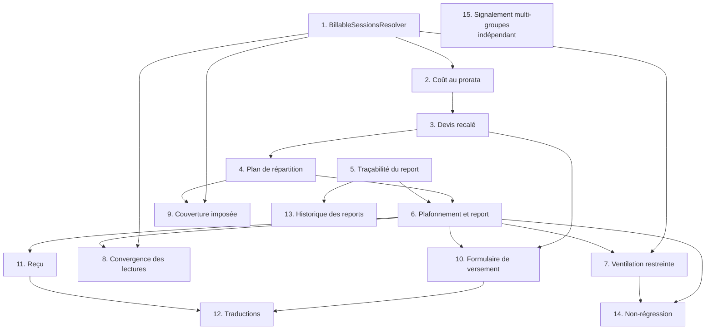

# Implementation Plan

## Overview

L'ordre est contraint par une chaîne de dépendances de données : le décompte des séances
facturables (tâche 1) alimente le coût au prorata (2), qui alimente le plafond du devis (3), qui
alimente le plan de répartition (4). Rien ne peut être branché avant que le résolveur partagé
existe.

Les tâches 1 à 9 sont backend et laissent chacune le projet compilable avec la suite de tests
verte. Les tâches 10 à 13 sont frontend et ne dépendent que des contrats exposés en 3.1 et 6.1.
La tâche 14 clôt la boucle en verrouillant le défaut d'origine.

Deux contraintes du dépôt pèsent sur presque chaque tâche : tous les montants en `BigDecimal`
échelle 2 `HALF_UP`, et la validation des règles monétaires écrite explicitement en Java dans les
services plutôt que par annotation.

## Task Dependency Graph



La tâche 5 est indépendante des tâches 1 à 4 : elle peut être menée en parallèle, seule la 6 a
besoin des deux branches. Les tâches 10 et 11 sont également parallélisables entre elles.

```json
{
  "waves": [
    {
      "wave": 1,
      "tasks": ["1", "5"],
      "rationale": "Le résolveur de séances facturables et la traçabilité du report n'ont aucune dépendance et ouvrent les deux branches du travail."
    },
    {
      "wave": 2,
      "tasks": ["2"],
      "rationale": "Le coût au prorata consomme le décompte produit par la tâche 1."
    },
    {
      "wave": 3,
      "tasks": ["3"],
      "rationale": "Le plafond du devis dérive du coût au prorata et expose les contrats consommés par le front."
    },
    {
      "wave": 4,
      "tasks": ["4"],
      "rationale": "Le plan de répartition lit le plafond série par série via le devis."
    },
    {
      "wave": 5,
      "tasks": ["6"],
      "rationale": "L'encaissement avec plafonnement et report a besoin du plan et de la traçabilité."
    },
    {
      "wave": 6,
      "tasks": ["7", "8", "9", "10", "11", "13"],
      "rationale": "Ventilation, convergence des lectures, couverture, formulaire, reçu et historique dépendent tous de l'encaissement mais pas les uns des autres."
    },
    {
      "wave": 7,
      "tasks": ["12", "14"],
      "rationale": "Les traductions closent le front, le test de non-régression valide la chaîne complète."
    },
    {
      "wave": 8,
      "tasks": ["15"],
      "rationale": "Le signalement multi-groupes est indépendant de la chaîne de facturation : purement informatif, il ne participe à aucun calcul monétaire et peut être mené à tout moment."
    }
  ]
}
```

## Tasks

- [x] 1. Créer le composant partagé de séances facturables
- [x] 1.1 Écrire `BillableSessionsResolver` et son record `BillableSessions`
  - **Décision tranchée à respecter** : l'unité de facturation est la Série. La signature est
    `resolve(studentId, seriesId)` et prend une série, jamais une plage de dates. Aucune
    agrégation entre groupes sur un mois civil
  - Créer l'interface et l'implémentation dans `back/src/main/java/com/school/management/service/payment/`
  - Résoudre l'inscription via `StudentGroupRepository.findByGroupIdAndStudentIdAndActiveTrue`, et non via la collection `student.getGroups()` en mémoire
  - Retenir une séance si sa date est postérieure ou égale à `date_assigned`, ou si l'étudiant y a une présence active
  - Sans inscription trouvée, ne retenir que les séances assistées
  - Exposer `billable` (ordre chronologique), `excluded`, `attendedCount`, `enrolled`, `enrollmentDate`
  - _Requirements: 1.1, 1.2, 1.3, 1.4, 1.6_

- [x] 1.2 Écrire les tests unitaires du résolveur
  - Séance postérieure à l'inscription retenue ; séance antérieure non assistée exclue ; séance antérieure mais assistée retenue
  - Absence d'inscription : seules les séances assistées sont retenues
  - Séance ajoutée après coup avec date postérieure : retenue
  - Vérifier que `attendedCount` ne compte que des séances présentes dans `billable`
  - _Requirements: 1.1, 1.2, 1.3, 1.4, 1.6_

- [x] 2. Recaler le coût de série sur le prorata
- [x] 2.1 Alimenter `PaymentCostResolver` avec le décompte facturable
  - Dans `calculatorFor`, remplacer `series.getTotalSessions()` par `billableCount()` du résolveur
  - Remplacer l'appel à `attendanceRepository.countPresentForStudentAndSeries` par `attendedCount()` du résolveur, afin que les deux décomptes portent sur le même ensemble de séances
  - Ce décompte reste **borné à la série**, conformément à la décision d'unité de facturation : ne pas introduire de comptage par plage de dates ni cross-group
  - Ne pas modifier `PaymentCostCalculator` : il reste pur, seul le paramètre change
  - _Requirements: 2.1, 2.2, 2.3_

- [x] 2.2 Écrire les tests de coût au prorata
  - Étudiant inscrit avant toutes les séances : coût identique au comportement actuel
  - Étudiant inscrit après deux séances non assistées : coût réduit de deux séances
  - Étudiant exempté : coût et montant dû nuls
  - Aucune séance facturable : coût et montant dû nuls
  - Propriété jqwik d'encadrement `0 ≤ amountDueSoFar ≤ Coût_Série_Prorata ≤ séances planifiées × prix × (1 − taux)`
  - _Requirements: 2.4, 2.5, 2.6, 2.7, 2.8_

- [x] 3. Exposer le prorata dans le devis
- [x] 3.1 Étendre `PaymentQuoteDTO` et `PaymentQuoteService`
  - Ajouter `billableSessions`, `excludedSessions`, `existingExcess` au record
  - Documenter `plannedSessions` comme déprécié : il porte désormais le décompte facturable, sans renommage à cette étape
  - Calculer `existingExcess` comme l'écart entre le montant versé et le coût au prorata quand il est positif, et forcer `maxPayable` à zéro dans ce cas
  - _Requirements: 3.1, 3.2, 3.3, 3.4, 3.5_

- [x] 3.2 Écrire les tests du plafond recalé
  - Inscrit régulier : plafond = coût au prorata − versé
  - Rattrapage seul : plafond = montant dû à ce jour − versé
  - Plafond jamais négatif
  - Série historiquement sur-encaissée : plafond nul et excédent existant exposé
  - Deux appels consécutifs sans changement de données produisent des montants identiques
  - _Requirements: 3.1, 3.2, 3.3, 3.5, 3.6, 3.7_

- [x] 3.3 Répercuter les nouveaux champs sur le modèle front
  - Ajouter les trois champs à `front/src/app/models/payment/payment-quote.ts`
  - _Requirements: 3.4, 3.5_

- [x] 4. Écrire le service de plan de répartition
- [x] 4.1 Créer `PaymentAllocationService` et le record `AllocationPlan`
  - Méthode `plan(studentId, groupId, startSeriesId, amount)` en lecture seule, sans aucune écriture
  - Parcourir les séries du groupe par identifiant croissant à partir de la série visée
  - Pour chaque série, lire le plafond via le devis, prendre `min(reste, plafond)`, décrémenter le reste
  - Marquer `carriedOver` pour toute série autre que la série visée
  - Sauter sans l'inscrire au plan toute série dont le plafond est nul
  - Écarter également toute série sans aucune séance facturable : une série sans séances planifiées n'est pas ouverte et ne peut rien recevoir
  - Distinguer les deux motifs d'écartement, série soldée et série non ouverte, afin que le message de refus soit exact
  - Cascader sans limite de profondeur jusqu'à épuisement du surplus
  - Retourner le reliquat non plaçable dans `unplaceable`
  - _Requirements: 4.1, 4.2, 5.1, 5.2, 5.4, 5.8, 5.9_

- [x] 4.2 Écrire les tests unitaires du plan
  - Montant inférieur au plafond : une seule allocation, aucun report
  - Montant égal au plafond : une allocation, reliquat nul
  - Dépassement avec série suivante disponible : deux allocations dont une reportée
  - Cascade sur trois séries
  - Série intermédiaire déjà soldée : sautée, report sur la suivante
  - Série suivante avec étudiant exempté : plafond nul, poursuite du report
  - Aucune série suivante : plan incomplet avec reliquat
  - Toutes les séries soldées : plan incomplet, aucune allocation
  - _Requirements: 4.1, 4.2, 5.1, 5.2, 5.4_

- [x] 4.3 Écrire les propriétés jqwik du plan
  - Conservation : somme des montants alloués plus reliquat égale le montant du versement
  - Aucun dépassement : chaque montant alloué est inférieur ou égal au plafond de sa série
  - _Requirements: 4.2, 4.3, 5.1_

- [x] 5. Ajouter la traçabilité du report
- [x] 5.1 Créer `PaymentCarryOverEntity` et son dépôt
  - Entité étendant `BaseEntity` avec étudiant, série source, série destination, ligne de paiement créditée, montant, date du versement d'origine
  - Créer `PaymentCarryOverRepository` avec une recherche par étudiant et par ligne de paiement
  - _Requirements: 6.1, 6.4_

- [x] 5.2 Créer le service d'enregistrement des reports
  - Méthode d'enregistrement appelée pour chaque allocation marquée `carriedOver`
  - _Requirements: 6.1_

- [x] 6. Remplacer le refus du dépassement par le plafonnement et le report
- [x] 6.1 Réécrire `PaymentProcessingService.processPayment`
  - Conserver `requirePositiveAmount` et `requireEnrolment`
  - Calculer le plan avant toute écriture ; si le plan est incomplet, refuser le versement en totalité par une erreur 400 indiquant le maximum encaissable sur la chaîne **et** l'action corrective : créer les séances de la série suivante pour l'ouvrir
  - Ne jamais encaisser partiellement : un montant reçu non entièrement enregistré ferait diverger la caisse du système
  - Pour chaque allocation : incrémenter `payments.amount_paid` de la série concernée, ventiler, puis enregistrer le report le cas échéant
  - Calculer le statut de la ligne de paiement contre le coût au prorata de sa série, et non contre le coût des séances assistées
  - Retourner un `PaymentAllocationResult` portant le montant imputé et la liste des reports
  - Conserver l'annotation transactionnelle pour que tout échec annule l'ensemble
  - _Requirements: 4.1, 4.2, 4.3, 4.4, 4.6, 4.7, 4.8, 4.9, 5.3, 5.5, 5.6, 5.7, 6.3_

- [x] 6.2 Retirer le plafond de `canProcessPayment` sur le chemin série
  - Conserver le refus du montant nul ou négatif et ses messages contextuels
  - Le plafond devient la responsabilité du plan d'allocation
  - _Requirements: 4.6_

- [x] 6.3 Écrire les tests d'encaissement avec plafonnement
  - Versement sous le plafond : une seule série créditée
  - Versement au-delà : série visée créditée à hauteur du plafond, série suivante créditée du reste, un report enregistré
  - Somme des montants imputés égale le montant du versement
  - Versement non plaçable en totalité : refus 400 et aucune écriture en base
  - Échec de ventilation simulé : annulation complète, aucun montant versé modifié
  - _Requirements: 4.3, 4.9, 5.5, 5.7_

- [x] 7. Restreindre la ventilation aux séances facturables
- [x] 7.1 Brancher `PaymentDistributionService` sur le résolveur partagé
  - Remplacer la liste des séances candidates par `billable()` du résolveur
  - Conserver le mode rattrapage en filtrant les séances facturables sur les présences de rattrapage
  - _Requirements: 4.5, 1.5_

- [x] 7.2 Écrire les tests de ventilation
  - Aucune affectation créée sur une séance antérieure à l'inscription et non assistée
  - Versement intégral d'une série réparti sur toutes les séances facturables
  - Étudiant en rattrapage seul : affectation limitée aux séances de rattrapage
  - _Requirements: 4.5_

- [x] 8. Faire converger les lectures sur la définition partagée
- [x] 8.1 Déléguer dans `StudentHistoryService`
  - Supprimer `resolveBillableSessions` et appeler le résolveur partagé
  - Remplacer `isOfficial` calculé par `student.getGroups().contains(group)` par le champ `enrolled` du résolveur
  - _Requirements: 1.5_

- [x] 8.3 Aligner le statut de paiement sur le coût au prorata
  - Faire évaluer le statut de série contre le coût au prorata et non contre un coût nominal, dans `StudentHistoryService`, `PaymentProcessingService` et `PaymentStatusService`
  - Vérifier que les trois consomment la même source, sous peine de reproduire la divergence que cette fonctionnalité corrige
  - Test : étudiant arrivé à la dernière séance d'une série de quatre et ayant réglé cette séance ; attendu soldé et à jour, et non en retard
  - _Requirements: 11.1, 11.2_

- [x] 8.4 Rendre le prorata lisible dans les historiques
  - Afficher chaque séance exclue en indiquant que l'étudiant n'était pas présent et que la séance n'est pas facturée, dans l'historique de paiement et dans l'historique complet
  - Distinguer visuellement une séance exclue d'une séance facturable impayée : la première n'est pas une dette
  - Étiqueter comme rattrapage une séance antérieure à l'inscription facturée parce qu'elle a été suivie
  - Afficher le coût au prorata et le nombre de séances facturables dans le récapitulatif de série
  - Ajouter les traductions française et anglaise correspondantes
  - _Requirements: 11.3, 11.4, 11.5, 11.6_

- [x] 8.2 Vérifier la cohérence du relevé de groupe
  - Écrire un test d'intégration constatant que l'attendu par série est la somme des coûts au prorata individuels
  - Vérifier qu'un montant reporté est compté dans les encaissements de la série destination et absent de ceux de la série source
  - Vérifier qu'un montant reporté n'est jamais classé en trop-perçu et que reste à payer et trop-perçu restent présentés séparément
  - Vérifier que la somme des imputations par série égale le total des versements du groupe
  - _Requirements: 8.1, 8.2, 8.3, 8.4, 8.5_

- [x] 9. Étendre la couverture imposée
  - Ajouter `BillableSessionsResolver` et `PaymentAllocationService` aux `includes` de la règle JaCoCo du `pom.xml`
  - S'assurer que chaque branche de ces deux composants est atteinte, ou retirer les branches défensives inutiles
  - _Requirements: 2.8, 3.7_

- [x] 10. Afficher la répartition dans le formulaire de versement
- [x] 10.1 Créer le modèle front du résultat de répartition
  - Ajouter `front/src/app/models/payment/payment-allocation.ts` : montant imputé et liste des reports avec série destinataire
  - Élargir le type de retour de `processPayment` dans `payment.service.ts`
  - _Requirements: 6.3_

- [x] 10.2 Afficher le prorata et l'aperçu du report dans `payment-dialog.component`
  - Afficher le coût au prorata, le nombre de séances facturables et le nombre de séances exclues de la série choisie
  - Afficher le motif d'exclusion lorsque au moins une séance est exclue
  - Remplacer le validateur `max` sur le plafond de la série par un plafond égal au maximum encaissable sur la chaîne, calculé en sommant les plafonds des devis déjà chargés par `getPaymentQuotesForGroup`
  - Conserver le refus du montant nul ou négatif
  - Afficher la répartition prévisionnelle imputé / reporté dès que le montant dépasse le plafond de la série
  - _Requirements: 9.1, 9.2, 9.3, 9.4_

- [x] 10.3 Récapituler la répartition dans le dialogue de confirmation
  - Afficher dans `payment-confirmation-dialog.component` le montant imputé sur la série et les montants reportés avec leurs séries destinataires
  - _Requirements: 9.3_

- [x] 11. Faire figurer le report sur le reçu
  - Étendre `PaymentReceiptData` avec la part imputée, les parts reportées et les noms des séries destinataires
  - Afficher le coût au prorata et le nombre de séances facturables retenues
  - Afficher un reste à payer égal au coût au prorata diminué du montant versé de la série
  - Afficher un montant reporté nul lorsqu'il n'y a pas de report
  - Vérifier que le montant reçu imprimé égale la somme de la part imputée et des parts reportées
  - Passer les nouveaux libellés par le nettoyage des espaces Unicode déjà en place, la police embarquée ne possédant pas U+202F
  - _Requirements: 7.1, 7.2, 7.3, 7.4, 7.5_

- [x] 12. Ajouter les traductions
  - Clés du motif d'exclusion, de l'aperçu de répartition et des mentions de report sur le reçu, en français et en anglais
  - Vérifier que les deux fichiers de traduction restent structurellement identiques
  - _Requirements: 9.2, 7.2_

- [x] 13. Restituer les reports dans l'historique de paiement
  - Exposer chaque report avec son montant, sa série source et sa série destination dans l'historique de l'étudiant
  - Distinguer un montant imputé directement d'un montant reçu par report
  - _Requirements: 6.2, 6.4_

- [x] 15. Signaler un changement de groupe
- [x] 15.1 Écrire `GroupChangeDetector`
  - Détecter la clôture d'une inscription dans un groupe et l'ouverture d'une inscription dans un autre groupe, les deux événements tombant dans le même mois civil
  - S'appuyer sur les inscriptions (`student_groups`) et non sur les présences : un étudiant suivant plusieurs matières a plusieurs inscriptions simultanément actives, ce qui ne constitue pas un changement
  - Exposer le mois concerné, le groupe quitté, le groupe rejoint et le nombre de séances suivies dans chacun sur ce mois
  - Garder le composant en lecture seule et hors du chemin d'encaissement
  - _Requirements: 10.1, 10.3_

- [x] 15.2 Écrire les tests du détecteur
  - Inscription clôturée dans un groupe et ouverte dans un autre le même mois : signalement émis avec les deux groupes et leurs décomptes
  - Étudiant inscrit simultanément à plusieurs matières, aucune clôture : **aucun signalement**, c'est le cas normal à ne pas transformer en alerte permanente
  - Clôture et ouverture sur deux mois civils différents : aucun signalement
  - Aucune inscription clôturée : aucun signalement
  - _Requirements: 10.1, 10.4_

- [x] 15.3 Exposer le signalement et l'afficher
  - Ajouter un point d'entrée de lecture pour les signalements d'un étudiant
  - Afficher le signalement sur la fiche de l'étudiant et sur le formulaire de versement, avec le mois, les groupes et les décomptes
  - Vérifier que le signalement n'altère aucun montant et ne bloque aucun enregistrement de versement
  - Ajouter les traductions française et anglaise du signalement
  - _Requirements: 10.2, 10.5, 10.6, 10.7_

- [x] 14. Écrire le test de non-régression du défaut d'origine
  - Étudiant inscrit ce jour dans un groupe dont toutes les séances de la série sont passées et non assistées
  - Versement du montant d'une série entière
  - Attendu : refus explicite avec le maximum encaissable, et non un encaissement intégralement classé en trop-perçu
  - Attendu : aucune ligne de paiement ni affectation créée
  - _Requirements: 1.3, 3.1, 4.3_

## Notes

**Toutes les décisions produit sont tranchées.** Aucune tâche ne repose plus sur une hypothèse.
Les décisions et leurs justifications sont consignées dans la section « Décisions de détail » des
exigences.

**Trois pièges à éviter pendant l'implémentation**, chacun ayant déjà produit un défaut dans ce
dépôt :

1. **Le statut de paiement doit être évalué contre le coût au prorata** (tâche 8.3). Trois
   composants comparent aujourd'hui un montant versé à un coût nominal :
   `PaymentProcessingService`, `StudentHistoryService` et `PaymentStatusService`. S'ils ne
   consomment pas la même source, on reproduit exactement la divergence que cette fonctionnalité
   corrige.
2. **Deux motifs distincts donnent un plafond nul** (tâche 4.1) : une série soldée et une série
   sans séances planifiées. Les confondre produirait un message de refus trompeur — « série
   soldée » là où il faudrait dire « créez les séances pour ouvrir la série ».
3. **Le signalement porte sur un changement de groupe, pas sur l'appartenance à plusieurs
   groupes** (tâche 15.1). Un étudiant suivant maths, physique et arabe a trois inscriptions
   actives simultanément : le signaler produirait une alerte permanente que personne ne lirait.

**Aucune reprise de données n'est prévue.** Les couples étudiant/série déjà encaissés au-delà du
nouveau prorata resteront en excédent affiché via le champ `existingExcess` introduit en tâche
3.1. Si une reprise devenait nécessaire, elle ferait l'objet d'une tâche distincte avec un script
de recalcul.

**`.kiro/steering/business-rules.md` a été mis à jour** avec deux nouvelles sections, « Prorata :
arrivée en cours de série » et « Versement excédentaire : report sur la série suivante ». C'est la
référence de domaine à consulter en cas de doute pendant l'implémentation.

**Ordre de vérification recommandé** : exécuter la suite complète après chaque tâche numérotée
principale. Les tâches 2.1, 6.1 et 7.1 modifient des composants dont la couverture JaCoCo est
imposée à 100 % lignes et branches ; un échec de la règle de couverture y est plus probable
qu'un échec de test.
