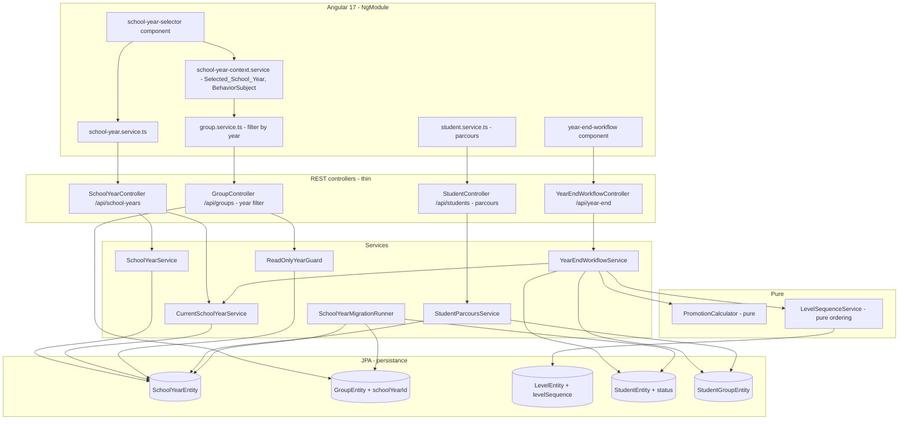

# Design Document — Année Scolaire (School Year)

## Overview

This design introduces the **année scolaire** (School Year) temporal dimension into the School
Management System following the already-decided **Option A** direction from `requirements.md`:

- A new `SchoolYearEntity` (label, start date, end date, current-year flag) lives in the
  existing `persistance` folder (never renamed). Exactly one School Year is current at a time.
- The School Year is attached to the **Group** only (`schoolYearId` on `GroupEntity`). Series,
  Sessions, payments, and attendance inherit their School Year through their Group — no year
  column is duplicated on those entities (Requirement 3.4, 3.5).
- The Student `level` continues to mean the **current** level. The historical level for a past
  year is derived from the Levels of the Groups the Student was enrolled in that year, via the
  existing `student_groups` / `StudentGroupEntity` link (Requirement 4).
- `LevelEntity` gains an integer `Level_Sequence` (ordering/rank) so "next level" and "highest
  level" can be determined for promotion (Requirement 8).
- `StudentEntity` gains a `Student_Status` (ACTIVE / INACTIVE) enum for departure/archival
  (Requirement 7).
- A **Year-End Workflow** service creates the next School Year, marks it current, and applies
  Promotion / Redoublement / Departure per Student while preserving all past data
  (Requirements 5, 6, 8).
- Data belonging to non-current School Years is **read-only**: create/update/delete against
  past-year data is rejected (Requirement 9).
- A **global School Year selector** (frontend context filter, default current year) plus
  backend endpoints filter Groups by School Year (Requirement 10).
- The Student profile shows a **parcours** (per-year level + groups) served by a dedicated
  endpoint (Requirement 11).
- A one-time **Migration** creates the initial current School Year, assigns all existing Groups
  to it, and sets all Students ACTIVE (Requirement 12).
- All new user-facing strings are translatable FR + EN via ngx-translate (Requirement 15).

### Design principles

- **The `persistance` folder is not renamed.** All new entities live inside it (convention).
- **Year lives on the Group, derived everywhere else.** No `schoolYearId` column is added to
  Series, Session, payment, or attendance. Their year is resolved through
  `session.series.group.schoolYear` (Requirement 3.4/3.5, 12.3).
- **Level Sequence is the single source of promotion ordering.** "Next level" and "highest
  level" are pure functions of the `levelSequence` integers; no level string parsing.
- **The promotion decision logic stays pure.** A pure `PromotionCalculator` decides the target
  level and status for a `(currentLevel, decision, isHighest)` triple, so the correctness-
  critical rules are trivially property-testable. The `YearEndWorkflowService` handles entity
  loading and persistence around it.
- **Thin controllers.** New controllers (`SchoolYearController`, `YearEndWorkflowController`,
  parcours endpoint on the student controller) delegate all logic to services.
- **DTO↔Entity via `MappingContext`.** New mappers extend the existing
  `com.school.management.shared.mapper.MappingContext` pattern; `ApplicationContextProvider`
  is not used (convention).
- **French comments/messages preserved.** Error messages and Javadoc are written in French to
  match the codebase; existing French strings are never translated.
- **Money stays `BigDecimal`.** This feature does not touch money math; existing `BigDecimal`
  usage in payments is left intact.

## Architecture



### Layering

The layered pattern (Controller → Service → Repository → Entity) is preserved. Two pure
helpers (`LevelSequenceService`, `PromotionCalculator`) sit below the orchestration services so
the ordering and decision logic is testable in isolation. `ReadOnlyYearGuard` is a cross-cutting
service consulted by mutating group/session/payment/attendance flows to enforce read-only past
years (Requirement 9).

## Components and Interfaces

### 1. SchoolYearService + SchoolYearController (new)

Controller endpoints (thin), matching existing controller style:

| Method | Endpoint | Purpose | Requirement |
|--------|----------|---------|-------------|
| POST | `/api/school-years` | Create a School Year | 1.2, 1.3, 1.4 |
| GET | `/api/school-years` | List all, ordered by start date desc | 1.5, 1.6 |
| GET | `/api/school-years/{id}` | Retrieve one | 1.5 |
| GET | `/api/school-years/current` | Current School Year (or "none defined") | 2.5, 13.1 |
| PATCH | `/api/school-years/{id}/set-current` | Mark as current | 2.1, 2.2, 2.4 |

`SchoolYearService` responsibilities:
- **create**: validate label present, start/end present, `startDate < endDate` (Requirement
  1.3), unique label (Requirement 1.4). If this is the first School Year, mark it current
  (Requirement 2.3).
- **findAll**: return ordered by `startDate` descending (Requirement 1.6).
- **setCurrent(id)**: within one transaction, clear the current flag on the previously current
  year and set it on the target (Requirement 2.1, 2.2). Rejects any operation that would leave
  no current year (Requirement 2.4).

### 2. CurrentSchoolYearService (new)

Small dedicated service that answers "what is the current year?" and enforces the single-current
invariant. Used by group creation defaults, the year-end workflow, and the read-only guard.

```java
@Service
public class CurrentSchoolYearService {
    Optional<SchoolYearEntity> findCurrent();        // Requirement 2.5, 13.1
    SchoolYearEntity requireCurrent();               // throws NoCurrentSchoolYearException (13.x)
    void makeCurrent(SchoolYearEntity target);       // flips flags atomically (2.1, 2.2)
}
```

When no current year exists, `findCurrent()` returns empty and `requireCurrent()` throws a
domain exception mapped to a clear "aucune année scolaire courante définie" response
(Requirement 13.1). Group creation calls `requireCurrent()` and therefore refuses to create a
Group when no current year is designated (Requirement 13.3).

### 3. LevelSequenceService (new, pure ordering)

Responsibility: interpret the new `levelSequence` field to answer promotion questions.

```java
@Service
public class LevelSequenceService {
    // deps: LevelRepository (only for loading; ordering logic is pure)
    Optional<LevelEntity> nextLevel(LevelEntity current, List<LevelEntity> ordered);
    boolean isHighest(LevelEntity level, List<LevelEntity> ordered);
    List<LevelEntity> orderedBySequence();           // sort by levelSequence asc
}
```

- `orderedBySequence()` returns levels sorted ascending by `levelSequence`.
- `nextLevel(current)` returns the level with the smallest `levelSequence` strictly greater than
  `current.levelSequence`, or empty if none (current is the highest).
- `isHighest(level)` is true iff `nextLevel` is empty.

The pure comparison logic (given an ordered list) is separated from repository loading so it can
be property-tested without a database.

### 4. PromotionCalculator (new, pure)

Responsibility: decide the outcome for one Student given a decision. No entity loading, no I/O.

```java
public enum PromotionDecision { PROMOTION, REDOUBLEMENT, DEPARTURE }

public record PromotionOutcome(
        Long targetLevelId,     // level id to set (may equal current)
        StudentStatus status,   // ACTIVE or INACTIVE
        boolean needsReview) {} // true when a highest-level student was asked to promote

public final class PromotionCalculator {
    // pure
    PromotionOutcome decide(Long currentLevelId,
                            Optional<Long> nextLevelId,   // empty => current is highest
                            PromotionDecision decision);
}
```

Decision rules (Requirements 5.3–5.5, 6.2, 6.3, 8.1, 8.3, 5.7 default handled by caller):
- **PROMOTION** with a next level present → `targetLevelId = nextLevelId`, `status = ACTIVE`,
  `needsReview = false`.
- **PROMOTION** with no next level (highest) → `targetLevelId = currentLevelId` (unchanged),
  `status = ACTIVE`, `needsReview = true` (flag for administrator review, Requirement 8.1).
- **REDOUBLEMENT** → `targetLevelId = currentLevelId`, `status = ACTIVE` (Requirement 6.2, 6.3).
- **DEPARTURE** → `targetLevelId = currentLevelId`, `status = INACTIVE` (Requirement 7.1).

The calculator never returns a `targetLevelId` outside the levels supplied to it, guaranteeing
Requirement 8.3 (never set a level absent from the sequence).

### 5. YearEndWorkflowService + YearEndWorkflowController (new)

Controller endpoint (thin):

| Method | Endpoint | Body | Purpose |
|--------|----------|------|---------|
| POST | `/api/year-end/run` | `YearEndRequestDTO { newLabel?, List<StudentDecisionDTO> decisions }` | Close current year, open next, apply per-student decisions |
| GET | `/api/year-end/preview` | — | Preview: proposed next label + default (Promotion) decision per active student, with highest-level students flagged for review |

`StudentDecisionDTO { studentId, decision (PROMOTION|REDOUBLEMENT|DEPARTURE) }`.

`YearEndWorkflowService.run(request)` algorithm (single transaction):

```
1. current = currentSchoolYearService.requireCurrent()          // 13.x guard
2. nextLabel = request.newLabel or deriveNextLabel(current.label) // "2025-2026" -> "2026-2027"
3. validate nextLabel not already used (Requirement 1.4)
4. nextYear = schoolYearService.create(nextLabel, current.endDate+1d?, ...) // dates admin-supplied or derived
5. currentSchoolYearService.makeCurrent(nextYear)                // sets current=false on old, true on new (5.1, 5.2)
6. ordered = levelSequenceService.orderedBySequence()
7. decisionsByStudent = index request.decisions by studentId
8. for each student in students eligible for the workflow:      // active students; see 14.3
     decision = decisionsByStudent[student].decision  or PROMOTION   // default (5.7)
     nextId = levelSequenceService.nextLevel(student.level, ordered).map(id)
     outcome = promotionCalculator.decide(student.level.id, nextId, decision)
     student.level = load(outcome.targetLevelId)
     student.status = outcome.status
     if outcome.needsReview: collect into reviewList (8.1, 8.2)
     save(student)
9. NOTHING is deleted or reassigned: all prior Enrollments, Groups, Series, Sessions,
   payments, attendance remain untouched (Requirement 5.6)
10. return YearEndResultDTO { newYear, reviewList, appliedCount }
```

Notes:
- Step 8 applies the level change to the Student directly and does **not** require an Enrollment
  in the current year, satisfying Requirement 14.3.
- `deriveNextLabel("2025-2026")` returns `"2026-2027"` by incrementing both years
  (Requirement 5.1). Pure and independently testable.
- Highest-level students asked to promote are left unchanged and returned in `reviewList` so the
  administrator can subsequently choose Redoublement or Departure (Requirement 8.1, 8.2).

### 6. StudentParcoursService (new) + parcours endpoint

Endpoint added to the existing `StudentController` (thin):

| Method | Endpoint | Purpose | Requirement |
|--------|----------|---------|-------------|
| GET | `/api/students/{id}/parcours` | Per-year level(s) + groups for a Student | 11.5 |

`StudentParcoursService.getParcours(studentId)` algorithm:

```
1. enrollments = studentGroupRepository.findByStudentIdAndActiveTrue(studentId)
2. group each enrollment by enrollment.group.schoolYear
3. for each schoolYear group:
     groups  = the enrolled groups in that year
     levels  = distinct group.level over those groups   // 4.3 single, 4.4 multiple
     entry   = ParcoursYearDTO { schoolYear, levels, groups }
4. omit any school year with no enrollment (Requirements 11.4, 14.2)
5. order entries by schoolYear.startDate descending (Requirement 11.3)
```

Historical-level derivation (Requirement 4.2–4.5, 14.1):
- The Level(s) for a past year are the distinct Levels of the Groups the Student was enrolled in
  that year. One distinct level → report that single level (4.3); several → report all (4.4).
- A year with no enrollment reports **no** historical level and is omitted from the parcours
  (14.1, 14.2).

### 7. ReadOnlyYearGuard (new, cross-cutting)

Responsibility: reject create/update/delete on data that belongs to a non-current School Year
(Requirement 9.2).

```java
@Service
public class ReadOnlyYearGuard {
    // deps: CurrentSchoolYearService
    void assertMutable(SchoolYearEntity year);     // throws ReadOnlySchoolYearException if not current
    void assertGroupMutable(GroupEntity group);     // resolves group.schoolYear
    void assertSeriesMutable(SessionSeriesEntity s);// resolves s.group.schoolYear
    void assertSessionMutable(SessionEntity s);     // resolves s.series.group.schoolYear
}
```

Invoked at the start of mutating operations in group/session/series/payment/attendance services.
Read operations never consult the guard, so any year's data stays fully readable (Requirement
9.3). The year of a Session/payment/attendance is always resolved by walking to its Group; no
year column is read off those records (Requirement 3.4/3.5).

### 8. SchoolYearMigrationRunner (new)

A one-time `ApplicationRunner` (or idempotent bootstrap component) that runs on startup when no
School Year exists yet:

```
1. if schoolYearRepository.count() > 0: do nothing (idempotent)
2. create initial SchoolYear (label from config/derived, isCurrent = true) (12.1)
3. assign every GroupEntity with a null schoolYear to the initial year (12.2, 12.5)
4. set every StudentEntity with a null status to ACTIVE (12.4)
5. Series/Session/payment/attendance are untouched — reachable via their Group (12.3)
```

The initial label can be supplied via a property (e.g. `school.year.initial-label=2025-2026`)
with a sensible derived default. The runner is idempotent so redeploys do not create duplicates.

### 9. Frontend components (Angular, NgModule-based)

- **`SchoolYearContextService`** — holds `Selected_School_Year` in a `BehaviorSubject`,
  initialized to the current year on load (Requirement 10.2), updated by the selector
  (Requirement 10.3), and preserved across navigation within the session (Requirement 10.6).
- **`school-year-selector` component** — global control rendered at the top of the app (in the
  navigation bar), lists School Years and lets the user switch (Requirement 10.1).
- **`school-year.service.ts`** — one service per entity, HTTP calls only, centralized
  `handleError` following the `payment.service.ts` pattern.
- **`group.service.ts`** — extended to pass the selected year to the group-list endpoint so
  Group/Session/payment lists reflect `Selected_School_Year` (Requirement 10.4).
- **`year-end-workflow` component** — the assistant UI (preview decisions, run) (Requirement 5).
- **Student profile** — a **parcours** panel calling `/api/students/{id}/parcours`
  (Requirement 11).
- **Read-only rendering** — when `Selected_School_Year` is not the current year, editing
  controls are disabled in group/session/payment views (Requirement 9.4).
- **i18n** — every new string uses ngx-translate keys defined in both `fr.json` and `en.json`
  (Requirement 15).

### 10. Group filtering endpoint (extended)

`GroupController` gains a year filter (Requirement 10.5):

| Method | Endpoint | Purpose |
|--------|----------|---------|
| GET | `/api/groups?schoolYearId={id}` | Groups belonging to a specified School Year |

Backed by `GroupRepository.findBySchoolYearId(Long schoolYearId)`. When no `schoolYearId` is
provided the endpoint defaults to the current year's groups (the frontend passes the selected
year). Session and payment list endpoints filter by resolving the group's year via joins.

## Data Models

### New entity: SchoolYearEntity (`persistance`)

```java
@Entity
@Table(name = "school_year",
       uniqueConstraints = @UniqueConstraint(name = "uk_school_year_label", columnNames = "label"))
@Getter @Setter @NoArgsConstructor @AllArgsConstructor @SuperBuilder
@JsonIgnoreProperties({"hibernateLazyInitializer", "handler"})
public class SchoolYearEntity extends BaseEntity {

    @Id @GeneratedValue(strategy = GenerationType.IDENTITY)
    private Long id;

    @Column(name = "label", nullable = false, unique = true)
    private String label;              // "2025-2026"

    @Column(name = "start_date", nullable = false)
    @Temporal(TemporalType.DATE)
    private Date startDate;

    @Column(name = "end_date", nullable = false)
    @Temporal(TemporalType.DATE)
    private Date endDate;

    @Column(name = "is_current", nullable = false)
    @Builder.Default
    private Boolean isCurrent = false;  // Exactly one true at a time (enforced in service)
}
```

The single-current invariant (Requirement 2.1) is enforced in `CurrentSchoolYearService`
(flip flags in one transaction) rather than by a DB partial-unique index, to stay portable
across PostgreSQL and H2. A uniqueness constraint on `label` enforces Requirement 1.4.

### Modified entity: GroupEntity (add `schoolYearId`)

```java
// Added to GroupEntity
@ManyToOne(fetch = FetchType.LAZY)
@JoinColumn(name = "school_year_id")
private SchoolYearEntity schoolYear;   // Requirement 3.1 (exactly one year per group)
```

Group creation assigns the current year by default (Requirement 3.2) or the explicitly supplied
year (Requirement 3.3). Series/Session/payment/attendance derive their year from this reference
(Requirement 3.4/3.5).

### Modified entity: LevelEntity (add `levelSequence`)

```java
// Added to LevelEntity
@Column(name = "level_sequence")
private Integer levelSequence;         // ordering/rank for Level_Sequence
```

Ordering is ascending: the lowest `levelSequence` is the first level, the highest is the
Highest_Level (no next level). Requirement 8.3 is guaranteed because promotion targets are chosen
only from existing levels.

### Modified entity: StudentEntity (add `status`)

```java
// Added to StudentEntity
@Enumerated(EnumType.STRING)
@Column(name = "status")
@Builder.Default
private StudentStatus status = StudentStatus.ACTIVE;   // Requirement 7
```

New enum:

```java
public enum StudentStatus { ACTIVE, INACTIVE }
```

Student list queries exclude INACTIVE students by default (Requirement 7.3) and include them on
explicit request (Requirement 7.4); reactivation sets ACTIVE (Requirement 7.5).

### Repositories

New / extended repository methods:

```java
// SchoolYearRepository (new)
List<SchoolYearEntity> findAllByOrderByStartDateDesc();       // 1.6
Optional<SchoolYearEntity> findByIsCurrentTrue();             // 2.5, 13.1
Optional<SchoolYearEntity> findByLabel(String label);         // 1.4
long count();                                                 // migration idempotency

// GroupRepository (extended)
List<GroupEntity> findBySchoolYearId(Long schoolYearId);      // 10.5
List<GroupEntity> findBySchoolYearIsNull();                   // migration (12.2)

// StudentGroupRepository (already has findByStudentIdAndActiveTrue) — reused for parcours

// StudentRepository (extended)
List<StudentEntity> findByStatus(StudentStatus status);       // 7.3, 7.4

// LevelRepository (extended)
List<LevelEntity> findAllByOrderByLevelSequenceAsc();         // ordering
```

### DTOs and Mappers

- `SchoolYearDTO` (id, label, startDate, endDate, isCurrent) with `SchoolYearMapper` (MapStruct
  via `MappingContext`).
- `GroupDTO` gains a `schoolYearId` (and optional `schoolYearLabel`) field; `GroupMapper`
  resolves the `SchoolYearEntity` through `MappingContext` (not `ApplicationContextProvider`).
- `StudentDTO` gains a `status` field.
- `ParcoursDTO { studentId, List<ParcoursYearDTO> years }`,
  `ParcoursYearDTO { schoolYearId, schoolYearLabel, List<LevelDTO> levels, List<GroupDTO> groups }`.
- `YearEndRequestDTO { newLabel?, startDate?, endDate?, List<StudentDecisionDTO> decisions }`,
  `StudentDecisionDTO { studentId, decision }`,
  `YearEndResultDTO { SchoolYearDTO newYear, List<StudentDTO> reviewList, int appliedCount }`.

Date fields parsed from requests use explicit `@DateTimeFormat(pattern = "yyyy-MM-dd")` per
conventions.

### Schema migrations

Dev uses `ddl-auto=update` (Hibernate auto-creates the new table and columns). For prod
(`validate`), the required DDL:

```sql
-- New table
CREATE TABLE school_year (
    id           BIGINT GENERATED BY DEFAULT AS IDENTITY PRIMARY KEY,
    label        VARCHAR(255) NOT NULL,
    start_date   DATE NOT NULL,
    end_date     DATE NOT NULL,
    is_current   BOOLEAN NOT NULL DEFAULT FALSE,
    date_creation TIMESTAMP,
    date_update  TIMESTAMP,
    created_by   VARCHAR(255),
    updated_by   VARCHAR(255),
    active       BOOLEAN,
    description  VARCHAR(255),
    CONSTRAINT uk_school_year_label UNIQUE (label)
);

-- Altered tables
ALTER TABLE groups  ADD COLUMN school_year_id BIGINT;
ALTER TABLE groups  ADD CONSTRAINT fk_groups_school_year
    FOREIGN KEY (school_year_id) REFERENCES school_year(id);
ALTER TABLE level   ADD COLUMN level_sequence INTEGER;
ALTER TABLE student ADD COLUMN status VARCHAR(20) DEFAULT 'ACTIVE';
```

Data backfill (run once, aligned with `SchoolYearMigrationRunner`, Requirement 12):

```sql
-- 12.1: create initial current year (label adjust as needed)
INSERT INTO school_year (label, start_date, end_date, is_current, active)
VALUES ('2025-2026', '2025-09-01', '2026-06-30', TRUE, TRUE);

-- 12.2 / 12.5: assign every group to the initial year
UPDATE groups SET school_year_id = (SELECT id FROM school_year WHERE is_current = TRUE)
WHERE school_year_id IS NULL;

-- 12.4: every existing student ACTIVE
UPDATE student SET status = 'ACTIVE' WHERE status IS NULL;

-- level_sequence must be populated by the administrator per level ordering
-- (e.g. 1ère=1, 2ème=2, 3ème=3 ...)
```

## Correctness Properties

*A property is a characteristic or behavior that should hold true across all valid executions
of a system — essentially, a formal statement about what the system should do. Properties serve
as the bridge between human-readable specifications and machine-verifiable correctness
guarantees.*

The following properties are derived from the prework analysis. Redundant criteria have been
consolidated: all single-current-year criteria collapse into one invariant; all promotion
outcomes collapse into one decision-correctness property; all historical-level/parcours criteria
collapse into one derivation property.

### Property 1: Single current School Year invariant

*For any* sequence of School Year creations and set-current / year-end operations applied to the
system, at most one School Year has `isCurrent == true` at any point, and after any successful
set-current or year-end operation the target year is the only current year while the previously
current year is no longer current.

**Validates: Requirements 2.1, 2.2, 5.2**

### Property 2: Level sequence next-level and highest-level

*For any* set of Levels with distinct `levelSequence` values, `nextLevel(L)` returns the Level
with the smallest `levelSequence` strictly greater than `L.levelSequence` when one exists and
empty otherwise, and `isHighest(L)` is true if and only if `nextLevel(L)` is empty.

**Validates: Requirements 8.1**

### Property 3: Promotion decision correctness

*For any* Student with a current Level and any promotion decision, `PromotionCalculator.decide`
yields: for PROMOTION with a next Level present, the next Level and status ACTIVE; for PROMOTION
with no next Level (highest), the unchanged Level, status ACTIVE, and `needsReview == true`; for
REDOUBLEMENT, the unchanged Level and status ACTIVE; for DEPARTURE, the unchanged Level and
status INACTIVE. When no explicit decision is supplied, the decision defaults to PROMOTION. The
outcome depends only on the current Level, the next Level, and the decision — never on whether
the Student has an enrollment.

**Validates: Requirements 5.3, 5.4, 5.5, 5.7, 6.2, 6.3, 7.1, 8.1, 14.3**

### Property 4: Promotion never produces a non-existent Level

*For any* current Level, next-Level option, and decision, the `targetLevelId` returned by
`PromotionCalculator.decide` is always one of the Level ids supplied to it (the current Level or
its next Level); it never yields a Level absent from the Level_Sequence.

**Validates: Requirements 8.3**

### Property 5: Next-year label derivation

*For any* School_Year_Label of the form "YYYY-(YYYY+1)", `deriveNextLabel` returns
"(YYYY+1)-(YYYY+2)"; that is, both years are incremented by one and the second year always
equals the first plus one.

**Validates: Requirements 5.1**

### Property 6: Historical level and parcours derivation

*For any* set of Student enrollments across School Years, the parcours contains exactly the
distinct School Years in which the Student has at least one enrollment (years with no enrollment
are omitted and report no historical Level), ordered by School Year start date descending; and
for each such year the reported Level set equals the distinct Levels of the Groups the Student
was enrolled in during that year (a single Level when all groups share it, all distinct Levels
otherwise).

**Validates: Requirements 4.2, 4.3, 4.4, 4.5, 11.1, 11.2, 11.3, 11.4, 14.1, 14.2**

### Property 7: Read-only past years reject mutations

*For any* Group, Session, payment, or attendance record whose resolved School Year (via its
Group) is not the current School Year, a create, update, or delete operation is rejected; when
the resolved School Year is the current one, the operation is permitted by the guard.

**Validates: Requirements 9.2**

### Property 8: Group filtering by School Year

*For any* set of Groups spread across School Years and any specified School Year, the
filter-by-year query returns exactly the Groups whose `schoolYear` equals the specified year and
no others.

**Validates: Requirements 10.4, 10.5**

### Property 9: Group year assignment on creation

*For any* Group created without an explicit School Year while a current year exists, the Group's
School Year equals the current year; *for any* Group created with an explicit School Year, the
Group's School Year equals the specified year.

**Validates: Requirements 3.2, 3.3**

### Property 10: Child records inherit their Group's year

*For any* Group with a School Year and any Series, Session, payment, or attendance reachable from
it, the resolved School Year of that child record equals the Group's School Year.

**Validates: Requirements 3.4**

### Property 11: School Year listing order

*For any* set of School Years, listing them returns a permutation of the input ordered by start
date in descending order.

**Validates: Requirements 1.6**

### Property 12: Date range validation

*For any* pair of start and end dates, creation of a School Year succeeds only when the start
date is strictly before the end date and is rejected otherwise.

**Validates: Requirements 1.3**

### Property 13: Migration completeness

*For any* pre-migration state of Groups and Students, after the Migration completes there is a
current School Year, no Group has a null School Year (every Group previously without a year is
assigned to the initial year), and every Student has a non-null status of ACTIVE.

**Validates: Requirements 12.2, 12.4, 12.5**

### Property 14: Student status listing filter

*For any* set of Students with mixed statuses, the default current-year listing returns exactly
the Students whose status is ACTIVE, and the explicit "include inactive" listing additionally
returns the Students whose status is INACTIVE.

**Validates: Requirements 7.3, 7.4**

## Error Handling

- **Validation errors** (`startDate >= endDate`, missing label/dates, duplicate label,
  attempting to leave no current year) throw a domain validation exception from the
  `service/exception` package, mapped to HTTP 400 with a French message (existing French
  messages are never translated).
- **No current School Year** — `CurrentSchoolYearService.requireCurrent()` throws a
  `NoCurrentSchoolYearException`, surfaced as a clear "aucune année scolaire courante définie"
  response (Requirement 13.1) and used to block Group creation (Requirement 13.3).
- **Read-only past year** — `ReadOnlyYearGuard` throws a `ReadOnlySchoolYearException` mapped to
  HTTP 409 Conflict with a French message when a mutation targets a non-current year
  (Requirement 9.2).
- **Not found** (unknown School Year, Student, Level) → 404 via the existing
  `ResourceNotFoundException` handling.
- **Highest-level promotion** is not an error: the Student is left unchanged and returned in the
  workflow's `reviewList` for the administrator to resolve (Requirement 8.1, 8.2).
- The pure `PromotionCalculator` and `LevelSequenceService` ordering logic throw
  `IllegalArgumentException` on malformed input; orchestration services translate these into
  domain validation exceptions so controllers stay thin.

## Testing Strategy

PBT **is** appropriate for this feature: the level-sequence ordering, promotion decisions,
next-year label derivation, single-current-year selection, historical-level/parcours derivation,
read-only guard, year filtering, and migration completeness are pure or near-pure logic with
universal properties over large input spaces. Endpoint wiring, schema/structural facts, i18n key
parity, and UI rendering use example, integration, and smoke tests instead.

### Dual approach

- **Property-based tests** (jqwik for Java) cover Properties 1–14 above.
- **Unit / example tests** (JUnit 5 + Mockito) cover concrete scenarios and edge cases: first
  year becomes current (2.3), reject leaving no current (2.4), current lookup (2.5), reactivation
  (7.5), no-current-year blocks group creation (13.3), missing-field validation (1.2), duplicate
  label rejection (1.4).
- **Integration tests** (Spring Boot Test, H2) cover repository queries and endpoint wiring:
  School Year CRUD endpoints (1.5), group year-filter endpoint (10.5), parcours endpoint (11.5),
  read-only presentation of a past year (9.1), read access to any year (9.3), and the migration
  runner on an empty/seeded H2 database (12.1).
- **Smoke / schema tests** verify that Series/Session/payment/attendance carry no direct
  School Year column and resolve their year via their Group (3.5, 12.3).
- **Frontend tests** (Karma + Jasmine) cover the selector defaulting to current (10.2), selection
  updates (10.3), session preservation (10.6), disabled controls for read-only history (9.4), and
  i18n key parity between `fr.json` and `en.json` (15.1, 15.4).

### Property test configuration

- Property-based testing library: **jqwik** for the Java backend. Do not hand-roll a generator
  framework; use jqwik `@Property` with `@ForAll` providers.
- Each property test runs a **minimum of 100 iterations** (`@Property(tries = 100)` or more).
- Each property test is tagged with a comment referencing its design property, format:
  **Feature: school-year, Property {number}: {property_text}**
- Each correctness property is implemented by a **single** property-based test.
- Generators must include edge values: the lowest and highest levels in the sequence, a
  single-level system (where every student is at the highest level), students with no enrollment,
  years with no enrolled groups, empty School Year sets, equal start/end dates, and pre-migration
  states with null group years and null student statuses.

### Key test targets

- `LevelSequenceService` (Property 2) — pure ordering, fastest to property-test.
- `PromotionCalculator` (Properties 3, 4) — pure decision logic.
- `deriveNextLabel` (Property 5) — pure string logic.
- `CurrentSchoolYearService` (Property 1) — mock repository; drive random operation sequences.
- `StudentParcoursService` (Property 6) — mock repositories; generate random enrollment graphs.
- `ReadOnlyYearGuard` (Property 7) — mock `CurrentSchoolYearService`.
- `GroupRepository.findBySchoolYearId` (Property 8) and `SchoolYearMigrationRunner` (Property 13)
  — H2 integration with generated data.
- `SchoolYearService` (Properties 11, 12, 9) — mix of mock-based and H2 integration.
- Student status filter (Property 14) — repository/service test with generated status mixes.
